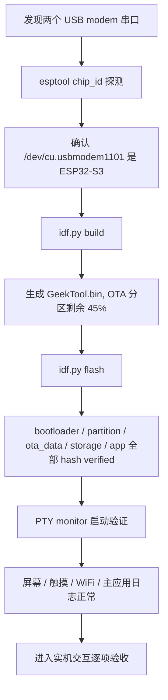
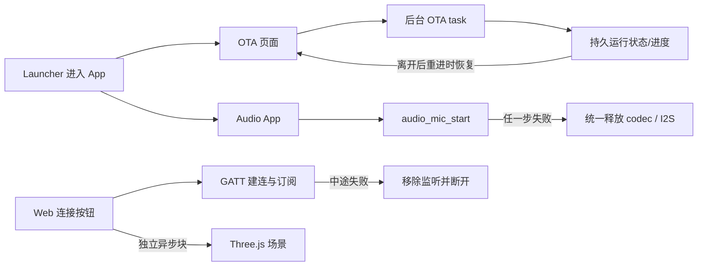
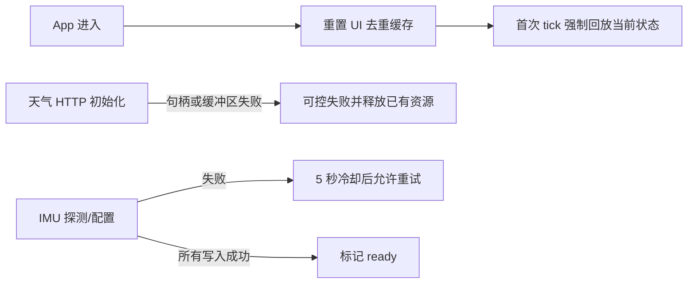
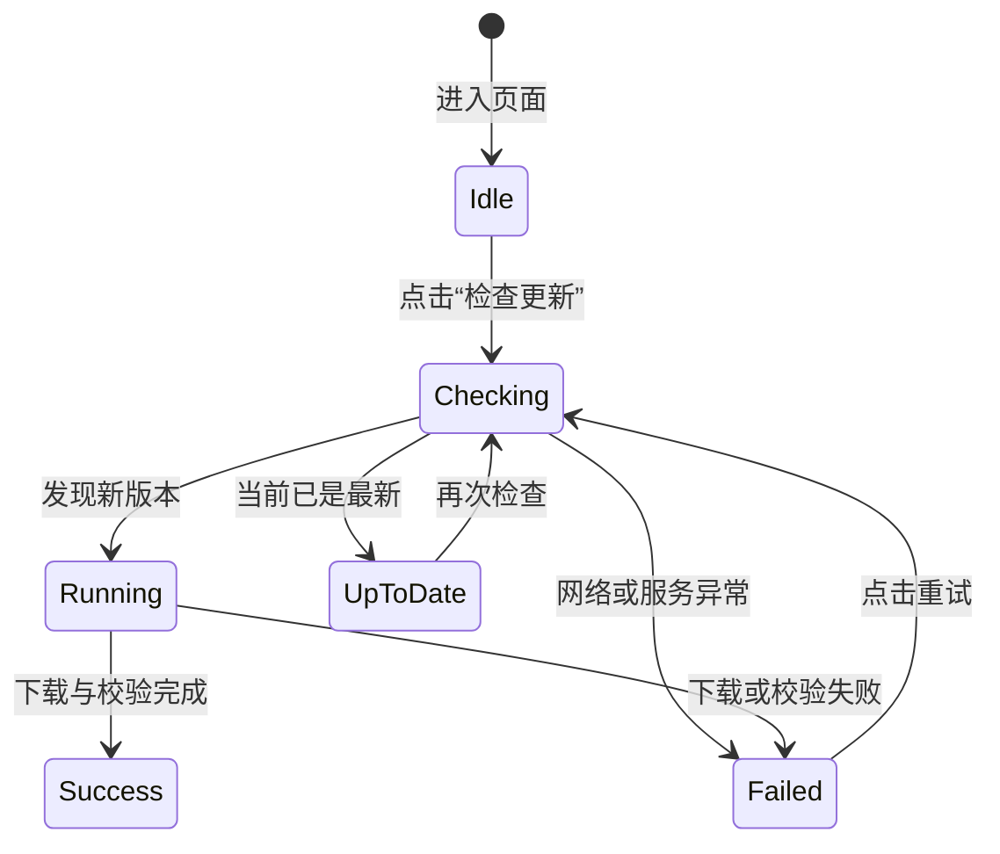
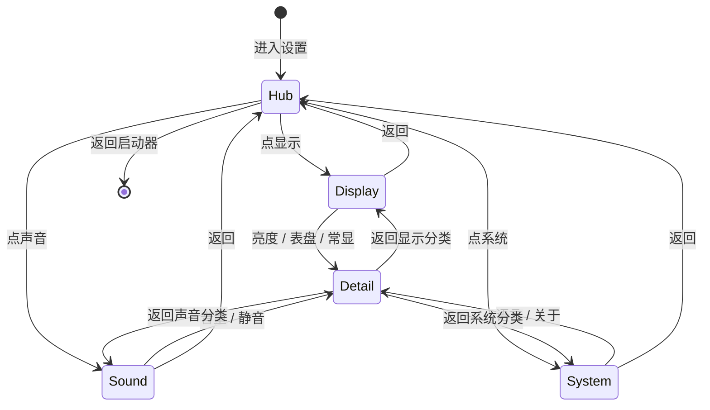

# GeekTool → ESP-IDF 移植配方与实现记录

早期移植目标:把 GeekTool 从 Arduino 迁到 **ESP-IDF + esp_lcd + esp_lvgl_port**,
用硬件 DMA 和缓冲流水线改善显示吞吐。配方来自小智(xiaozhi-esp32)官方对本板的支持。

**本地核对基线(2026-10-03)**:ESP-IDF 6.0.1、LVGL 9.5.0、esp_lvgl_port 2.8.0~1、
esp_codec_dev 1.5.10。下文早期版本表和设计目标为历史记录;当前调用链和验证见
[流畅性与动画优化](#2026-10-01-流畅性与动画优化)及
[OTA 失败恢复修复](#2026-10-02-ota-失败恢复修复)及
[实体按键功能对调](#2026-10-02-实体按键功能对调)及
[遥控台扩展](#遥控台扩展鼠标--演示--媒体)。当前启动放行与OTA首启检查见 [启动逻辑](./STARTUP.md)，
联网恢复见 [联网逻辑](./NETWORKING.md)。CI 依赖差异见流畅性发布核对。

> 参考:`78/xiaozhi-esp32` → `main/boards/waveshare/esp32-s3-touch-amoled-1.75/`
> 该板同时支持 `1.75` 和 `1.75C`,我们用 **1.75C** 的引脚。

---

## 0. 关键结论

- **显示吞吐**:`esp_lcd` 的 QSPI **硬件 DMA**与缓冲流水线让 CPU 和推屏重叠。
  面板 TE 命令 `0x35` 已启用,当前代码没有 TE GPIO 同步;DMA/双缓冲本身不保证无撕裂,
  AMOLED 的实际流畅度仍需真机观察和测量。
- **LVGL 版本会变成 9**(`esp_lvgl_port 2.7.x` 依赖 LVGL v9)。所以我们的 UI 代码要做 **8.4 → 9 的 API 移植**
  (`lv_disp_*`→`lv_display_*`、`transform_zoom`→`transform_scale`、事件取参 `lv_event_get_param` 等)。

---

## 1. 依赖组件(组件管理器自动拉取)

| 组件 | 版本 | 作用 |
|------|------|------|
| `espressif/esp_lcd_co5300` | `^2.0.3` | CO5300 QSPI AMOLED 面板驱动(自带 + 可覆盖 init) |
| `waveshare/esp_lcd_touch_cst9217` | `^1.0.3` | CST9217 触摸 |
| `espressif/esp_io_expander_tca9554` | `==2.0.0` | 板载 TCA9554 IO 扩展(地址 000) |
| `esp_lvgl_port` | `~2.7.2` | LVGL 移植层(双缓冲/DMA/刷新,LVGL v9) |
| `lvgl/lvgl` | `~9.2` | GUI |

---

## 2. 1.75C 引脚(⚠ 和 Arduino 版不同!)

```
显示 QSPI:  CS=12  PCLK=38  D0=4  D1=5  D2=6  D3=7
LCD 复位:   GPIO1        ← 1.75C 是 1(非 C 是 39);Arduino 版误用了 2
触摸:       RST=2  INT=11  (I2C 共用总线)
I2C:        SDA=15  SCL=14
音频 I2S:   MCLK=16  WS=45  BCLK=9  DIN=10(麦)  DOUT=8(扬)   PA=46
TCA9554:    I2C 地址 000(0x20)
BOOT 键:    GPIO0
屏:         466×466,无 mirror/swap,列偏移 gap=0x06
```

## 3. CO5300 厂商初始化序列(QSPI 模式,来自小智已验证)

```c
static const co5300_lcd_init_cmd_t vendor_specific_init[] = {
    {0xFE, (uint8_t[]){0x20}, 1, 0}, {0x19, (uint8_t[]){0x10}, 1, 0}, {0x1C, (uint8_t[]){0xA0}, 1, 0},
    {0xFE, (uint8_t[]){0x00}, 1, 0}, {0xC4, (uint8_t[]){0x80}, 1, 0},
    {0x3A, (uint8_t[]){0x55}, 1, 0},   // 16bit/px
    {0x35, (uint8_t[]){0x00}, 1, 0},   // TE on
    {0x53, (uint8_t[]){0x20}, 1, 0}, {0x51, (uint8_t[]){0xFF}, 1, 0}, {0x63, (uint8_t[]){0xFF}, 1, 0},
    {0x2A, (uint8_t[]){0x00,0x06,0x01,0xD7}, 4, 0},
    {0x2B, (uint8_t[]){0x00,0x00,0x01,0xD1}, 4, 600},
    {0x11, NULL, 0, 600},              // sleep out
    {0x29, NULL, 0, 0},               // display on
};
```
亮度:命令 `0x51`(1 字节,0~255)。偶数对齐:LVGL9 用 `LV_EVENT_INVALIDATE_AREA` 回调把刷新区域 x1/y1 向下取偶、x2/y2 向上取奇(CO5300 必须)。

显示创建关键点(`esp_lvgl_port`):双缓冲 + 缓冲放 PSRAM + 合适的 buffer 大小,
开 `full_refresh` 或 `direct_mode` 以获得整帧一致刷新(无台阶撕裂)。

---

## 4. 前置条件(你的电脑)

- 安装 **ESP-IDF v5.1+**(VS Code 的 Espressif 插件,或命令行 `idf.py`)。这是 Arduino 之外的另一套工具链。
- 第一次构建会自动从组件管理器下载上面的依赖。

---

## 5. 推荐的推进顺序(里程碑)

1. **(强烈建议先做)验证前提**:用 IDF 直接编译小智官方固件的 `esp32-s3-touch-amoled-1.75c` 目标,
   烧到你板子上,确认 IDF 这套**在你的硬件上确实不撕裂**。顺带把 IDF 环境跑通。
2. **M1 — 显示底层**:新建独立 IDF 工程,用上面的组件 + 引脚 + init,点亮屏 + 触摸 +
   一个 LVGL9 轮播 smoke test,确认**滑动无撕裂、无台阶**。← 风险都在这一步,先单独打通。
3. **M2 — UI 移植**:把 GeekTool 的启动器 + WiFi/I2C/System 三个 app 从 LVGL 8.4 移到 9,接到 M1 上。
4. **M3 — 收尾**:AXP2101 真实电量、省电、OTA 等。

## M1 结论(已验证、已定稿)

显示底层跑通并接受。最终配置:`esp_lcd_co5300`(QSPI **80MHz**)+ `esp_lvgl_port`
**单缓冲**(内部 DMA,160 行)+ `swap_bytes`。构建:`idf.py set-target esp32s3 && idf.py build flash monitor`。

**踩坑经验(都很关键)**:
- **SPI DMA 必须开**(`spi_bus_initialize` 用 `SPI_DMA_CH_AUTO`)。关掉 = 轮询阻塞 = 和 Arduino 一样撕裂,优势全无。
- LVGL 缓冲放**内部 DMA RAM**(`flags.buff_dma=1`),**别放 PSRAM**(`buff_spiram`+DMA 之前点不亮)。
- SPI/QSPI 屏用**单缓冲**(`double_buffer=false`);双缓冲部分刷新会**闪烁**(小智 SPI 屏也是单缓冲)。
- QSPI 时钟 `io_cfg.pclk_hz = 80MHz` 提吞吐;花屏就降 60/40。
- `esp_io_expander_tca9554` 在 IDF6 缺 `esp_driver_i2c` 依赖 → 已从依赖移除,M2 要用再找兼容版本(别改 managed_components)。

**残留撕裂的最终结论**:`esp_lvgl_port` 的 `avoid_tearing` 只支持 **RGB/DSI** 屏;CO5300 是 **QSPI**,
推屏不与屏幕刷新同步,**全屏快滑的撕裂是架构上限,代码不再深抠**(用户已接受)。

## M2 进度

**M2a — 启动器 + 导航(已烧录,启动正常)** `launcher.c`
- "小面积运动"设计:静止黑底 + 居中大图标,切换只动中心一小块,避开整屏滑的撕裂。
- 切换动画 `swap_exec`:中心图标+名字半程滑出淡出 → 中点换内容 → 反向滑入淡入。
  旋钮在文件顶部:`SWAP_MS`(总时长)、`SWAP_SLIDE`(滑动幅度,设 0 = 纯淡入淡出)。
- 连击保护:动画进行中 `lv_anim_get` 命中则忽略新手势。

**M2b-1 — 共享列表 + System + I2C(已随整机烧录启动,System/I2C 交互待实机逐项验证)**
- `ui_list.c`:圆屏曲率聚焦滚动列表,三个 app 共用。LVGL 8→9 改名:`lv_event_send`→
  `lv_obj_send_event`、`get_child_cnt`→`_count`、`clear_flag`→`remove_flag`、
  `LV_LABEL_LONG_DOT`→`..._MODE_DOTS`、回调里 `lv_event_get_target_obj`。
- `app_sys.c`:`ESP.*` → `esp_chip_info`/`esp_flash_get_size`/`esp_psram_get_size`/
  `esp_get_free_heap_size`/`esp_get_idf_version`;`millis()`→`esp_timer_get_time()/1000`。
- `app_i2c.c`:Arduino `Wire` → `i2c_master_probe()`;总线由 `main.c` 创建,经新增的
  `board_i2c_bus()`(声明在 `board_config.h`)共享给 app。

**M2b-2 — WiFi(已随整机烧录启动,自动重连已验证,配网交互待实机逐项验证)** `app_wifi.c`
- Arduino `WiFi` → `esp_wifi`:`wifi_svc_init()` 一次性建 netif/event loop/wifi 并 `start`;
  扫描 `esp_wifi_scan_start(async)`,连接 `esp_wifi_set_config`+`esp_wifi_connect`。
- **线程约定(关键)**:esp_wifi/IP 事件回调**只写 volatile 标志位,绝不碰 LVGL**;
  所有 UI 更新放在 `wifi_tick()`(LVGL 任务)里轮询标志 —— 沿用 Arduino 的轮询模型,
  免去给 LVGL 额外上锁。密码键盘对话框照搬到 LVGL 9(`lv_btn`→`lv_button`、
  `lv_obj_del_async`→`lv_obj_delete_async`)。去掉了 Arduino 版填充用的假网络。
- 依赖:`main/CMakeLists.txt` 加 `esp_wifi esp_netif esp_event`(及 M2b-1 的 `esp_timer` 等)。

**Flash**:16MB → **32MB**(`sdkconfig.defaults` 已改 `CONFIG_ESPTOOLPY_FLASHSIZE_32MB`)。
当前 `partitions.csv` 是双 OTA app 槽(`ota_0`/`ota_1` 各 3MB)+ 4MB `storage`;烧录会写入
`ota_data_initial.bin`,让新固件从 `ota_0`(`0x20000`) 启动。

## 2026-07-13 烧录验证记录

- 目标串口:`/dev/cu.usbmodem1101`。`esptool.py chip_id` 确认为 ESP32-S3 rev v0.2、8MB PSRAM、MAC
  `a4:cb:8f:d6:35:b8`;另一个 `/dev/cu.usbmodem309NTPCEG5682` 无串口响应,本次未使用。
- 环境:`export PATH="/opt/homebrew/bin:$PATH"` 后 `source ~/.espressif/v6.0.1/esp-idf/export.sh`;
  使用 ESP-IDF v6.0.1。
- 构建:`idf.py -p /dev/cu.usbmodem1101 build` 通过,生成 `build/GeekTool.bin`;
  镜像大小 `0x1a3fb0`,3MB OTA app 分区剩余 `0x15c050`(45%)。
- 烧录:`idf.py -p /dev/cu.usbmodem1101 flash` 写入 bootloader、partition table、`ota_data_initial.bin`,
  `storage.bin` 和 `GeekTool.bin`,所有段均 `Hash of data verified`,最后 hard reset 成功。
- 串口启动:`idf.py monitor` 需交互式 TTY;普通管道会报 `Monitor requires standard input to be attached to TTY`。
  使用 PTY 监视后确认从 `ota_0`(`0x20000`) 启动,Flash 32MB、PSRAM 8MB 正常识别。
- 启动日志已确认:`CO5300 panel ready`、`LVGL task`、`CST9217 touch ready`、`GeekTool M2a up`;
  WiFi 自动连接 `superRice`,获取 IP `192.168.2.109`。本次固件版本显示为 `d067acd-dirty`,
  对应烧录的是当前未提交工作区状态。
- 续烧录:当前工作区新增/修改了 `bootkey.*`、`app_fluid.c`、启动器和若干 app 文件后再次执行
  `idf.py -p /dev/cu.usbmodem1101 flash`;`GeekTool.bin` 大小 `0x1a48f0`,3MB OTA app 分区剩余
  `0x15b710`(45%)。bootloader、partition table、`ota_data_initial.bin`、`storage.bin` 和 `GeekTool.bin`
  全部 `Hash of data verified`;PTY monitor 再次确认屏幕、触摸、主应用和 WiFi 自动重连正常。
- 再次续烧录:当前工作区继续修改 `app_wifi.c`、`lock.c`、`main.c`、`sdkconfig.defaults` 等后执行
  `idf.py -p /dev/cu.usbmodem1101 flash`;由于 `sdkconfig.defaults` 变化触发完整重编译。`GeekTool.bin`
  大小 `0x1a79b0`,3MB OTA app 分区剩余 `0x158650`(45%)。所有写入段仍全部 `Hash of data verified`;
  PTY monitor 确认从 `ota_0` 启动,Flash 32MB、PSRAM 8MB、CO5300、CST9217、LVGL、主应用和 WiFi 自动重连正常,
  WiFi 获取 IP `192.168.2.109`;日志显示 Light sleep 已启用。
- 本轮续烧录:继续执行 `idf.py -p /dev/cu.usbmodem1101 flash`,仅增量重编译 `app_fluid.c` 等;
  `GeekTool.bin` 大小 `0x1a7d20`,3MB OTA app 分区剩余 `0x1582e0`(45%)。bootloader、partition table、
  `ota_data_initial.bin`、`storage.bin` 和 `GeekTool.bin` 全部 `Hash of data verified`;PTY monitor 确认从
  `ota_0` 启动,Flash 32MB、PSRAM 8MB、CO5300、CST9217、LVGL、主应用和 WiFi 自动重连正常,IP 仍为
  `192.168.2.109`,Light sleep 仍启用。串口还看到 `enter maze` / `QMI8658 ready` / `enter fluid` 日志,
  仅代表 app 可进入并初始化到该阶段,交互效果仍需肉眼验收。
- 未完成的实机操作验收:启动器左右滑/进入/返回、System/I2C 列表、WiFi 扫描与密码连接、天气请求、
  设置亮度/音量、锁屏/侧键/省电、OTA 真 URL、音频 app 的 `rms=` 随声音变化。


```mermaid
flowchart TD
    A["发现两个 USB modem 串口"] --> B["esptool chip_id 探测"]
    B --> C["确认 /dev/cu.usbmodem1101 是 ESP32-S3"]
    C --> D["idf.py build"]
    D --> E["生成 GeekTool.bin, OTA 分区剩余 45%"]
    E --> F["idf.py flash"]
    F --> G["bootloader / partition / ota_data / storage / app 全部 hash verified"]
    G --> H["PTY monitor 启动验证"]
    H --> I["屏幕 / 触摸 / WiFi / 主应用日志正常"]
    I --> J["进入实机交互逐项验收"]
```

## M3 进度

**M3a — AXP2101 真实电量 + 充/放电可视化(已随整机烧录启动,电量显示和充放电表现待肉眼验证)**
- `power.c`/`power.h`:挂 AXP2101(I2C `0x34`),只读不写。电量 `0xA4`,
  方向 `0x01[6:5]`(1=充/2=放),充满 `0x01[2:0]==100`(寄存器取自小智 `common/axp2101.cc`)。
- `launcher.c` `battery_timer_cb` 每 2s 读一次,更新电量环 + ⚡:
  - 环颜色编码状态:放电 = 绿/琥珀/红(按电量);充电 = 青蓝(`COL_WIFI`);充满 = 绿(`COL_OK`)。
  - ⚡(`LV_SYMBOL_CHARGE`,顶端居中)仅充电/充满时显示;**充电时呼吸**(透明度动画)、充满常亮。
    只动这一小块,守住"小面积运动"避撕裂原则。
- 电量环写死的 72 已去掉(初始 0,开机立即读一次)。
- 充电参数(CV 电压/充电电流)没碰 —— 要调照小智板级 init 写 `0x64/0x61/0x62/0x63`。

**M3b — 锁屏 / Nothing 表盘 / 侧键 / 省电(已随整机烧录启动,侧键和省电策略待实机操作验证)**
- `watchface.c`:全屏黑底点阵表盘,挂 `lv_layer_top`(盖住启动器+app)。手绘 5×7 点阵数字、
  60 点外环、红点冒号(1Hz 闪)、沿环走的秒点;数字每分钟才重建 → 低运动避撕裂。
  下方信息区:日期、WiFi 名、电量% + IP(连上 WiFi 后显示)。
- `lock.c`:**AXP2101 PWRON 侧键**(不是 BOOT)—— 短按=锁/解切换、长按=关机。
  去抖+长短判定由 PMU 硬件做,软件只轮询 IRQ(`power_key_event`:`0x49` bit3=短/bit2=长,写 1 清,
  使能在 `0x41`)。表盘**上滑解锁**。省电:**锁屏+放电**时空闲 15s 变暗(亮度 `0x20`)→
  30s 熄屏(`display_sleep`);**充电常显**;触摸/按键唤醒。
- `display.c` 新增 `display_set_brightness`(`0x51`)+ `display_sleep`(`disp_on_off`)。
- 时间:`localtime`(时区 `CST-8` 在 main 设),WiFi 连上后 `esp_sntp` 自动校时(`pool.ntp.org`)。
  **没接 PCF85063 RTC**,没联网时表盘从开机零点起走。
- PWRON 键寄存器取自 XPowersLib(`~/Documents/Arduino/libraries/XPowersLib`)。

**M3c — OTA(本段记录初版移植;当前发布链路见根 README 与本文件 2026-07-19 记录)**
- `partitions.csv`:改双 app 槽 `ota_0/ota_1`(各 3MB)+ `otadata`(原单 `factory`)。
  **改了分区表,下次 flash 会重新分区**;`nvs` 偏移不变(WiFi 配置等保留)。
- `app_ota.c`:点更新环 → 独立任务跑 `esp_https_ota`(带 crt bundle,支持 HTTPS),成功后
  `esp_restart`,状态在 `ota_tick` 显示。**需先连 WiFi**。当前按 NVS beta 开关选择 Cloudflare R2
  正式对象 `GeekTool.bin` 或内测对象 `GeekTool-beta.bin`,不再使用初版的本地占位 URL。
- 依赖加了 `esp_https_ota app_update esp_http_client esp-tls mbedtls`。

## 里程碑完成

M1 显示 → M2 启动器+WiFi/I2C/System → M3 电量/锁屏/Nothing 表盘/省电/OTA。
可选后续:点阵日期、充电常显防烧屏(降亮度)、OTA 进度条、PCF85063 离线走时。

## UI 统一 — Nothing 单色(已随整机烧录启动,视觉细节待肉眼验收)

全局改造靠两个集中开关,不逐控件改:
- **调色板**(`app.h`):全部收敛到 黑`COL_BG` / 白`COL_TXT` / 灰`COL_TXT2` / 一个红`COL_RED`。
  旧彩色别名(`COL_WIFI/I2C/SYS/OTA/OK/RING`)都 `#define` 成白、`COL_WARN`=红 → 改这几行就能全局变色,各 app 不用动。
- **主题**(`main.c`):`lv_theme_default_init(disp, 红, 白, dark=true, montserrat)` + `lv_display_set_theme`
  → 键盘/按钮/文本框等默认控件统一暗色红强调。`sdkconfig.defaults` 开了 `LV_USE_THEME_DEFAULT`。
- **字体**(`app.h` 三个宏):正文 `UI_FONT_L/M` = 内置点阵像素字 `unscii_16`;含图标(⚡ / ‹ › / 键盘符号)的
  标签用 `UI_FONT_SYM` = `montserrat_20`(unscii 没有图标字形,符号会变空格)。开了 `UNSCII_8/16`。
- 细节:启动器图标 → **描边圆环**(不填充);OTA → **红色 CTA 按钮**;电量环 放电=白 / 低电+充电=红;
  表盘布局没动(用户要求),只把日期/WiFi 标签换成同一像素字(电量行因带 ⚡ 仍用 montserrat)。

**换真 Ndot 字体**:现用内置 unscii(够 Nothing 味、零转换风险)。要上 Nothing 官方 **Ndot**:
用 lv_font_conv 把 Ndot.ttf 转 LVGL 字体(合并 `0xF000-0xF8FF` 符号区),丢进 `main/`,
`app.h` 把 `UI_FONT_L/M` 指过去即可 —— 字体已集中,改一处。

## App 点描图标 + 天气 app(已随整机烧录启动,天气请求和图标观感待实机操作验证)

本节记录早期单色轮廓实现。2026-10-03 用户重新确认彩色 AMOLED 效果稿并授权重做天气页；
当前布局、完整天气码/昼夜图标及验证以 [天气 UI 实现说明](./WEATHER_UI.md) 和实际代码为准。

- **点描图标**:通用画法在 `glyph.c`/`glyph.h`(`glyph_arc`/`glyph_line`/`glyph_circle` 沿轮廓匀距撒小圆点,
  比之前 9×9 大点精致)。启动器图标 `launcher.c` 的 `ic_wifi/ic_scan/ic_chip/ic_ota/ic_sun`
  (`ICON_FN[]` **顺序对齐 `APPS[]`**),细线轮廓 + 红点焦点。加新 app = `APPS[]` 和 `ICON_FN[]` 各加一行。
- **天气 app**(`app_weather.c`,第 5 个):**Open-Meteo**(`api.open-meteo.com`,**HTTP** 不用 HTTPS,无 key)拿
  当前温度 + WMO 天气码 + 湿度 + **当日低/高温**。响应 ~1-2KB。**不用 cJSON**(组件名解析不到的坑):
  十几行 `json_num`(strstr 找 `"key":` 取无引号数值,数组跳 `[`)解析,**先定位到 `current`/`daily` 段**
  再取值,避开前面 `*_units` 段同名键的字符串值。天气码→图标用 `draw_wicon(int code)` 按 WMO 区间选(`wmo_desc` 给文字)。
  云/晴/雨/雪图标都用 `glyph_*` 点描(云 = 重叠圆求外轮廓 + 底边线);温度 5×7 大点阵 + 度环。
  顶部标题 `launcher_set_title(CITY)` 显示城市(`icon_cb` 已改成先设标题再 `enter`,app 可覆盖)。
  布局 y 固定不重叠:云 87–192 / 温度 205–296 / 天气 312 / 低高+湿度 344 / 状态 376。需先连 WiFi,换城市改 `WX_LAT/WX_LON`。
- 坑回顾:① `glyph_dot` 漏了 `bg_opa`(remove_style_all 后默认透明)→ 点全看不见,补 `LV_OPA_COVER`。
  ② GCC `-Wformat-truncation` 对小缓冲 snprintf 误报 → `main/CMakeLists.txt` 加 `-Wno-format-truncation`。
  ③ **天气走 HTTP 不走 HTTPS**:S3 内部 RAM 被显存(单缓冲 160 行)+WiFi 占满,mbedtls `ssl_setup`
  分配不出 ~32KB 收发缓冲 → `-0x008D` 失败。公开天气数据没必要 TLS,Open-Meteo 裸 HTTP 直接给 JSON。
  ④ **天气图标用户不满意但决定不改了**(试过 9×9 实心 / 描边 / 重叠圆 / 网格点阵几版),维持现状。

## 设置 app(第 6 个,已随整机烧录启动,滑条交互待实机操作验证)

- `settings.c`/`settings.h`:全局亮度 + 音量状态,存 NVS(命名空间 `settings`)。
  - **亮度**:`settings_set_brightness` 直接驱动 CO5300(`display_set_brightness`),拖动实时、松手才写 NVS(防频繁写 flash)。
    开机 `settings_init()`(在 `main.c` `display_init()` 之后)从 NVS 读并应用;**锁屏唤醒亮度也读它**
    (`lock.c` 的 `SCR_FULL` 改用 `settings_brightness()`,不再写死 `0xFF`)。
  - **音量**:存值(0-100)+ NVS,当前已接 `audio_out.c` 的 ES8311/I2S 输出。设置页可播放短提示音,
    倒计时结束可播放闹铃;麦克风与扬声器共用 I2S0,各 App 退出时必须完整释放后再切换。
- `app_settings.c`:两个 `lv_slider`(主题红强调),`VALUE_CHANGED` 实时应用、`RELEASED` 存 NVS。
- 启动器图标 `ic_settings`(三条滑轨,中间旋钮红)。`APPS[]`/`ICON_FN[]` 都加到第 6 项。
- **⚠ QSPI 命令编码坑(亮度一直不生效的根因)**:CO5300 走 QSPI 时,任何直接发的命令都要按 QSPI 编码 ——
  `cmd = (0x02 << 24) | (real_cmd << 8)`(`0x02` = 写命令 opcode)。驱动内部 `tx_param` 自动这么做,
  所以 init 的 `0x51` 没问题;但 `display_set_brightness` 之前发的是**裸 `0x51`**,面板收不到。
  已修(`display.c`)。以后任何 `esp_lcd_panel_io_tx_param` 直接发 CO5300 命令都得这样编码。

## 音频可视化 app(第 7 个,**已随整机烧录启动 —— 音频采集仍需实机进入 app 看 `rms=` 验证**)

- `audio_mic.c`/`.h`:麦克风采集。**ES7210(4 路 TDM)+ I2S RX(master)→ esp_codec_dev**,读单声道 16bit @ 16kHz。
  配置对齐小智 `BoxAudioCodec` 输入侧;I2S 用 `I2S_CHANNEL_DEFAULT_CONFIG` / `I2S_TDM_*_DEFAULT_CONFIG` 宏(跨 IDF 版本稳)。
  ES7210 总线 7-bit 地址是 `0x40`,但 `esp_codec_dev` 的 `audio_codec_i2c_cfg_t.addr` 要传 8-bit
  写地址 `ES7210_CODEC_DEFAULT_ADDR`(`0x80`,组件内部再右移为 `0x40`);当前输入增益为 40dB。
  新增依赖 `espressif/esp_codec_dev`(组件管理器首次 build 下载)+ `esp_driver_i2s`。
- `app_audio.c`:独立任务读一帧(480 样本)→ 对 18 个对数分布频点跑 **Goertzel** → `s_band[]`(快上慢下平滑);
  当前 `audio_tick` 读取快照驱动固定 18×16 点阵、列顶红点和冷白/浅青/暖杏/柔玫红能量渐变。
  任务里 `ESP_LOGI("audio","rms=%.0f")` 供验证拾音；当前版式、健康状态与回归见 [音频与水平仪](./AUDIO_LEVEL_DESIGN.md)。
- **风险**:① 首次 build 要下 `esp_codec_dev`,API 字段万一对不上会编译报错(照报错改);② 采集能不能真拾到音
  得看串口 `rms=` 有没有随声音跳 —— 这部分我没法离线测,大概率要在板上调增益/格式。退出时任务自己 `audio_mic_stop` 收尾。
- **⚠ 内存坑(加音频后开机黑屏)**:`esp_codec_dev`+I2S 链进来后内部 RAM 吃紧,LVGL 那块 466×160 单缓冲(~146KB 内部 DMA RAM)
  分配失败(`lvgl_port_add_disp ... Not enough memory for buf1`)→ 显示根本没起来 = 黑屏。把缓冲从 **160 行降到 80 行**
  (`display.c` `buffer_size = LCD_H_RES*80`,~73KB)就放得下了。再加 app 若又不够,继续降行数(别放 PSRAM,本板 PSRAM+DMA 点不亮)。
- 另:亮度下限抬到 `SETTINGS_BRIGHT_MIN=0x40`(25%)+ 开机夹住,防止存了过低亮度导致开机看着黑屏(和上面那个是两回事)。
- **⚠ ES7210 要 AXP2101 ALDO1 供电(写 0x40 全 NACK 的根因)**:音频 codec(ES7210/ES8311)挂在 **ALDO1**(3.3V)。
  小智在 `Pmic` 构造里 `0x92=(3300-500)/100` 设压 + `0x90 |= bit0` 开 ALDO1。我之前 `power.c` 只读 AXP2101、没开这轨 →
  ES7210 没电 → I2C 写 `0x40` 全 NACK → `es7210 open fail`。已加 `power_audio_on()`(只开 ALDO1、不碰其它轨),
  在 `audio_mic_start` 开头调用 + 60ms 上电延时。I2C 扫描看到 `0x40` 是对的,但传给
  `esp_codec_dev` 控制器的配置值必须是 8-bit `0x80`。

## 数字孪生退出 + 充电 95% 修复

- **twin app 退出卡死**:`go_home()` 在 LVGL 任务里同步调用 `cur_app->exit()`。旧版 `ble_twin_stop()` 在退出里直接
  `nimble_port_stop()` + `nimble_port_deinit()`,而 IDF NimBLE 的 `nimble_port_stop()` 会用永久等待等 host stop 完成;
  一旦 stop/deinit 与 GAP 事件、连接断开或 WiFi 恢复抢时序,LVGL 任务就可能卡住。第一次只加 `s_stopping` 阻止
  `DISCONNECT`/`ADV_COMPLETE` 重新广播,但仍保留同步 stop/deinit,实机退出仍会卡。
  当前修正:BLE host 跟 WiFi service 一样只初始化一次;twin 退出只清 RX 回调、停广播、断开当前连接、关闭前台 active 标志,
  不再在 LVGL 任务里 deinit NimBLE。后续注意:任何 app 的 `exit()` 都会跑在 LVGL 任务里,不要在里面做不可控的长阻塞;
  对系统协议栈优先采用"服务常驻 + 前台启停"模型,不要每次 app 退出都强制 deinit。
  ```mermaid
  flowchart TD
      A["进入 twin app"] --> B["ble_twin_start"]
      B --> C{"NimBLE host 已运行?"}
      C -- "否" --> D["初始化 NimBLE host + 注册 GATT"]
      C -- "是" --> E["仅打开 active 标志"]
      D --> F["host sync 后开始广播 GeekTwin"]
      E --> F
      F --> G["采样任务 notify IMU/电量帧"]
      H["退出 twin app"] --> I["停止采样 + 清 RX 回调"]
      I --> J["关闭 active 标志"]
      J --> K["停广播/断开当前连接"]
      K --> L["保留 NimBLE host,返回启动器"]
  ```
- **充电最多约 95%**:`power.c` 原来沿用 xiaozhi 示例的 AXP2101 CV 4.1V 保守档(`0x64=0x02`)。
  对普通 4.2V 锂电,4.1V 截止常会让电量计停在 95% 左右。已改为 `0x64=0x03`(4.2V),保留预充 50mA、终止 25mA、
  默认输入限流和温度降流策略不变。后续注意:不要改到 4.35V/4.4V,除非确认电池本身是高压锂电。

## 2026-07-19 代码与文档一致性优化

### 状态

- 已实现、已完成本机构建与浏览器验证

### 背景与当前行为

- 仓库代码与 Tag 已到 `v1.7-beta.5`,启动器实际注册 16 个 App,但根 README 仍停在
  `v1.4 / 15 个 App`,且本文件早期的 OTA URL、音频输出和 ES7210 地址说明已经被后续实现推翻。
- OTA 任务允许离开页面后在后台继续下载,但再次进入页面会把 `s_state/s_pct` 重置为空闲,
  UI 与仍在运行的任务脱节。
- `audio_mic_start()` 在 I2S 或 codec 初始化中途失败时直接返回,不会释放前面已经创建的对象;
  再次进入音频 App 可能继续泄漏资源或因 I2S0 被占用而失败。
- Web 蓝牙连接在 GATT 服务发现或通知订阅中途失败时没有统一清理设备事件和连接;Three.js 场景也随首包同步加载。

### 目标、范围与非目标

- 目标:修复上述生命周期问题,降低 Web 首包耦合,并让入口文档反映当前真实代码。
- 范围:`app_ota.c`、`audio_mic.c`、`app_audio.c`、Web 连接/场景入口、根 README、Web README 与本记录。
- 非目标:不升级 ESP-IDF 组件版本,不调整硬件参数、分区表、BLE 协议、OTA 发布地址或现有 UI 视觉。
- 本轮只做本机构建与静态检查;没有连接开发板,因此不把 OTA、音频、BLE 或屏幕效果标记为真机通过。

### 调用链与方案


```mermaid
flowchart LR
    L["Launcher 进入 App"] --> O["OTA 页面"]
    O --> T["后台 OTA task"]
    T --> S["持久运行状态/进度"]
    S -->|"离开后重进时恢复"| O
    L --> A["Audio App"]
    A --> M["audio_mic_start"]
    M -->|"任一步失败"| C["统一释放 codec / I2S"]
    W["Web 连接按钮"] --> G["GATT 建连与订阅"]
    G -->|"中途失败"| D["移除监听并断开"]
    W -->|"独立异步块"| R["Three.js 场景"]
```

### 验收、风险与回滚

- `idf.py -C GeekTool-IDF build` 通过,并记录镜像大小与分区余量。
- `npm --prefix web run build` 通过,对比拆分前后的产物体积。
- `git diff --check` 通过,README 的版本、App 数量、音频与 OTA 描述能由当前代码佐证。
- 风险集中在异步退出/重入时序;实现保持后台 OTA 策略不变,只恢复真实状态。若真机发现回归,
  可按文件回退本节涉及的局部生命周期修改,不需要更改 NVS、分区或发布对象。

### 实际实现结果

- `app_ota.c` 不再在页面进入时清空后台状态;重进会重置 UI 去重缓存,再由首个 `ota_tick`
  恢复检查中、下载进度、成功、失败或已是最新状态。重新发起更新时仍会把进度归零。
- `audio_mic.c` 对 TDM、data/control interface、ES7210 codec、codec device 和 open 的失败分支
  统一调用幂等清理;`app_audio.c` 在建任务前置位 alive,并在旧任务仍未退出时拒绝重复创建。
- Web GATT 服务发现或通知订阅中途失败时会移除事件监听并断开;Three.js 场景使用
  `lazy + Suspense`,姿态算法只直引 Three 数学子模块,避免渲染器回流主包。
- 固件构建通过:`GeekTool.bin` 为 `0x1ced30`,3 MiB OTA 分区剩余 `0x1312d0`(40%)。
- Web 类型检查与生产构建通过:主包从 `620.71 kB` 降到 `172.11 kB`(约 -72%),
  Three.js 场景独立为 `462.85 kB`,不再出现 500 kB chunk 告警。
- 应用内浏览器在 `1280 x 720` 和 `390 x 844` 验证页面非空、canvas=1、无错误覆盖层、
  干净会话无 console error/warn;点击“重置”后可见状态变为“校准已重置”,移动视口无横向溢出。
- `git diff --check` 通过。未连接开发板,OTA 后台重入、ES7210 失败重试和真实 BLE 连接仍需真机复验。

### 与原计划的偏差

- 初次只动态导入 `CubeScene` 时,Three 顶层入口仍被姿态算法共享,主包几乎没有下降;随后改为
  直接引用 `Quaternion/Vector3/MathUtils` 子模块,才实现真实拆包。没有扩大到依赖升级或 UI 重设计。

## 2026-07-19 第二轮异常路径优化

### 状态

- 已实现、已完成本机构建与静态验证

### 当前行为与范围

- 天气任务未检查 `esp_http_client_init()` 返回的句柄;内存紧张时可能带着空句柄继续 open/close。
- 天气和鼠标 App 用跨页面保留的静态值去重;重进页面时如果连接/失败状态未改变,
  新创建的标签可停在“正在启动”或“正在获取”。
- IMU 探测只执行一次,配置寄存器写入失败仍会标记 ready;瞬时 I2C 异常后也不会恢复。
- 本轮限定修改 `app_weather.c`、`app_mouse.c` 和 `imu.c`,不改天气 API、BLE HID 协议、
  IMU 量程/坐标映射、NVS 数据或 UI 布局。

### 方案与验收


```mermaid
flowchart LR
    E["App 进入"] --> R["重置 UI 去重缓存"]
    R --> S["首次 tick 强制回放当前状态"]
    H["天气 HTTP 初始化"] -->|"句柄或缓冲区失败"| F["可控失败并释放已有资源"]
    I["IMU 探测/配置"] -->|"失败"| C["5 秒冷却后允许重试"]
    I -->|"所有写入成功"| O["标记 ready"]
```

- 天气 HTTP 对 client/body 失败分支不解引空句柄,任务仍能正常退出并允许后续重试。
- 天气/鼠标每次进入都回放当前状态,并恢复与状态匹配的文字颜色。
- IMU 只在全部配置写入成功后标记可用;失败后限频重试,避免每帧冲击 I2C。
- 固件构建、`git diff --check` 与相关静态检查通过;未接开发板时,保留天气断网恢复、
  BLE 重连和 IMU I2C 故障注入为真机待验证项。

### 实际实现结果

- `app_weather.c` 对 HTTP client 和 8 KiB body 分配分别判空;只有 open 成功才 close,
  只要 client 存在就 cleanup,异常分支最终设为 `WX_FAIL` 并释放 body。
- 天气页进入时重置 `s_shown`,加载/成功时把状态文字颜色恢复为次要色;
  鼠标页用 `s_link_state_known` 保证首次 tick 必定显示配对或已连接,且启动失败文案不会被覆盖。
- `imu.c` 检查 CTRL1/2/3/7 全部写入;探测或配置失败会移除已添加的 I2C device,
  后续读取按 5 秒冷却重试,不再将部分初始化当作 ready。
- ESP-IDF 6.0.1 完整构建通过:`GeekTool.bin` 为 `0x1cef40`,3 MiB OTA 分区剩余
  `0x1310c0`(40%);Web 类型检查与 Vite 生产构建再次通过,主包 `172.11 kB`,异步场景 `462.85 kB`。
- `git diff --check` 通过。本轮未接开发板,因此天气断网/内存紧张分支、BLE 鼠标重进与
  QMI8658 故障注入仍是真机待验证,不作真机通过表述。

### 与计划的偏差

- 无。未扩大到 NVS 自动擦除或更底层的 I2C 总线重置,避免引入用户数据丢失或跨模块影响。

## 2026-07-19 OTA 圆屏视觉重构（Orbit Console）

本节保留历史设计与验证记录；页面表现已由 [2026-10-03 极简页面](#2026-10-03-ota-极简页面)
替代。开放轨道、进度扫点及底部通道胶囊不再作为当前视觉基线。

### 状态

- 已实现、已完成本机构建与 466×466 离线视觉 QA;真机待验证

### 背景与当前行为

- 真机照片显示 OTA 页同时存在全局 458px 充电/电量环和页面内 268px 完整进度环,形成重复的
  “靶心”视觉;版本文字压在内环上沿,标题、返回键、版本和主操作缺少统一纵向秩序。
- 空闲态中央只有下载符号,点击含义依赖底部提示文字;“测试通道”标签和开关又独立贴在屏幕下沿,
  主操作、状态说明和次要设置没有形成清晰层级。
- OTA 后台任务、退出后继续下载、再次进入恢复状态等行为已经稳定,本轮只重构 OTA 页的
  LVGL 表现层,不改下载地址、版本比较、任务生命周期、分区或发布协议。

### 目标、范围与非目标

- 采用已确认的 **Orbit Console** 方向:保留全局外环作为设备状态边界,页面内部改为顶部留口的
  点阵轨道,把“检查更新”作为唯一主操作,底部测试通道收进一枚紧凑胶囊。
- 覆盖 `空闲 / 检查中 / 下载中 / 成功 / 已是最新 / 失败` 六种页面状态;所有状态沿用项目已有
  黑底、白灰点阵、红色交互强调和绿色成功语义,不引入图片资源或新的渲染依赖。
- 非目标:不改启动器全局标题/返回/电量层的通用布局,不新增 OTA 能力,不修改 Wi-Fi 与 OTA 业务逻辑,
  不扩大到其他 App 的视觉重构。

### 信息层级与状态流


```mermaid
stateDiagram-v2
    [*] --> Idle: 进入页面
    Idle --> Checking: 点击“检查更新”
    Checking --> Running: 发现新版本
    Checking --> UpToDate: 当前已是最新
    Checking --> Failed: 网络或服务异常
    Running --> Success: 下载与校验完成
    Running --> Failed: 下载或校验失败
    Failed --> Checking: 点击重试
    UpToDate --> Checking: 再次检查
```

- 顶部:全局返回键与“在线更新”标题,下方只显示一行当前版本。
- 中部:开放式点阵轨道承载检查动画或下载进度;中央图标、百分比和主操作文案保持同一视觉焦点。
- 底部:状态说明位于轨道下方;测试通道作为次要设置固定在独立胶囊内,不与主操作争夺注意力。

### 实施步骤与验收标准

1. 移除 OTA 页完整内环和无语义的上下漂浮动画,建立开放式点阵轨道与统一状态渲染函数。
2. 重排版本、中央图标/百分比、状态说明、主操作热区与测试通道胶囊,保持 466×466 圆屏安全区。
3. 保留现有触摸行为和后台状态恢复;运行态以轨道显示真实进度,其余状态提供明确反馈与重试入口。
4. ESP-IDF 完整构建和 `git diff --check` 必须通过;静态检查确认六种状态均有明确视觉输出。
5. 视觉验收:不再出现双完整圆环,文字不压线、不贴屏幕边缘,空闲态无需阅读说明即可识别主操作,
   测试通道保持可触达但视觉降级。离线预览只用于几何核对,最终 AMOLED 亮度、触摸命中和动态流畅度
   仍以真机照片/操作为准。

### 风险与回滚

- 点阵对象比单个 `lv_arc` 更多,但数量会控制在与现有秒表刻度同一量级;若真机刷新或内存出现回归,
  可只回退 `app_ota.c` 的表现层,不会影响 OTA 任务和分区数据。
- 全局充电环颜色由电池状态决定,页面不能假设外环始终为绿色;内部成功态仍需靠图标和文字独立表达。

### 实际实现结果

- `app_ota.c` 删除页面内完整 `lv_arc` 和上下弹跳动画,改为 54 个 LVGL 原生点组成的 260° 开放轨道。
  空闲态为白色轨道+红色起点,检查态由红色前沿沿轨道运行,下载态显示真实百分比、白色已完成段和红色前沿。
- 中央下载/对勾/叉继续复用项目 `glyph_line` 点阵语言;主操作文案改为“检查更新”,空闲、失败和已最新态
  共用 214×178 热区,检查/下载/成功待重启时自动禁止重复点击。
- 测试通道改为 192×48 底部胶囊,保留原设置持久化;检查、下载和成功待重启阶段禁用开关,
  避免用户将中途切换误解为会改变当前任务的下载通道。
- 六种状态在 466×466 本地几何预览中逐项核对,并将选定参考与空闲态预览按同尺寸并排比较;
  轨道顶部留口、版本行、主操作、状态反馈和底部胶囊均无可见越界或文字压线。
- ESP-IDF 6.0.1 完整构建通过:`GeekTool.bin` 为 `0x1cf500`,3 MiB OTA 分区剩余
  `0x130b00`(40%);`git diff --check` 通过。设计核验记录见根目录 `design-qa.md`。
- 本轮没有烧录开发板,因此 AMOLED 实际亮度、54 点轨道动画流畅度、主操作/开关触摸命中、六状态真机画面
  仍列为待验证,不以浏览器几何预览替代真机结论。

### 与计划的偏差

- 选定概念的底部胶囊更窄;实现为容纳现有 54×28 开关、中文标签和触摸间距扩大到 192px。
  其余偏差仅来自全局电量环和字体属于启动器共享层,本轮按非目标保持不变。

## 2026-07-20 设置页三分类视觉重构

### 状态

- 已实现、已完成本机构建与 466×466 离线视觉 QA;真机 OTA 后待验证

### 背景与当前行为

- 真机设置首页把显示、声音、系统的 7 个具体选项连续放进多张 306px 深色矩形卡片。虽然功能完整,
  但圆屏首屏主要被一个手机式列表卡占据,所有行视觉权重接近,分组标题与内容脱节,下方内容也缺少明确的层级预告。
- 当前返回关系只有“全部选项菜单 → 单项详情”两层;本轮按确认方案改为“设置首页 → 分类 → 单项详情”三层,
  让首屏只承担分类选择,具体设置在分类内出现。
- 亮度、表盘、常显、音量、静音、语言、关于的现有业务回调、NVS 存储、音量试听与运行时立即生效行为
  均为兼容约束,不能因视觉重构改变。

### 目标、范围与非目标

- 设置首页只显示 `显示 / 声音 / 系统` 三个大触摸入口,带实时摘要、点阵图标和次要箭头;
  中间“声音”入口用轻表面和红色焦点点强调,上下入口退为黑底描边,复现选定方案的视觉层级。
- 分类页使用轻量独立行展示该分类内的具体选项,不再用一个大矩形把所有内容包住;详情页继续使用适合圆屏的
  大读数滑块、大开关、表盘/语言选择和 About 信息。
- 非目标:不修改设置数据结构、默认值、亮度下限、音量输出、AOD/静音语义、表盘资源或全局电量环/返回键布局。
- 本次与上一节 OTA Orbit Console 改动共同进入下一测试版;发布前必须同时通过固件构建和代码一致性检查。

### 导航与动画


```mermaid
stateDiagram-v2
    [*] --> Hub: 进入设置
    Hub --> Display: 点显示
    Hub --> Sound: 点声音
    Hub --> System: 点系统
    Display --> Detail: 亮度 / 表盘 / 常显
    Sound --> Detail: 音量 / 静音
    System --> Detail: 语言 / 关于
    Detail --> Display: 返回显示分类
    Detail --> Sound: 返回声音分类
    Detail --> System: 返回系统分类
    Display --> Hub: 返回
    Sound --> Hub: 返回
    System --> Hub: 返回
    Hub --> [*]: 返回启动器
```

- 动画只作用于 3 个首页入口或当前面板:入场错峰 `40ms`,位移不超过 `14px`,时长 `160–220ms`,
  使用 ease-out/ease-in-out;不做全屏大距离滑动、不做常驻循环动画,避免 QSPI 刷新面积和对象更新量过大。
- 页面切换先建立目标内容,再做短淡入和小位移;离场不等待动画、不在回调内阻塞,确保返回栈和音频释放稳定。
- 按压反馈只改变当前行的背景/边框,点击区不小于 `64px` 高。

### 实施与验收

1. 把原一级连续菜单拆为三分类首页与分类列表,补齐 `首页 / 分类 / 详情` 状态和逐级返回。
2. 用项目原生 `glyph_*` 点阵能力绘制显示、声音和系统图标,使用现有黑/白/灰/红 token,不新增图片资源。
3. 首页摘要必须实时反映亮度、当前表盘、音量、静音和语言;从详情返回时重建对应层级刷新数值。
4. 验证三分类、7 个详情入口、亮度/音量实时反馈、开关、表盘、语言、About 与全部返回分支。
5. ESP-IDF 6.0.1 完整构建、`git diff --check`、视觉对照和动画/生命周期代码审查通过后,
   提交并打下一个 beta tag;再核对 Actions、GitHub prerelease 与 R2 测试通道资产。
6. 浏览器几何预览只能验证 466×466 布局与交互层级;实际帧率、触摸命中、拖动手感和屏幕亮度仍需真机 OTA 后确认。

### 实际实现结果

- `app_settings.c` 已从原来的“两层连续长列表”改为 `首页 → 分类 → 详情` 三级状态机。首页只显示显示、声音、
  系统三枚 72–82px 高胶囊;分类页分别承载 3、2、2 个独立设置行,7 个原有详情和逐级返回路径全部保留。
- 首页摘要会在返回时重新读取亮度、表盘、音量、静音、语言和 About 文案;语言切换后当前详情标题也立即刷新,
  不再出现中文内容配英文/旧标题的短暂不一致。
- 首页图标继续使用 `glyph_circle`、`glyph_line`、`glyph_arc` 原生点阵对象。首页和分类行只做一次
  `12px / 180–190ms` ease-out 入场,最多 3 行、间隔 40ms;详情面板只做一次 180ms 淡入/短位移,
  `app_settings.tick` 仍为 `NULL`,不存在常驻动画或整屏连续重绘。
- 音频输出从“进入设置立即初始化”改为“首次打开音量详情时按需初始化”,退出设置统一释放;浏览亮度、表盘、
  常显、语言或 About 时不再承担 codec/I2S 初始化延迟和资源占用。
- 滑块、开关、选中列表统一使用黑/灰/白/红 token,补齐按压边框反馈;详情标题交给启动器共享标题层,
  删除了详情页内重复的小标题,为控件和说明留出更稳定的圆屏安全区。
- ESP-IDF 6.0.1 完整构建通过:`GeekTool.bin` 为 `0x1cfef0`,3 MiB OTA 分区剩余
  `0x130110`(40%);`git diff --check` 与预览工程生产构建通过。466×466 参考/实现并排视觉核对、
  `首页 → 显示 → 亮度 → 显示 → 首页` 交互回归和浏览器错误日志检查均通过,记录见根目录 `design-qa.md`。
- 本轮未在真机安装测试版,因此 AMOLED 像素观感、实际触摸命中、滑块拖动手感与动画帧率仍保留为 OTA 后验收项。

### 与计划的偏差

- 选定概念中的外环是极细白线;实际产品继续使用启动器共享的 8px 电量环,本设置 App 不越权修改全局层。
- 浏览器预览用图标库模拟点阵轮廓来核对几何,固件实际使用项目原生 `glyph_*` 点对象;布局、尺寸、颜色层级
  与选定方案一致,但最终图标像素密度以真机固件为准。


## 2026-10-01 流畅性与动画优化

版本:`v1.7-beta.8`,基于 `50de959` 的流畅性优化;已提交并发布内测 OTA。
固件/Web 构建、主机回归和 Web 页面渲染通过,待真机验收;发布核对见本节末尾。
保持 466×466 分辨率、粒子数量、点阵字模/点距/颜色、
I2S 参数、迷宫重力/阻尼、BLE 20 字节协议及原始采样节奏。

### 调度与遮挡

- `launcher.c:app_tick_timer` 每 20ms 做心跳和触摸升频;按 `app_t.tick_period_ms` 调度各 App,
  默认 50ms,水平仪/迷宫/音频/秒表使用 20ms。节拍按截止时间推进,繁忙时跳过积压,不集中补 tick。
- `launcher_app_visible` 由锁屏和快捷面板的实际可见状态决定;`visibility` 负责暂停独立视觉任务。
  流体定时器、OTA 轨道动画和音频分析在遮挡时暂停;BLE sampler 和 OTA 下载任务继续运行。
- 倒计时显式开启 `tick_in_background`:隐藏时继续依据 `esp_timer` 判断到期、每 3 秒提醒,
  不更新屏幕、不处理隐藏页面的 BOOT 键。恢复时同步当前状态。秒表继续用绝对时间累计。
- 电量环只在颜色变化时提交样式;锁屏期间隐藏启动器外环并停止充电呼吸,解锁从缓存恢复。

### 绘制与动画

- `ui_update.h` 比较真实文字/样式再调用 LVGL setter。OTA 每点每帧只提交最终样式,
  避免“全部 dim → 重亮尾巴”两次写入和无效化列表溢出;计时点环、列表和读数也按变化提交。
- `glyph_digits_create/set` 用一个 LVGL 数字对象绘制原有圆点,不再每秒/分钟删建上百个对象。
  更新只失效化变化的字符。自绘字之间透明,`LV_EVENT_COVER_CHECK` 必须返回 NOT_COVER,
  让背景参与重绘,防止灭点残影。计时器和各表盘复用此控件;同心环和骰子保留点对象更新。
- 启动器仍为 220ms、56px 短滑/淡入淡出。动画前准备下一图标,中点交换对象;
  动画中最多保留一个后续方向,完成后继续响应。没有引入整屏滑动或更换视觉主题。
- 水平仪通过 `imu_read_tilt_z` 一次读取同帧三轴,消除第二次读取失败使用未初始化 z 的问题;
  消抖按经过时间计算。IMU 配置在开机锁外预热,20ms 稳定期由读取端检查,不在 UI 中睡眠。
- 迷宫按实际时间分成最多 10ms 的子步,阻尼换算到同一时间单位;胜利闪烁仍为约 900ms。

### 流体与资源生命周期

- `motion.h` 固定 8.25ms 物理步长,保留旧 33ms×4 的重力/阻尼速度;渲染目标节拍为 20ms。
  单帧最多补 12 步,遮挡恢复时清除时间积压。240 颗粒子、半径和碰撞算法保持不变。
- 唤醒与**入睡时姿态**比较,不能逐帧覆盖比较基准,否则缓慢累计倾斜永远达不到阈值。
  静止 693ms 后释放流体 CPU 锁,以原 33ms 传感器检测节奏等待唤醒;遮挡也释放本 App 的锁。
- 画布按 8 条水平带累计脏区;所有擦除、新位置和静止粒子修补都进入脏区,不遗漏改过的像素。
  Canvas 和粒子内存仍在 LV_EVENT_DELETE 中释放,退出先停 timer,避免异步删屏访问已释放缓冲。
- `audio_bus.c` 的互斥锁由硬件所有者任务持有。`audio_out_*` 只发启动/停止/播放/音量请求;
  输出 worker 等 I2S write 返回后释放 codec/I2S,输入任务释放后才允许输出取得 I2S0。
  退出不再等 400/500/600ms,也不因等待超时而强制释放正在写的设备。
- 输入/输出任务快速重进复用尚未退出的唯一任务;真正收尾后在临界区清除句柄并自删,
  释放任务栈。任务失败按激活代次抑制重复启动;音量在下一音频块应用,写失败停止本次播放。
- `app_i2c.c` 的后台扫描以代次取消旧请求,只由 LVGL tick 展示匹配代次的完成结果。
  `img_store.c` 后台读取/解码后发布只读缓存;图片表盘先显示加载态,完成后补背景和衬底。
  缓存仍为一次解码,未改变素材、分辨率或 RGB565 字节序。

### Web 姿态链路

`BLE notify → parseTwinFrame → deviceFrameTiming → computeOrientation → orientationRef → requestRender`。
每个数据包都更新姿态,读数面板每 100ms 更新;“数据频率”表示 BLE 收包率。
`CubeScene` 使用 50ms 时间常数的 slerp,30/60/120Hz 收敛时间一致;静止后停止请求帧,
页面隐藏时停渲染,恢复/尺寸变化/连接状态变化时重新绘制。断连/卸载统一移除监听;
场景释放边框、箭头、网格等几何和材质,共享对象只释放一次。

坐标仍为 `-ay/+ax/+az`,校准仍为 `offset * raw`。uptime 的 uint32 正常回绕继续计时;
设备重启或大于 1 秒的间断重建滤波基线,不积分成巨大旋转。无磁力计的偏航仍为相对姿态。
原生定时器和资源释放依据分别见 [LVGL 9.5 Timer](https://lvgl.io/docs/open/9.5/main-modules/timer.html)
和 [Three.js disposal](https://threejs.org/manual/pages/how-to-dispose-of-objects.html);关键 API 已核对本地实际依赖源码。

### 验证与验收

主机测试编译真实 `glyph.c`、`app_fluid.c`、`app_countdown.c` 和本地 LVGL,只替换硬件接口:

```sh
cmake -S GeekTool-IDF/tests/host -B /tmp/geektool-host-tests
cmake --build /tmp/geektool-host-tests -j 8
ctest --test-dir /tmp/geektool-host-tests --output-on-failure
cd web
npm test
npm run build
```

- 80 组原圆点/新数字控件像素对照:4 种点距、10 种数字组合、正常/半透明,并核对更新后无残影。
  相同数字和样式零失效化,变化字符只产生局部区域。
- 真实流体帧:缓慢累计倾斜唤醒、遮挡/PM 锁平衡、修改像素全被脏带覆盖;
  同样 3.3 秒在 33ms/20ms 渲染下均执行 400 个物理步,长卡顿补步有界。
- 真实倒计时:暂停/恢复保留微秒剩余量,隐藏到期仍提醒、无隐藏重绘,恢复同步状态,
  长忙帧不集中补响。
- Web 11 组回归:帧解析、uptime 回绕/重启、映射/校准、滤波、30/60/120Hz 收敛,
  自然断连/手动断连/订阅失败的监听释放。实际浏览器中 3D 场景正常显示,无 console 错误。
- ESP-IDF 6.0.1 完整构建、Web 类型检查/生产构建及 `git diff --check` 通过。

真机最小验收:连续快速切图标和进退 audio/声音设置/倒计时;流体缓慢倾斜及锁屏恢复;
水平仪/迷宫手感;锁屏下倒计时响铃、OTA 下载继续;BLE 连接/设零位/断连重连。
检查串口 I2S/codec 错误、看门狗重启、内部 RAM 是否回收,并观察 AMOLED 动画中间帧。
主机测试不覆盖实际 I2C/I2S/DMA/BLE 时序;未测真机 FPS、功耗或提升百分比。

### 内测发布核对

2026-10-01 用户授权提交、部署和发版。`v1.7-beta.8` 指向优化提交
`23f0c1486b9179a16adcbe38d109b2a4e5a6e9a3`;
[Actions 36876458246](https://github.com/soBigRice/soRound_os/actions/runs/36876458246)
的固件构建、Release 和 R2 上传均成功。
[Release](https://github.com/soBigRice/soRound_os/releases/tag/v1.7-beta.8) 资产与公开
`GeekTool-beta.bin` 逐字节一致,包内版本为 `v1.7-beta.8`,大小 1,940,256 字节,
SHA-256 为 `6052ee7d8c8377a5096531f8870db93ae4eecd2fcbd2abc037bc57ee06fe6147`。
HTTP 为 200,`Cache-Control: no-store, max-age=0`;正式对象发布前后摘要相同,仍为 `v1.6.1`。
仅部署固件内测通道;Web 代码已提交,仓库没有 Web 线上部署配置。实际设备升级和交互仍待验证。

发布可复用检查:仓库忽略 `dependencies.lock`,组件清单使用 `^` 范围,因此本地缓存依赖与
干净 CI 的解析结果可能不同。此次本地为 LVGL 9.5.0 / esp_lvgl_port 2.8.0~1 /
esp_codec_dev 1.5.10,CI 为 LVGL 9.6.0~1 / esp_lvgl_port 2.9.0 / esp_codec_dev 1.6.2;
CI 还解析到 CO5300 2.2.0、CST9217 1.0.4、esp_jpeg 1.3.1。
下次发布先核对 CI 解析版本,不能将本地构建或主机测试直接视为对不同依赖的验证;
固定依赖及锁文件策略属于另行评审的构建调整。本次保持既有发布配置。

补充验证:从 [官方组件库](https://components.espressif.com/components/lvgl/lvgl/versions/9.6.0~1)
下载与 CI 一致的 LVGL 9.6.0~1（源码 `60b614c23c816ca5edc5f2840c9945eff7da0ad4`）,在
临时目录对同一套 `tests/host` 和真实 `main` 源码执行回归,仅调整测试依赖路径。
80 组像素对照、局部失效化/残影、流体和倒计时用例全部通过;没有更改或替换项目依赖。
此补测不覆盖 CI 中其他硬件组件的实际时序,仍须用本 Release 的固件做真机验收。

## 2026-10-02 OTA 失败恢复修复

基于 `7c8712a` 的修复,已随 `v1.7-beta.9` 提交并发布内测 OTA。用户最初报告设备为 beta7、OTA 经常失败;
没有失败百分比或串口记录,因此未确认该设备的具体根因。已确认旧实现单次下载遇到断流立即失败,
读取镜像描述失败仍继续刷写,界面不区分连接/读取头/下载/校验错误,跨任务共享状态没有一致快照。
本次修正这些直接缺口,不改变通道地址、NVS 格式、分区表、HTTPS 证书验证或启动回滚策略。

### 调用链与状态

`app_ota.c:start_btn → ota_task → ota_update.c:ota_update_run → esp_https_ota_begin /
get_img_desc / perform / finish`。唯一后台 worker 捕获开始时选定的通道,只发布临界区保护的
`ota_status_t` 快照;`ota_tick` 在 LVGL 线程读快照并渲染。退出页面不取消下载,重入恢复真实状态。
状态为连接、读取镜像头、下载、重连、校验和终态;校验及启动分区切换前进度最多显示 99%。
成功后 worker 保持占有权直到重启,不能在重启等待期间再次发起 OTA。
任务结束恢复实际原有 Wi-Fi 省电档,不再固定覆盖为 MAX_MODEM。

| 条件 | 处理 |
| --- | --- |
| 临时连接错误、断流、HTTP 408/429/5xx | 最多 3 次,间隔 1 秒、2 秒;每次记录阶段、HTTP/TLS 和内部堆空闲/最大连续块 |
| 已写入至少 1024 字节、未写完、响应有强 ETag | 由 ESP-IDF 原生 `ota_resumption` 发 Range;If-Match 固定对象,只在本任务 RAM 中保留断点 |
| 缺少/弱 ETag 或尚未写够镜像头 | 从零重下,不推测断点、不写入跨重启续传状态 |
| SDK 将 Range 回退为完整 200 | 清除旧断点并重算进度;206 必须与断点及完整对象大小吻合 |
| 镜像头失败、项目不符、大小超分区、对象改变、证书/内存/Flash/校验错误 | 中止;不降级 HTTP、不跳过证书或镜像校验、不切换启动分区 |
| 远端版本与当前相同 | abort,显示已是最新,不刷写、不重启 |
| 下载未收齐或实际写入量与完整大小不符 | 不调用 finish;仅完整镜像才进入校验及切换启动分区 |

续传通过 Content-Range 取得完整大小,不能把尾段 Content-Length 当作整个镜像大小。
恢复时核对 ETag、大小及暂存镜像 ELF SHA;写入偏移来自 SDK 的成功写入计数,镜像头预读量不算断点。
perform 循环 45 秒没有新写入则结束本次尝试;此保护不覆盖 SDK begin/get_img_desc 内部的阻塞时段。
HTTP 超时为 15 秒,OTA 读缓冲使用板上 PSRAM,发送缓冲为 1024 字节;
内部 RAM 不足只是待核实的故障候选,没有设备日志证明本次用户失败由此引起。
`main.c` 保留原启动确认时机,仅检查 `esp_ota_mark_app_valid_cancel_rollback` 的返回值,
确认失败会如实报错,不再打印已取消回滚。

SDK 行为已核对本机 ESP-IDF 6.0.1 的 `esp_https_ota.c`、`esp_http_client` 和 `esp_ota_ops`;
接口依据为 [ESP-IDF 6.0.1 HTTPS OTA](https://docs.espressif.com/projects/esp-idf/en/v6.0.1/esp32s3/api-reference/system/esp_https_ota.html)。

### 验证、防复发与剩余验收

- `tests/ota/ota_tests.c` 编译真实下载引擎,18 组覆盖正常完成、断流续传、无 ETag 重下、200 回退、
  有界重试、连接恢复、证书/内存/404/412 错误、错误 Range、头部/项目/大小、同版本、截断、停滞及校验失败。
  模拟 Flash 保存真实字节并在 finish 比对,断流续传须产生完整一致镜像。
- `tests/host/ota_ui_tests.c` 使用真实 LVGL、页面、翻译及中文字模,检查英/中各 4 个重连、校验、
  下载失败和 TLS 失败状态,控制禁用、重复启动、beta URL 捕获及任务创建失败恢复。
  实际渲染检查两行错误提示与通道胶囊不重叠;英文胶囊标签采用 `beta`。
  原有 80 组数字像素对照、流体和倒计时回归仍通过。离线渲染没有启动器全局叠层,不等于真机截图。
  发版前在临时目录复用 CI 解析的 LVGL 9.6.0~1,同一套性能及新增 OTA 页面测试也全部通过;
  项目依赖和锁文件策略未改动。
- ESP-IDF 6.0.1 完整构建通过,`GeekTool.bin` 为 `0x1d36f0`,3 MiB app 分区剩余
  `0x12c910`(39%);`git diff --check` 通过。测试命令见根 README。
- 公开 beta 对象实测 Range `0-1023` 及 `3072-4095` 均返回 206、正确 Content-Range 和相同 ETag。
  错误 If-Match 的线上请求两次都在 TLS 连接阶段超时,没有验证线上 412;该边界仅由模拟用例覆盖。
- 增加中文错误文案时,发现字体工具仅扫描部分页面,直接重生成会删除既有字符。
  `tools/gen_font_cn.swift` 已并入旧产物字集并清除生成的空白行尾;327 个字形覆盖当前翻译,
  原有 297 个字符及位图逐字节保持一致。下次增加文案优先比较旧字集和像素,不能只看新文字能显示。

本轮没有连接开发板,未执行刷机、设备 OTA、断线故障注入、重启或回滚验收。
beta7 的下载器不会因服务器上传新包而自动获得本次恢复能力;
若旧客户端无法完成升级,需一次 USB 更新修复固件,保留 NVS 和现有资源分区,不默认整片擦除。
安装修复固件后最小验收:下载中临时断开/恢复网络,观察重连次数和进度,确认最终启动新分区;
离开/重进 OTA 页面状态连续,失败页有阶段/错误码,同版本检查不重刷,Wi-Fi 省电档恢复。
2026-10-02 用户说明昨天已更新,并授权继续发布新包;此前 beta8 发布不包含本节修复。
沿用既有 Tag → Actions → GitHub prerelease / R2 beta 对象发布流程,设备端下载、断线恢复与重启仍待验收。

### 内测发布核对

`v1.7-beta.9` 指向修复提交 `f6de169fd9385e77c995e5197199dca1be300b8a`;
[Actions 36965736970](https://github.com/soBigRice/soRound_os/actions/runs/36965736970)
的固件构建、Release 和 R2 上传全部成功。
[Release](https://github.com/soBigRice/soRound_os/releases/tag/v1.7-beta.9) 的 `GeekTool.bin`
与公开 beta OTA 对象逐字节一致,包内版本为 `v1.7-beta.9`,项目名 `GeekTool`,
ESP-IDF `v6.0.1`,镜像 checksum/validation hash 有效。发布包为 1,948,000 字节,
SHA-256 `dd8efedfd08e14c4ed27451d12f0010520e4ce5d90cd24aa78e12a9ce2f7e6c2`;
CI 镜像 `0x1db960`,3 MiB 分区剩余 `0x1246a0`(38%)。

公开地址返回 200、`Cache-Control: no-store, max-age=0`;
带匹配 If-Match 的 Range `3072-4095` 返回 206,Content-Range、ETag 及分段字节与完整包吻合。
正式通道发布前后逐字节一致,SHA-256 仍为
`703e4e5ff3c0b3b63baeaf45fcfaa73ae0a9d07e47028f9d73ae1b205a120807`。
CI 仍解析为 LVGL 9.6.0~1 / esp_lvgl_port 2.9.0 / esp_codec_dev 1.6.2;
本次已对 CI 的 LVGL 版本补测,没有修改组件清单或发布流程。
发布资产验证通过不代表设备已安装 beta9,真机剩余验收见上一节。

发版传输经验:本次 GitHub 直连在连接阶段超时,通过 macOS 已配置的本机代理完成推送。
下次同类连接失败先用 `scutil --proxy` 核对当前代理,按命令指定,不写死历史端口或修改全局 Git 设置。

## 2026-10-02 实体按键功能对调

用户确认对调的是 PWR / BOOT 两个实体键。本地基于 `1be5dab` 实现,已 USB 烧录并确认正常启动,
未发包,实体按键操作待用户验收;
本节取代早期 M3b 的软件映射,不覆盖硬件电源和烧录功能。

| 按键 | beta9 软件行为 | 当前本地软件行为 |
| --- | --- | --- |
| BOOT 短按 | 秒表/倒计时开始、暂停、继续/结束复位 | 全局锁屏/解锁,含熄屏后解锁唤醒 |
| BOOT 长按 | 无软件长按动作 | 按住 2 秒软件关机,本次按压不再触发短按 |
| PWR 短按 | 全局锁屏/解锁 | 可见的秒表/倒计时开始、暂停、继续/结束复位 |
| PWR 长按 | 软件关机 | 不派发计时控制或软件关机;PMU 硬件断电行为保留 |

`bootkey.c/h` 替换为 `buttons.c/h`,使用语义化控制事件避免函数名与实际实体键相反。
`lock_init → buttons_init → 20ms button_cb → buttons_poll(launcher_app_visible())`:
GPIO0 软件去抖 30ms,短按松手确认,长按仅触发一次,启动时按住必须先松开再响应。
GPIO 输入配置和引脚未改,PMU `power_key_event` 仍每 100ms 读取并清 IRQ,只有这一处读取者,
不会因为 20ms GPIO 轮询增加 PMU I2C 请求。锁屏和关机事件由 `lock.c:button_cb` 消费。

PWR 短按暂存为一次控制事件;`app_stopwatch:stopwatch_tick` / `app_countdown:countdown_tick`
通过 `buttons_control_pressed` 消费,控制计时状态转换不变。锁屏/快捷面板遮挡时丢弃事件;
进入 App、切换锁屏和可见性变化时清除旧事件,超出 200ms 未消费也不补发。
中英文开始/继续提示同步标明 PWR,新文案只使用原中文字集,不重生成字体。
触屏计时控件、锁屏省电策略、后台倒计时提醒、PMU 电源配置、OTA 和 NVS 均未改动。

硬件限制已核对 [Waveshare 产品文档](https://docs.waveshare.com/ESP32-S3-Touch-AMOLED-1.75C)
及 [烧录 FAQ](https://docs.waveshare.com/ESP32-S3-Touch-AMOLED-1.75C/FAQ):
断电后 PWR 上电、PMU 长按强制断电及 BOOT 上电下载入口不能用应用软件互换。

验证:真实 `buttons.c`、`lock.c` 和秒表代码的主机测试覆盖两个实体键映射、锁/解锁、2 秒关机、
长短互斥/松手不二次触发、抖动、上电按住、忙帧跨阈值、PWR 一次消费/长按不派发、
遮挡/锁屏丢弃/清旧事件/过期和 PMU 100ms 读取节奏。原有倒计时、流体、80 组数字像素和 OTA
中英文状态测试全部通过;固件完整构建通过。首次主机链接缺少模拟字体入口,补齐
`i18n_font_m` 后通过,未改生产字体逻辑。最终本地镜像 `0x1d3950`,3 MiB app 分区剩余
`0x12c6b0`(39%),`git diff --check` 通过。本次补跑 CI LVGL 9.6 主机环境时发现临时依赖目录已不存在,
该补测未执行;本次主机测试和固件构建使用本地 LVGL 9.5.0。

用户连接设备并明确授权烧录后,已通过 `/dev/cu.usbmodem1101` 写入 ESP32-S3。烧录前实际运行
`v1.7-beta.8`,当前 `ota_0` 的序号为 13、状态 VALID。核对设备分区表后,仅把应用写入备用
`ota_1`(`0x320000`),再写一个启动选择扇区(`0x10000`,序号 14、状态 NEW)。两次写入均通过
esptool 数据哈希校验,启动选择读回一致;原 `ota_0` 和其选择扇区保持完整,未写 bootloader、
分区表、NVS、PHY 或资源分区。

烧录版本为 `v1.7-beta.9-1-g1be5dab-dirty`,应用 1,915,216 字节,
SHA256 `2493047df10bc85e3340a776ba485bd40c12424e3330a86c1077a67a6100794e`。
串口确认从 `0x320000` 启动,版本和 ELF 哈希匹配;显示、触摸、IMU、PSRAM 初始化成功,
466×466 图片资源成功解码,原 Wi-Fi 配置自动重连。观察期间未见 panic、断言或看门狗复位。
启动后再次读取 otadata,确认序号 14 已为 VALID,原选择扇区未变。串口监视已关闭,设备正常运行。
本地备份、实际镜像、清单和日志位于 `build/flash-records/buttons-20261002-ca88knxy/`
(构建产物,不纳入 Git)。这次是 USB 烧录,不能作为设备 OTA 下载/断线恢复已验收的证据。

串口工具经验:本机 esp-idf-monitor 1.9.0 使用 `--disable-address-decoding` 时触发
`Logger.pc_address_decoder` 的主机端 AttributeError;去掉该选项并明确指定已安装的工具链前缀后
正常读取日志,未修改第三方工具。此异常不代表设备崩溃。

本轮未实际操作实体按键。真机最小验收:BOOT 短按锁/解及熄屏解锁;BOOT 长按关机后松手不锁屏;
PWR 控制两个计时 App,锁屏/快捷面板内按 PWR 后恢复不改变计时;原有 PWR 上电和 BOOT 烧录入口正常。
用户已明确要求提交全部代码,本次保存全部相关代码、测试及说明;实体按键待验收状态不变。

## 遥控台扩展(鼠标 / 演示 / 媒体)

核对日期:2026-10-03。ESP-IDF 6.0.1、LVGL 9.5.0;固件与主机测试通过,遥控台未烧录开发板。

### 目标与保留项

将现有 `app_mouse` 扩展成同一连接内的三模式遥控台。保留内部 `mouse` 标识、启动器图标、
设备名 `soRound`、鼠标 Report ID1 的四字节格式、Just Works 绑定和共享 NimBLE host。
顶栏返回、全局电量环、实体按键映射及 twin 的 20 字节协议保持不变。
沿用现有 NimBLE GATT 服务扩展,避免为键盘/媒体控制同时重写绑定与 twin 的 host 生命周期;
未新增依赖、改变分区或自动推送固件。

| 模式 | 真实输入 / 输出 | 状态边界 |
|---|---|---|
| 鼠标 | 触控位移、轻点、左右键、滚轮;新增左键拖拽锁定 | `PRESS_LOST` 释放瞬时按键;单指拖拽用独立锁定按钮 |
| 演示 | USB Keyboard PageUp `0x4b` / PageDown `0x4e` | 幻灯片 / 文档须在主机获得焦点;不发送 F5 或伪装跨软件通用的开始演示命令 |
| 媒体 | Consumer Previous `0xb6`、Next `0xb5`、Play/Pause `0xcd`、Mute `0xe2`、Volume +/- `0xe9/0xea` | 不推断曲名、播放状态或主机音量;具体响应由主机应用决定 |
| 演示计时 | `esp_timer_get_time()` 累计经过时间,点按暂停/继续,归零停止 | 无需连接;切换模式、锁屏时继续计时,退出页面结束本次计时 |

### 调用链与可靠释放

- `app_mouse.mouse_enter → ble_hid_start → ble_core_start`:三种 Input Report 在共享 host 首次启动时
  一起注册,模式切换只重建当前页面,不重启 host、不重新配对。
- 鼠标 `pad_event / mouse_button_event / wheel_event → ble_hid_mouse`:原 ID1 负载为
  `[buttons, dx, dy, wheel]`,带符号的相对位移保持原语义。
- 演示 / 媒体 `remote_action → ble_hid_key_tap / ble_hid_media_tap`:最多排队 8 次完整点击,
  队列满时页面明确显示繁忙并要求重试。ID2 是 8 字节键盘输入,ID3 是小端 16 位 Consumer Usage。
  BLE Report 特征不再次前缀 Report ID;通过 Report Reference 描述符关联 1/2/3。
- `mouse_tick → ble_hid_tick`:20ms 调度,按下与释放之间至少 35ms;每次 tick 最多发送一帧。
  发送失败保留待处理状态,持续失败达到 1 秒时断开,由主机清除持有输入状态。
- `clear_input → ble_hid_release_all`:模式切换或 `mouse_visibility(false)` 取消未发送点击,
  已提交给 NimBLE 的按住状态优先排队释放。`tick_in_background=true` 仅确保遮挡期间也能完成释放;
  隐藏时不更新页面。鼠标任意按键释放失败也会进入零状态恢复,包括同时按住左右键后
  只松开其中一个;不丢弃释放报文。恢复期间清理页面按住状态,避免后续位移再次按下旧按键。
- `gap_event`:连接代次隔离断连后的旧动作;加密和通知订阅按连接句柄验证。
  `ble_hid_ready(report)` 同时检查连接、加密、该 Report 的通知和 suspend 状态;
  配对成功不能直接视为全部控制可用。通知撤销后无法完成释放同样有超时断开防线。
  主机 suspend 时取消队列,恢复后释放;只支持 Report Protocol。
- GAP 可能在 notify 期间取消队列:连接代次与队列代次分别核对,仍记录 NimBLE 接受的按键并释放,
  不推进已清空队列、不把旧报文记到新连接。notify 成功仅说明 NimBLE 接受,不是主机执行验收。

### 验证与版本兼容

`tests/hid/hid_tests.c` 编译真实 `ble_hid.c`,只替换无线传输与 GAP 事件。
覆盖 Report Map 解析与 4/8/2 字节契约、通知就绪、同键连续点击、六种媒体 Usage、队列容量、
取消和释放重试、组合鼠标按键的部分释放失败、内存失败、持续失败断开、通知撤销、
suspend 与发送期间取消/重连竞态。

`tests/hid/remote_ui_tests.c` 使用真实页面、真实 LVGL 和真实 HID 实现,模拟触摸及主机事件。
覆盖原鼠标位移/轻点/滚轮、拖拽锁定、`PRESS_LOST`、遮挡释放、三模式无重连切换、全部媒体键、
离线计时暂停/恢复/跨模式/小时边界、繁忙和启动失败、中英文文字边界及圆屏模式按钮位置。
可传输出目录生成实际 LVGL 渲染;预览中的顶栏/电量环是测试框架重建,不是设备截图。
新增测试与原有性能、OTA 页面、实体按键三组回归共 5 组通过,已分别在本地 LVGL 9.5.0
与上游 LVGL 9.6.0 补测;18 组 OTA 恢复边界及最终固件构建通过。

旧主机可能缓存原鼠标的 Report Map;升级后新增模式不可用时需在主机删除旧配对再重新连接。
最小实机验收:新配对 → 鼠标轻点/左右键/滚轮/拖拽 → 演示前后翻页及计时 → 播放器六种媒体键 →
切换模式不中断连接 → 拖拽/按键中锁屏或离开页面 → 断连重连不重放输入 → twin 仍可连接。
当前无开发板串口,上述主机/设备兼容性、真实触摸及 AMOLED 观感未验收。

### 本次可复用检查

圆屏字体不能只按字号估算英文宽度:本项目 `unscii_16` 的字符宽度为 16px,初次布局测试发现
78px 模式按钮中的英文 `mouse` 越界。窄模式按钮改用既有 Montserrat 20 + 中文 fallback,
正文按钮按容器明确居中/换行,音量标签使用完整可见的短文案;真实中英文渲染检查防止回归。
LVGL `lv_refr_now` 不推进选中颜色的动画;截图前需运行真实定时器至动画结束,否则会显示上一模式
仍处于选中色,不能据此反复改 UI 数值。中文字体生成保留既有字集,新增文案后生成并核对缺字。
发布前复核发现释放恢复只覆盖全松开的零报文,遗漏组合按键只松开一个的情况。
新增用例在修复前失败、修复后通过;恢复判断按“此前按住的任意位是否被清除”,不能只判断新位图为零。
LVGL 9.6 已弃用 `lv_obj_add_flag/remove_flag/set_flag`,遥控台严格编译因此暴露兼容问题。
`lvgl_compat.h` 对四种实际用到的标志在 9.6 选择独立 setter、9.5 保留原位操作;
遥控台与 `glyph.c` 点描控件共同使用,没有改变标志或关闭告警。测试显式指定 RGB565,
保留 9.5 的 16 位配置;两版本的五组回归均通过,无需升级本地组件或重构其他页面。

2026-10-03 天气与 OTA 合并验证继续使用这一兼容层,补充 `ui_obj_set_hidden/ui_obj_is_hidden`。
天气显隐调用在 LVGL 9.6 的严格编译中暴露弃用告警;改用对应 setter/getter 后,
9.5 和上游 9.6.0 的六组回归均通过,没有关闭告警或改变显示行为。

来源:[ESP-IDF 6.0.1 HID 示例](https://github.com/espressif/esp-idf/blob/v6.0.1/examples/bluetooth/esp_hid_device/main/esp_hid_device_main.c)、
[Bluetooth HID Service](https://www.bluetooth.com/specifications/specs/human-interface-device-service-1-0/)、
[USB-IF HID Usage Tables](https://www.usb.org/hid)。本次复核标准 Usage 和独立 Input Report 结构,
没有套用示例的蓝牙栈来替换项目已有 NimBLE。
发包按明确发布授权执行,不覆盖已发布 beta9 Tag。

### 内测发布核对

2026-10-03 用户授权继续修复、提交和发版。`v1.7-beta.10` 指向代码提交
`b634602469d99a02c4033e9a8546fa7ab810aab8`,同时包含此前 `203c496` 的实体按键对调。
[Actions 37034677052](https://github.com/soBigRice/soRound_os/actions/runs/37034677052)
的固件构建、GitHub Release 和 R2 上传全部成功;
[Release](https://github.com/soBigRice/soRound_os/releases/tag/v1.7-beta.10) 明确标记 prerelease。

GitHub `GeekTool.bin` 与公开 `GeekTool-beta.bin` 逐字节一致,大小 1,957,904 字节,
SHA-256 `2bb6a83d7a825fd2edf35df3dc839d54aa9d6fc7fff7d1bc3a4e73d5983eb902`。
包内版本 `v1.7-beta.10`,项目 `GeekTool`,ESP-IDF `v6.0.1`,镜像 checksum/validation hash 有效。
公开下载返回 200、`Cache-Control: no-store, max-age=0`;带匹配 If-Match 的 Range
`3072-4095` 返回 206,ETag、Content-Range 和 1024 字节分段与完整镜像一致。
正式对象发布前后逐字节一致,SHA-256 仍为
`703e4e5ff3c0b3b63baeaf45fcfaa73ae0a9d07e47028f9d73ae1b205a120807`。

CI 解析 LVGL 9.6.0~1 / esp_lvgl_port 2.9.0 / esp_codec_dev 1.6.2;
发布镜像 `0x1de010`,3 MiB 应用分区剩余 `0x121ff0`(38%)。
已补测上游 LVGL 9.6.0 的五组主机回归,本地仍保留原组件及依赖策略。
本地干净 Tag 构建的包内版本、镜像校验也通过;公开发布资产以 CI 包及上述摘要为准。
遥控台真机输入、主机兼容性和设备 OTA 下载/重启仍待验收,不能以资产核对替代。

## 2026-10-03 OTA 极简页面

核对日期：2026-10-03。ESP-IDF 6.0.1、LVGL 9.5.0。用户已选定整屏点阵环和大填充点阵箭头，
并要求接入向上动效、状态配色及圆环进度。用户已确认本轮原生渲染，并授权与天气任务统一发版；
本地实现与自动验证完成，真机验收待完成。发布结果见本文件对应版本核对记录。

### 已确认构图与修改边界

466×466 圆屏内只有一个主圆环，中心 `(233,233)`、半径 216px、104 个半径 3px 的点，
外径约 438px，略小于既有 458px 电量环。中央箭头使用 109 个点组成 15 列×17 行填充矩阵，
点距 12px、点半径 4px，头部宽 15 列、杆身宽 5 列。顶部 OTA 字样、返回和右上角设置均用点阵。
下载时底部保留 116×4px 细横条与小百分比；版本号和 Beta 通道移入设置。

用户纠正说明：旧 Orbit Console、实线箭头、稀疏三线轮廓箭头、小内环和上下往返运动均不符合本次选择。
后续先核对真实圆屏构图、箭头填充密度和运动中间帧，不能把旧方案的限制沿用为永久规则。

### 状态与动效

| 后台状态 | 配色及图标 | 圆环行为 |
|---|---|---|
| `OTA_IDLE` | 白色上箭头、灰色圆环 | 完整静态灰环 |
| `OTA_CHECKING / OTA_HEADER` | 白色上箭头 | 六个白点形成顺时针扫动 |
| `OTA_RUNNING` | 白色上箭头、红色进度 | 从十二点方向按真实百分比顺时针填充，已完成末端呼吸 |
| `OTA_RETRYING` | 琥珀色上箭头和重连次数 | 保留真实进度，末端呼吸 |
| `OTA_VERIFYING` | 蓝色上箭头及校验/勿断电提示 | 保留真实进度，末端呼吸 |
| `OTA_OK / OTA_UPTODATE` | 绿色点阵对勾 | 完整绿色环 |
| `OTA_FAIL` | 红色点阵叉和阶段/错误码 | 完整暗红环 |

`draw_up_arrow → start_arrow_anim → arrow_anim_exec` 以 1.5 秒上移 36px、首尾淡入淡出及 120ms 不可见停顿循环，
复位时不可见，始终不播放向下回弹。`orbit_render` 以 `clamp(pct,0,100) × 104 / 100` 计算完成点数；
`orbit_anim_exec` 只驱动检查扫动或已完成末端亮度，不会把未下载部分点亮成假进度。

### 入口与生命周期

- `ota_enter` 创建 `g_main`、右上角 `g_gear` 和默认隐藏的 `g_settings`，立即用 `ota_tick` 重放加锁快照。
  `ota_tick` 持续更新圆环、横条和百分比；仅在状态/尝试次数变化时重建主图标。
- `settings_btn` 暂停箭头和圆环并进入设置；`beta_changed` 沿用 `settings_set_beta → settings_save` 的 NVS 契约。
  后台任务期间开关禁用，回调另检查任务存活，防止切换。首次返回由 `ota_back` 返回主界面并重放当前状态，
  再次返回由 launcher 离开 App；进入/退出设置不改变下载任务。
- `ota_visibility(false)` 与 `ota_exit` 删除两个视觉动画；恢复可见时重新读取快照。
  下载 worker、续传/校验、同版本判断、URL、分区与回滚保持原契约，离开页面下载继续，重入恢复真实进度。
- `launcher.c:battery_covered / header_app_style` 仅在 OTA 页隐藏实线电量环与充电图标、切换点阵返回键；
  `enter_app / go_home` 和既有电量刷新负责恢复其他页面的原样式。

### 验证与防复发

`tests/host/ota_ui_tests.c` 使用真实 LVGL、OTA 页面和双语字库，重建 launcher 顶栏作为布局参照。
26 个中英文页面/状态渲染均通过物理圆边界检查，覆盖待机、运动中间帧、设置、检查、下载、重连、校验、
成功、已最新、下载/TLS 错误和后台重入。真实模拟触摸覆盖设置、通道保存、返回层级和下载时禁用；
另覆盖动画清理/恢复、0/25/50/75/100% 与越界进度、两通道 URL、任务重入、创建失败和离线防护。

首次校验预览发现长英文提示越过圆屏下缘。修正为箭头与横条之间的安全区并分行保留勿断电提示；
修正后全部状态及 66 个检查/下载动画帧通过边界检查。后续双语/长错误文案先检查物理圆形边界，不能只检查矩形容器。

OTA 独立改版阶段的固件完整构建通过，镜像 `0x1d62c0`，3 MiB 应用分区剩余 39%。
五组主机回归、18 组 OTA 下载恢复/错误边界与 `git diff --check` 通过，已查看真实主机渲染及运动中间帧。
预览是原生 LVGL 主机渲染，不是设备截图；真机 AMOLED 观感、触摸、帧率及实际 OTA 下载/重启仍待验收。

## 2026-10-03 v1.7-beta.11 发布核对

用户明确授权 OTA 完成后与天气任务一起发版。`v1.7-beta.11` 指向联合代码提交
`d31d2c80307bfe82997d461f169194f5b052488d`，包含整屏 OTA 点阵环/箭头动效、状态配色、
真实进度和设置子页，以及天气彩色点阵、专用字体、昼夜映射与数据更新序号修复。

[Actions 37119195742](https://github.com/soBigRice/soRound_os/actions/runs/37119195742)
的固件构建、Release 和 R2 上传均成功；
[Release](https://github.com/soBigRice/soRound_os/releases/tag/v1.7-beta.11) 已发布并标记 prerelease。
CI 使用 ESP-IDF 6.0.1、LVGL 9.6.0~1、esp_lvgl_port 2.9.0、esp_codec_dev 1.6.2；
镜像 `0x1ec4c0`，3 MiB 应用分区剩余 36%。本地组件策略未修改。

GitHub `GeekTool.bin` 与公开 Beta 对象逐字节一致，大小 2,016,448 字节，
SHA-256 `93956446572410a0d6370c94df4402897c75f180fef2335dbcfa43290a138cfc`。
包内版本 `v1.7-beta.11`、项目 `GeekTool`、目标 ESP32-S3、ESP-IDF `v6.0.1`，
checksum 和 validation hash 有效。公开 Beta 下载返回 200、`no-store, max-age=0`；
匹配 If-Match 的 Range `3072-4095` 返回 206，ETag、Content-Range 与 1024 字节分段均与完整镜像一致。
正式对象发布前后逐字节未变，SHA-256 仍为
`703e4e5ff3c0b3b63baeaf45fcfaa73ae0a9d07e47028f9d73ae1b205a120807`。

本地 LVGL 9.5 和上游 9.6.0 的六组回归通过，包含 26 个中英文 OTA 渲染与 78 个天气渲染；
18 组 OTA 下载恢复/错误边界、Tag 构建及镜像校验通过。本版已 USB 烧录并确认正常启动，
真实 AMOLED 观感、触摸操作、设备 OTA 下载/重启和实际回滚仍待验收。

### 2026-10-03 USB 烧录与启动核对

用户连接设备并明确授权烧录。实际设备为 ESP32-S3 revision v0.2，串口
`/dev/cu.usbmodem1101`，MAC `a4:cb:8f:d6:35:b8`。读取设备分区表与 otadata 后确认，
原版本 `v1.7-beta.10` 从 `ota_1` 启动，选择序号 16、状态 VALID。
完整备份旧备用 `ota_0`（3 MiB）后，将上述 GitHub Release 原始镜像写入
`ota_0`（`0x20000`）；esptool 写入哈希校验通过，完整读回的 SHA-256 与发布资产一致。
分区表、两份原启动选择数据和原 `ota_1` 应用头在写入应用后均读回确认未变。

随后仅写启动选择扇区 `0xf000`（序号 17、NEW），读回确认新扇区一致，
原 `0x10000` 的序号 16、VALID 扇区完整保留。未写 bootloader、分区表、NVS、PHY 或资源分区。
启动日志确认从 `0x20000` 运行 `v1.7-beta.11`，ELF 前缀 `4d585c9db` 与发布镜像匹配；
8 MiB PSRAM、CO5300 显示、CST9217 触摸、QMI8658 初始化成功，466×466 图片资源解码成功，
原 Wi-Fi 自动重连并获得 IP。观察 30 秒后读取 otadata，确认序号 17 已成为 VALID，
原选择扇区未变；再次正常重启观察 12 秒，版本、分区、ELF 和 Wi-Fi 均匹配，未见 panic、
断言或看门狗复位。串口已关闭，设备正常运行。

备份、原始镜像、完整读回、启动日志与清单位于
`build/flash-records/ota-weather-beta11-20261003-o_poymt4/`（构建产物，不纳入 Git）。
本次 USB 安装不能作为新 OTA 页面/天气页面的屏幕观感、触摸、动效帧率、设备 OTA 下载恢复
或实际回滚已验收的证据。

串口读取经验：esptool 5.3.0 的 stub 大块读取连续发生数据流中断；未发现其他程序占用串口，
降至 115200 并关闭进度输出后仍失败，具体主机/链路根因未证实。改用同版本 ESP32-S3 ROM
`read_flash_slow` 的 64 字节请求后，3 MiB 备份和完整镜像读回成功；写入也使用 ROM 模式。
遇到类似问题先区分读取链路与固件故障，保留原启动分区，不以整片擦除处理传输问题。

### 2026-10-03 天气原稿图标修正版 USB 安装

用户明确授权烧录，并在等待时说明此次开发测试无需完整备份，因此停止整分区备份。
实际串口 `/dev/cu.usbmodem1101`，ESP32-S3 revision v0.2，设备身份与上述记录相同。
烧录前读取分区表及 otadata，确认 beta.11 位于 `ota_0`，序号 17、VALID。
将当前未提交工作区编译的 `v1.7-beta.11-1-g4371a46-dirty` 写入备用 `ota_1`（`0x320000`），
镜像 2,646,560 字节，SHA256
`e04c3746a377f8822d80f69fde1d5777f6eda48511315cfac69a02357f273337`，
ELF SHA256 `97d3dcc4a2d80dfeb81f4f172c7471c07cdcac269599e9d6c276f11c4460312e`。

esptool 5.3.0 ROM 写入及完整 MD5 哈希校验通过。此次 CLI 的大块 ROM 读取明显慢于前次
直接 API，未证实主机/链路根因；取消完整应用读回，改用已通过的完整写入哈希及应用头读回。
新应用头与镜像一致；写入后分区表、原启动选择、原活动应用头和 NVS 逐字节未变。
只写 `ota_1` 及 `0x10000` 的启动选择扇区（序号 18、NEW），原序号 17 的选择扇区保留。
未写 bootloader、分区表、NVS、PHY 或图片资源。

首次启动观察 30 秒，版本、分区、ELF 匹配，8 MiB PSRAM、CO5300、CST9217、QMI8658
及 466×466 图片资源初始化/解码成功；原 Wi-Fi 获得 IP。otadata 读回确认序号 18 已成为
VALID，原序号 17 扇区未变。随后正常重启观察 12 秒，再次启动及重连正常，未见 panic、
断言、看门狗或 brownout。串口已释放，设备正常运行。

记录目录 `build/flash-records/weather-artwork-20261003-ndoepj_b/`，仅本地构建产物。
本次安装包含天气原稿图标修正，不含设置/地址选择的浏览器交互稿；没有创建新发布版本或提交。
天气页面的实际点阵观感、触摸及设备 OTA 下载/回滚仍待真机操作验收。

### 2026-10-04 设置/地址与夜间云形、IMU 恢复（本地测试版）

用户实拍 `IMG_3069.HEIC` 显示夜间小阵雨云层偏扁，并授权完成设置交互、天气地址选择；
随后报告水平仪侧倾到某方向后重力失效。使用当前 `main` 的既有工作区继续修改，未回滚
此前天气资源、OTA 或按键改动。未获得当前版本的完整设备验收；USB 串口缺失后用户明确改为授权直接发布 beta，
由用户自行 OTA 安装。发布证据在下方追加，不将主机检查视为设备验收。

- `gen_weather_artwork.py` 从原稿 moon/cloud + 降水条补齐五种夜间降水，避免旧备用云形
  横纵缩放不一致；37 项资源、74 组 RGB565 图标 framebuffer 对照一致。
- `app_settings.c` 原生七项单屏设置、点阵数字/横条、直接开关、五种表盘预览及选择；
  保留最低亮度、松手保存、音频释放和语言/关于行为。具体逻辑入口见
  [SETTINGS_LOCATION_DESIGN.md](./SETTINGS_LOCATION_DESIGN.md)。
- `weather_locations*` / `weather_location_ui*`：3256 项完整离线层级节点，独立 NVS blob，
  最近地址带省名；取消不保存。新地点使缓存失效，旧请求按 generation 丢弃，表盘同步。
- `imu.c`：原实现初始化后读失败只返回 false，`s_ok` 永远为 true，不能触发重新配置。
  新实现给私有 IMU device 的读/配置串行加锁，连续三次 I2C 读失败或采样时间戳停止
  一秒时标记不可用，一秒后重新配置；配置失败按五秒间隔重试。先停采样、写原配置、
  再启用，不重置触摸/PMU/音频的共享 I2C bus。
- 同一 burst 从 `0x30` 读取时间戳与 accel/gyro，输出单位/屏幕交换轴维持原契约。
  时间戳每帧推进而静止加速度可不变，依据
  [QST QMI8658C Rev A §5.5](https://www.qstcorp.com/upload/pdf/202210/13-52-27%20QMI8658C%20Datasheet%20Rev%20A%20%281%29.pdf)。
  不以“轴数值相同”判断卡死，避免将静置或固定侧倾误报为失效。
- `app_level.c` 连续无效读数时清掉旧角度并暂隐藏气泡；恢复后继续原来滤波/碗沿限位。
  原侧倾的具体硬件触发原因尚未复现；代码证明的是读故障无法恢复这一缺口，不是
  所有侧倾失效的唯一根因。真机仍需四向侧倾、竖直后放平及切迷宫/流体验收。

验证：十组 host 回归全通过，含 IMU 四向正负轴、近竖直、时间戳回绕、静置不误报、
I2C 断读、时间戳卡死、配置失败节流及恢复；地址层级/稳定 ID 保存读回、旧 HTTP 晚返回、
保存失败/取消、标题真实触控区与省市区滚轮确认；设置中英文字形/圆屏范围/音频生命周期。
实际 LVGL 导出 96 个天气/地址页面及七项设置、五种表盘预览。
首轮本地固件构建成功：`GeekTool.bin` `0x2effb0`（3,080,112）字节，3 MiB 分区剩余
`0x10050`（65,616）字节。未改分区布局、存储镜像或升级依赖。

烧录状态：用户已授权 USB 写入且明确不备份。本轮准备步骤在打开
`/dev/cu.usbmodem1101` 时失败（No such file）；枚举只有 Bluetooth-Incoming-Port / debug-console。
未读到分区、未写任何 Flash。用户随后选择自行 OTA，并授权发布，停止等待串口；镜像与测试均保留。
本轮不再执行 USB 写入/备份。用户 OTA 后仍需核对新版本启动及水平仪侧倾；
若后续改回 USB，核对串口/MAC/活动槽并采用 inactive app 写入与完整 hash 校验。
记录目录：`build/flash-records/settings-location-imu-20261004-ft0wu52y/`（此次仅准备失败）。

经验：传感器“初始化可用”不能代替运行中采样健康；恢复须避免删除另一个采样任务正在用的
I2C handle，也不能通过总线 reset 影响触摸。先看读错误/采样时间戳，再区分静止与卡死。
主机故障注入只证明恢复分支，不能把编译或注入成功当作用户报告的侧倾已在实机修复。

发布前兼容补测：本地组件为 LVGL 9.5，发布环境解析到 9.6。新增地址页与天气容器
仍有直接 `lv_obj_add_flag/remove_flag` 调用，9.6 的弃用警告使严格 host 构建失败。
改为已有 `lvgl_compat.h` 的专用 setter，保持隐藏、滚动、点击和手势冒泡语义；
未放宽 `-Werror`。最终十组回归在 9.5 与上游 9.6.0 均全通过。
首次 `v1.7-beta.12` 发布运行已取消，Release/R2 步骤均跳过；改用新的 `v1.7-beta.13` 标签，不改写旧标签。
host CMake 的 `LVGL_SOURCE_DIR` 可指向另外一份实际 LVGL 源码，便于复测发布环境版本，默认仍使用本地组件。
以后新增 LVGL 控件复用兼容层，并在两个实际组件版本补测，不能把本地组件版本当作 CI 版本。

## 2026-10-04 v1.7-beta.13 发布核对

用户明确改为“直接发，我走 OTA”。`v1.7-beta.13` 指向代码提交
`7e95ef652103bca791ee6d583239d9032f0ba9f8`，包含原稿天气资源、夜间云形修正、
七项原生设置、天气省市区地址选择与 IMU 运行中恢复，并保留 beta.11 的 OTA/实体按键行为。

[Actions 37137543302](https://github.com/soBigRice/soRound_os/actions/runs/37137543302)
构建、GitHub 资产发布和 R2 上传均成功。
[Release](https://github.com/soBigRice/soRound_os/releases/tag/v1.7-beta.13) 为已发布 prerelease，
北京时间 2026-10-04 00:42:56 发布，唯一资产为 `GeekTool.bin`。
CI 使用 ESP-IDF `v6.0.1`，解析 LVGL `9.6.0~1`；包内项目 `GeekTool`、版本
`v1.7-beta.13`、目标 ESP32-S3，镜像 checksum/validation hash 均有效。

- GitHub 资产与公开 `https://ota.miaozong.cc/GeekTool-beta.bin` 逐字节一致，大小
  `0x2f81d0`（3,113,424）字节，SHA-256
  `b34b630938f80ab0c9cdd378a021954189e26d9bd4253abe7e9d98d307adb2b5`。
  3 MiB OTA app 槽剩余 `0x7e30`（32,304）字节；未改变分区布局。
- beta GET 返回 HTTP 200、`Cache-Control: no-store, max-age=0`；正式对象
  `GeekTool.bin` 发布前后逐字节相同，SHA-256
  `703e4e5ff3c0b3b63baeaf45fcfaa73ae0a9d07e47028f9d73ae1b205a120807`。
- 最终源码的 LVGL 9.5 与上游 9.6.0 十组 host 回归均通过，含 96 个天气/地址页面、
  74 组图标 RGB565 像素对照、设置控件/生命周期、地址取消/保存/旧请求与 IMU 故障恢复。
  本地 Tag 构建也通过，版本为 `v1.7-beta.13`，镜像 `0x2effc0`（3,080,128）字节。

本轮未完成设备 USB 安装。用户自行从 OTA 页右上角设置开启 beta 后升级；圆屏观感、
真实联网地址切换、水平仪四向侧倾/竖直后放平及 IMU 其他应用仍待设备操作验收。
资产核对、主机渲染和故障注入不代替这些验收；当前不能断言实拍设备已安装或侧倾触发原因已排除。


## 2026-10-04 音频/水平仪复核与天气详情

按已确认 466×466 稿复核音频/水平仪，修正水平仪中心小圆环的绘制层级，并保持数字与完整外伸刻度分离。天气原首屏不改，增加真实 Open-Meteo 当前详情、12 小时趋势、五天预报和日光/UV；采用原生惯性滚动、右侧圆弧及滚动耦合渐入，遮挡、地址切换和退出清理动画。逻辑、接口字段与经验分别维护于 [音频/水平仪](./AUDIO_LEVEL_DESIGN.md) 和 [天气详情](./WEATHER_DETAILS_DESIGN.md)，本节不复制实现细节。

LVGL 9.5 与 9.6.0 各十一组 host 回归通过：每版本 20 个完整首屏与既有 74 个图标比较完全一致，详情支持中英文真实 draw task 字形/圆屏检查、指针惯性、淡出、暂停、退出无残留和静止零重绘。导出 120 帧实际原生滚动动画；离线截图使用 2026-10-04 上海公开响应，固件始终请求真实所选地址。

首轮 ESP-IDF 6.0.1 本地构建通过：`GeekTool.bin` 为 3,132,848 字节，3MiB OTA 分区剩余 12,880 字节，SHA256 `9943b71e6054756cc83238d8289723671ff9173ae0c8af4a4476e17d329bad7f`。这次构建在发布容量修正之前，最终资产以下方 beta.14 记录为准。未更改依赖版本、分区、签名或发布流程。真机触摸帧率、拾音、四向姿态与主观外观仍待用户验收；本地测试构建和中间渲染清理，保留截图/动画、固定基准和共享固件产物。

2026-10-04 用户明确授权“接下来提交发版”。沿用 beta 通道，先验证发布环境容量，再发布新标签；这项授权不等于真机交互已验收。

发布预构建 `37183064155` 发现 CI 镜像 `0x304fa0` 超过 OTA 槽 20,384 字节，未发布资产。裁掉原天气字库的透明空边无损节省 29,180 字节；全部 324 个字形与原首屏像素保持，双版本十一组 host 回归再次通过。详细根因与防线见 WEATHER_DETAILS_DESIGN 发布容量修正。

## 2026-10-04 v1.7-beta.14 发布核对

用户明确授权“接下来提交发版”。功能提交 `0ea742a` 与字库容量修正 `9680430` 已提交；
`v1.7-beta.14` 指向源码 `968043041aca8921d7b4a41182cda92f7de729f2`，
附注标签对象 `a76a8142d851a804dfc26ecea41a864a26719260` 与本地完全一致。
Git HTTPS 上传超时后经官方 GitHub Git API 上传同一标签，未改写既有标签。

[main 预构建 37184442540](https://github.com/soBigRice/soRound_os/actions/runs/37184442540)
与 [标签发布 37184982751](https://github.com/soBigRice/soRound_os/actions/runs/37184982751) 均成功。
[Release](https://github.com/soBigRice/soRound_os/releases/tag/v1.7-beta.14)
已标记 prerelease，北京时间 2026-10-04 15:15:07 发布，唯一资产 `GeekTool.bin`；中文说明已核对。
CI 使用 ESP-IDF `v6.0.1`、LVGL `9.6.0~1`、`esp_lvgl_port 2.9.0`。

- 发布包为 `0x2fdda0`（3,136,928）字节，3 MiB OTA 槽剩余 `0x2260`（8,800）字节。
  包内项目 `GeekTool`、版本 `v1.7-beta.14`、目标 ESP32-S3、IDF `v6.0.1`，
  段结构、XOR checksum 与内嵌 SHA256 均有效。GitHub 资产摘要与实际下载一致：
  `99ac2dabb69876e3cea98ef9654d1524f8ceecec7a1a6adfb3539775586e8a49`。
- `https://r2-ota.miaozong.cc/GeekTool-beta.bin` 与
  `https://ota.miaozong.cc/GeekTool-beta.bin` 完整下载均与 GitHub 逐字节一致；
  HEAD/GET 返回 200、强 ETag 与 `Cache-Control: no-store, max-age=0`。
  `Range: bytes=131072-196607` 携带 `If-Match` 均返回 206，65,536 字节与资产对应切片完全一致。
- 两个域名的正式对象仍为 `v1.6.1`、1,872,192 字节，发布前后摘要相同：
  `703e4e5ff3c0b3b63baeaf45fcfaa73ae0a9d07e47028f9d73ae1b205a120807`。
- 最终源码 LVGL 9.5/9.6 各十一组 host 回归通过；每版本 20 帧原首屏、74 组图标、
  全部 324 字形语义与像素保护通过。Swift 生成器实际再生成验证保持一致。
  本地容量修正构建为 3,103,664 字节；公开升级必须使用上述 CI 发布包。

未执行 USB 写入或设备 OTA。用户在 OTA 设置开启测试通道后检查更新；升级后启动、
466×466 实机音频渐变/拾音、水平仪四向与竖直后放平、天气完整五屏与触摸帧率仍待设备验收。
主机渲染及下载验证不能代替这些验收。已清理本轮临时主机构建、字体复现与下载中间文件，
保留可接管的模块说明、测试基准、发布摘要和最终固件。

## 2026-10-04 抛硬币外观与抛掷动画

本次只调整 `main/app_dice.c` 的硬币模式，并增加 `main/font_coin.c`。1/2/3 颗骰子、豹子提示、50ms 骰子滚动/IMU 节拍、点击/甩动入口和 NVS 模式值保持。硬币为 184px 圆形，双层银色币缘和刻纹，正面白字、反面红字；币面英文用 H/T，中文用正/反，底部显示结果与操作提示。英文提示缩短以适配圆屏底部曲率。

调用链：`dice_enter()` → `build_stage()` 建币面与影子 → `tap_cb()` 或 `dice_tick()` 中相邻加速度差大于 1.1g → `start_roll()` → `coin_tick()` → `finish_coin()`。

- `start_roll()` 仅取一次 `esp_random() & 1` 作为目标结果，重复触发在抛掷期间忽略。`s_val[0]` 在落地后提交，`s_coin_side` 仅表示当前可见币面；视觉翻面不重抽结果。
- 框架以 20ms 调用 `dice_tick()`，骰子和 IMU 仍以累计 50ms 节拍执行。硬币按真实毫秒推进 1040ms 上抛/下降与 180ms 落地回弹，最大上升 58px；LVGL 原生纵向缩放与小角度旋转作用于整个币面及文字，不创建常驻动画定时器。刻纹在 `coin_draw()` 内绘制，无逐帧对象创建。
- 正反结果相同转 6 个半圈，结果不同时转 7 个半圈；余弦决定可见面和纵向投影，最终恢复完整圆形并显示抽样结果。
- 锁屏/快捷面板由框架暂停 tick，`dice_visibility()` 重置时间基准和 IMU 上次样本；恢复时从原阶段继续，不计入遮挡时间，也不触发积存甩动。设置入口将正在抛掷的结果定格，停止旧舞台；设置返回重建对应模式，退出清空状态/对象引用。
- IMU 初始化不可用时仍可点击，提示使用点屏操作；无效/非有限加速度清除旧样本。静止硬币无持续重绘。

已证实根因与防线：旧币面直接使用 `lv_font_montserrat_40`，没有中文正/反，也没有 fallback；真实 LVGL 截图出现占位方框，修复前中文 glyph 断言失败。旧抛掷仅随机替换文本，没有位移或变换。`tools/gen_coin_font.swift` 用本地 CoreText 导出 52px 的 H/T/正/反四字 4bpp 精简字库，位图共 3009 字节，不修改共享字库或字体设置。下次出现方框先核对该控件实际字体、glyph 和 fallback，不能只调整圆角或文字尺寸。原生能力依据：[LVGL 9.5 字体](https://lvgl.io/docs/open/9.5/main-modules/fonts/overview.html)、[绘制描述符](https://lvgl.io/docs/open/9.5/main-modules/draw/draw_descriptors.html)。

验证入口为 `tests/dice/dice_ui_tests.c`，集成到 `tests/host/CMakeLists.txt` 的 `dice_coin_animation_and_layout`。实际调用页面与 LVGL 渲染，仅替换随机输入、NVS、IMU 硬件；覆盖中英文 glyph/变换后圆屏边界、上升/薄边翻转/落地、两种结果、连点、甩动、遮挡恢复、设置切换/取消抛掷/退出、无 IMU 点击、静止零重绘与全部骰子模式。

2026-10-04 最终 LVGL 9.5 / 9.6.0 各一组硬币/骰子目标回归通过（9.6 初次严格编译暴露旧 flag API 的弃用，页面已沿用项目 `lvgl_compat.h` 的等价 setter，未关闭警告）。最终本地 ESP-IDF 6.0.1 / LVGL 9.5 构建通过，镜像 3,109,152 字节，3MiB OTA 槽剩余 36,576 字节；SHA256 `230076b678b8cc3360a3b42f491757614d17ade791bf135cb3f9a4f90e8a5d1f`。原生 466×466 截图/动图用于外观审阅，电量环为测试夹具，不代表当前设备电量。无开发板串口，未刷机；真机点击/甩动、触摸帧率与主观效果待用户验收。功能完成后用户明确授权发布 OTA 升级包，沿用 beta 通道，发布证据见对应版本记录。临时主机构建和逐帧中间文件完成后清理，保留审阅图和已有主固件产物。

发布准备：LVGL 9.6.0 全部十二组 host 回归通过，包含既有音频/水平仪、天气首屏像素与全部 324 字形、HID、实体按键、IMU、OTA 页面及新增硬币回归；`tests/ota` 的十八项恢复/错误边界通过。用户此次 OTA 发布授权不视作硬件体验验收。

## 2026-10-04 v1.7-beta.15 发布核对

用户明确要求功能完成后发布 OTA 升级包，沿用 beta 通道。源码提交
`5d98a062a2470eae5532a50a3353f13b2ea4576c` 包含本次九个相关文件；
附注标签 `v1.7-beta.15` 的对象为 `07802d39129877d9137de3af031cd21e281d70ac`，
指向同一源码提交。Git HTTPS 上传超时后通过官方 Git 数据 API 上传，提交、树和标签 SHA
均与本地完全相同，未改写旧标签或分支历史。

[main 预构建 37189621235](https://github.com/soBigRice/soRound_os/actions/runs/37189621235)
与 [标签发布 37189962991](https://github.com/soBigRice/soRound_os/actions/runs/37189962991) 均成功。
[Release](https://github.com/soBigRice/soRound_os/releases/tag/v1.7-beta.15) 明确标记 prerelease，
北京时间 2026-10-04 16:50:26 发布，唯一资产为 `GeekTool.bin`；中文标题和升级说明已核对。

- CI 使用 ESP-IDF `v6.0.1` 和 LVGL `9.6.0~1`；包内项目 `GeekTool`、版本
  `v1.7-beta.15`、芯片 ID 为 ESP32-S3，镜像段边界、XOR checksum 及附加 SHA-256 有效。
- 发布包为 `0x2ff300`（3,142,400）字节，现有 3MiB OTA app 槽剩余 `0xd00`（3,328）字节。
  SHA-256 `9dd38808b095d7a7ecae1f13755a2c7139474fef54c3233351e5bda1f427549b`，
  与 GitHub 资产元数据中的 digest 一致；未更改分区、依赖或发布流程。
- `https://r2-ota.miaozong.cc/GeekTool-beta.bin` 和
  `https://ota.miaozong.cc/GeekTool-beta.bin` 的完整 GET 均与 GitHub 资产逐字节一致。
  HEAD/GET 为 200，长度、强 ETag 和 `no-store` 正确；携带对应 `If-Match` 的
  `Range: bytes=131072-196607` 均为 206，65,536 字节与包内切片一致。
- 两个域名的正式对象仍为 `v1.6.1`、1,872,192 字节，与发布前下载的正式包逐字节一致，
  SHA-256 `703e4e5ff3c0b3b63baeaf45fcfaa73ae0a9d07e47028f9d73ae1b205a120807`。
- 验证客户端使用 curl HTTP/1.1，设备地址使用 ESP-IDF 默认 `ESP32 HTTP Client/1.0`，
  R2 源使用服务的 `soRound-OTA-Mirror/1`。本机默认 urllib 请求曾返回 403，原因未确认；
  未据此修改服务或固件。检查自动下载工具时先核对实际 HTTP 方法、协议与 User-Agent，
  再区分工具请求受限和设备下载失败，不能仅依据不同客户端的单次状态码判断 OTA 不可用。

设备 OTA 页右上角设置开启测试通道后检查并升级到 `v1.7-beta.15`。未替用户刷机，
实际下载/写入/重启、新分区启动、再次检查不重复更新及点击/甩动/动画手感仍待设备验收。
本次临时测试构建、下载副本、逐帧文件、日志与发布辅助脚本完成后清理；保留源码、
可检索记录、原生审阅图和既有固件构建目录。

## 2026-10-04 v1.7-beta.16 发布核对

用户反馈最新固件天气在已联网时所有城市均获取失败。本次修复的调用链、根因和发送缓冲回归见
[天气模块验证说明](./WEATHER_DETAILS_DESIGN.md#验证与防线)。发布沿用用户此前的 OTA 授权及已有测试通道流程。

源码提交 `74518296507d48ba5ba1b75b84726dfffbcc9570`，annotated tag `v1.7-beta.16`
对象为 `65a5499d2e0c0dc069f2cf9e75c1010d2e4b89c8`。LVGL 9.5/9.6 各十二组主机回归通过，
新增请求行容量、open/header/read 失败与已连接错误文案检查，原首屏、图标和字体语义保护通过。

[main 预构建 37193319052](https://github.com/soBigRice/soRound_os/actions/runs/37193319052)
与 [标签发布 37193675279](https://github.com/soBigRice/soRound_os/actions/runs/37193675279) 成功，
均使用 ESP-IDF 6.0.1 / LVGL `9.6.0~1`。标签构建完成 GitHub Release 与 R2 上传；
[Release](https://github.com/soBigRice/soRound_os/releases/tag/v1.7-beta.16) 标记 prerelease，
北京时间 2026-10-04 18:00:20 发布，唯一资产 `GeekTool.bin`。

- 发布镜像为 `0x2ff470`（3,142,768）字节，3MiB OTA 槽剩余 `0xb90`（2,960）字节。
  SHA-256 `3b84f19eabf8a7d8c0e5b193f05460c29345e0983f5e77b2c503df29f7ee3ace`，与 GitHub digest 一致。
  包内 `GeekTool` / `v1.7-beta.16` / ESP32-S3、段边界、XOR checksum 和附加 SHA-256 均有效。
- `https://r2-ota.miaozong.cc/GeekTool-beta.bin` 与 `https://ota.miaozong.cc/GeekTool-beta.bin`
  完整 GET 均为 200，与 GitHub 资产逐字节一致，长度、强 ETag 和 `no-store` 正确。
  curl 使用 HTTP/1.1 和设备默认 `ESP32 HTTP Client/1.0`；两个地址携带各自 `If-Match` 的
  `Range: bytes=131072-196607` 均返回 206，65,536 字节与镜像对应切片一致。
- 两个域名的正式对象与发布前正式包逐字节一致，SHA-256 仍为
  `703e4e5ff3c0b3b63baeaf45fcfaa73ae0a9d07e47028f9d73ae1b205a120807`。

设备 OTA 设置开启测试通道后升级到 beta.16，再打开天气检查当前与详情数据、切换城市。
本轮设备未接串口，未执行刷机；实际下载、写入、重启与设备端天气恢复待用户验收。

### 2026-10-04 分区扩容与USB迁移

用户反馈 beta.16 天气仍获取失败，并询问是否与分区或 bin 压缩有关。
当前发布流程直接上传 ESP-IDF `GeekTool.bin`，OTA 更新应用槽；没有 bin 压缩/解压环节。
天气资源使用无损 RLE、字体透明边缘裁剪，仅影响资源表示，不改天气 URL、JSON 数据或解析逻辑。
天气失败必须以设备请求日志定位，不能凭包体接近槽上限就归因到天气。

原两个 OTA 槽均为 3MiB，beta.16 发布镜像只剩 2,960B；System UI 的 main 预构建余量为 6,176B。
用户明确同意两个槽各扩到 4MiB 并 USB 迁移。源码 `partitions.csv` 已调整，同时保留 4MiB 图片 FAT 容量：

| 分区 | 迁移前 offset / size | 新配置 offset / size |
| --- | --- | --- |
| nvs / otadata / phy_init | `0x9000 / 0x6000`、`0xf000 / 0x2000`、`0x11000 / 0x1000` | 保持 |
| ota_0 | `0x20000 / 0x300000` | `0x20000 / 0x400000` |
| ota_1 | `0x320000 / 0x300000` | `0x420000 / 0x400000` |
| storage | `0x620000 / 0x400000` | `0x820000 / 0x400000` |

新布局末端 `0xc20000`，约 12.125MiB，低于 32MiB Flash。
迁移需一次 USB 刷写新分区表、初始化 OTA 选择、应用及重新生成的只读 `storage.bin`；
用户随后明确要求“不用备份，直接烧录”，本次按该授权跳过备份，不执行整片 erase。
此前 stub 大块及 64KiB 分段读取出现数据流中断，没有获得完整备份；半份文件已清理。
实际刷写采用此前在这块板上成功的 esptool 5.3.0 ROM 模式；读取失败不作为固件故障或天气根因。
`img_store.c` 将 storage 只读挂载，`main/CMakeLists.txt` 从仓库 images 生成镜像；
移动地址后需重新刷入，不能只修改 CSV 后向旧设备发大 bin。
当前 `ota_update.c` 未接入分区表 OTA 迁移，不擅自增加远程迁移流程；
官方区分应用 OTA 的安全模式与分区表更新的非断电安全模式，依据
[ESP-IDF 6.0.1 OTA](https://docs.espressif.com/projects/esp-idf/en/v6.0.1/esp32s3/api-reference/system/ota.html)。
新布局经 ESP-IDF 6.0.1 `gen_esp32part.py --flash-size 32MB` 生成和反解校验通过。
回退同样需 USB 恢复原布局及相应固件/资源，本次没有原 Flash 备份。
设备已 USB 写入最终 beta.17 发布包，新表中的两个 OTA 槽与 storage 均为 4MiB；
应用、资源、otadata、分区表的设备端 MD5 校验通过，bootloader、NVS、PHY 区域的前后摘要完全相同。
启动版本、分区、ELF、外设和原 Wi-Fi 自动重连均已核对，详细证据见下方 beta.17 发布记录。
初始化 otadata 后直接启动 ota_0；本次迁移没有保留原备用应用，不声称已测试迁移失败自动回滚。
以后超过 3MiB 的应用镜像需要旧设备先迁移；
当前 System 镜像仍小于 3MiB，OTA 应用通过设备上的分区表定位槽和资源，单独更新 bin 不改变旧布局。

## 2026-10-04 v1.7-beta.17 发布与USB迁移核对

系统信息改为总览 / 内存 / 设备三页，显示内部 RAM、PSRAM 的实时已用、可用、
最大连续块与历史最低可用，以及芯片、容量、固件/SDK、运行时长、任务数。
统计口径、刷新生命周期、字体语义保护与验收入口见 [SYSTEM_UI](./SYSTEM_UI.md)。
原天气首屏、硬币点击/甩动、音频与倾斜行为由既有主机回归保护；设备交互仍需人工验收。

源码提交 `c469f80417e554fa1cd7f35dace725e175784e2a`，系统实现提交 `0494e1e`；
annotated tag `v1.7-beta.17` 对象为 `5a6b2fef2cd41015b79367048cbed11858f8ff28`。
[发布构建 37203973934](https://github.com/soBigRice/soRound_os/actions/runs/37203973934)
通过，使用 ESP-IDF 6.0.1 / LVGL `9.6.0~1`；main 预构建 `37201832750`、
`37203194477` 均通过。标签包 `0x2fe7e0`（3,139,552B），4MiB 应用槽余
`0x101820`（1,054,752B，约25%）。本地 LVGL 9.5 的包体不同，不能以其大小或 ELF 代替发布包。

[Release](https://github.com/soBigRice/soRound_os/releases/tag/v1.7-beta.17) 为 prerelease。
GitHub 原始 `GeekTool.bin` SHA-256：
`351873bf98ad8563588479d9703c052c5d6a231d76bd07d12020471cc5797e97`。
SDK `image-info` 核对 ESP32-S3、`GeekTool` / `v1.7-beta.17`、所有段、XOR checksum 和
附加 SHA-256 有效，ELF SHA-256 为
`aaea8269ca93c6b97dc455f76806b2f34fa696f308c3464dec5cba13ceba5103`。

GitHub、R2 和国内 beta 镜像完整字节及 SHA-256 一致，两个公开地址均为 `no-store`；
`Range: bytes=131072-196607` 配匹配的 `If-Match` 均返回206、65,536B，内容与发布包片段一致。
国内整包200请求分别在90秒/4,688B和60秒/3,063,487B超时；第二份前缀与发布包一致，
以相同 ETag 请求 `bytes=3063487-` 得到206并补齐76,065B，合并后的全包摘要匹配。
这证明断点恢复和镜像内容，不把整包请求超时归因到设备；未修改服务器配置。
R2及国内正式 `GeekTool.bin` 全包仍为1,872,192B，SHA-256
`703e4e5ff3c0b3b63baeaf45fcfaa73ae0a9d07e47028f9d73ae1b205a120807`，保持 v1.6.1。

### 设备写入证据

用户明确批准双4MiB分区及USB迁移，随后明确要求不备份、直接烧录。
本次没有完整 Flash 备份，读取中断留下的半份文件已删除。使用 esptool 5.3.0 ROM 模式，
写入与 OTA 发布完全相同的 GitHub 原始镜像至 `0x20000`，重建的4MiB只读 FAT 至 `0x820000`；
两者通过设备端摘要校验后写初始化 otadata（`0xf000`）和新分区表（`0x8000`）。
四个写入区的 MD5 再次核对通过；bootloader `0..0x7fff`、NVS `0x9000..0xefff`、
PHY `0x11000..0x11fff` 的写入前后 MD5 完全相同。未擦整片 Flash，没有写保留区域。
esptool 日志中的 compressed 指 USB 传输压缩，写入芯片并校验的是原始镜像，不是压缩 OTA bin。

正常复位后观察45秒：启动表为 `ota_0=0x20000/0x400000`、
`ota_1=0x420000/0x400000`、`storage=0x820000/0x400000`；
从 `0x20000` 运行 beta.17，ELF 前缀 `aaea8269c` 匹配发布包。
8MiB PSRAM 测试、CO5300 显示、CST9217 触摸、QMI8658 及466×466图片解码成功，
原 Wi-Fi 自动连接并获得 IP；没有观察到 panic、断言、看门狗或 brownout。
串口已关闭。发布镜像、写入/启动日志和摘要清单位于
`build/flash-records/system-beta17-20261004/`，为有用的本地验收证据，不纳入源码。

LVGL 9.5 与9.6各14组主机回归通过，系统页22次原生渲染、中英布局与所有历史字形语义通过。
这次 USB 启动核对不等于系统页真实显示/触摸、设备 OTA 下载重启或自动回滚已验收。
天气在本次迁移前已由用户确认恢复，原 beta.16 失败请求根因未取到完整日志；
不能把 Flash 扩容或资源压缩当作天气恢复原因。系统 UI 仍待设备端数值和操作验收。

## 2026-10-04 v1.7-beta.18 图标发布核对

启动器16个App及左右箭头改用原生几何控件，统一148px画布、7px圆头笔画、白色主体和红色语义细节；
196px按钮边框减淡。应用注册顺序、进入/返回、手势阈值及220ms切换沿用。
单控件绘制与整体透明合成、原生预览、已有测试对齐缺口的证据和修复见 [LAUNCHER_ICONS](./LAUNCHER_ICONS.md)。

源码 `0fca0bdd8993f99e45e6d9f3e3e4dae9ecd804b2`；annotated tag `v1.7-beta.18`
对象 `799ab7c7ccd2a09a0ede3de9a1116a0361cbf38f`。
[发布构建37208816505](https://github.com/soBigRice/soRound_os/actions/runs/37208816505)通过，
ESP-IDF6.0.1 / LVGL `9.6.0~1`；[Release](https://github.com/soBigRice/soRound_os/releases/tag/v1.7-beta.18)为prerelease。
发布包3,142,096B（`0x2ff1d0`），4MiB槽余1,052,208B；旧3MiB槽仍能容纳，但仅余3,632B。
此应用OTA不会迁移分区，已迁移设备继续使用双4MiB布局。

GitHub资产digest与实际文件SHA-256一致：
`1d0861a91a475aecfc0c3f4d176314970be9b92f20cb84623561a3a634e170a6`。
`image-info`核对ESP32-S3、`GeekTool` / `v1.7-beta.18`、所有段、XOR checksum及附加SHA-256有效；
ELF SHA-256 `10ec90471dec98a386e78b1a02abf00845ac9d11b6e5bbcdfe4a57f038a111b9`。

R2整包200返回且逐字节匹配；国内首次整包请求在TLS/连接阶段被重置（curl35，没有正文）。
随后 `bytes=0-65535` 获得206、65,536B，携带同一强ETag的 `bytes=65536-` 获得206、3,076,560B；
合并后与GitHub完整字节及摘要一致。不能把此结果描述为首次整包GET成功。
两个地址均为 `no-store`，携带各自 `If-Match` 的 `bytes=131072-196607` 均为206，65,536B片段一致。
R2与国内正式对象完整摘要仍为
`703e4e5ff3c0b3b63baeaf45fcfaa73ae0a9d07e47028f9d73ae1b205a120807`，1,872,192B，保持v1.6.1。
未改变发布工作流、OTA服务配置或正式通道。

LVGL9.5/9.6各14组主机回归通过且断言开启，各33张中英文/半透明原生画面导出成功。
SDK本地9.5构建通过；主机预览、测试及CI包核对不等于设备真实观感或触摸验收。
本次电脑仅检测到Bluetooth/debug串口，USB未连接，没有写入beta.18；设备上次已确认启动的是beta.17。
开启测试通道可获取beta.18，真实OTA下载/写入/重启、图标观感和手势仍待验收。
本地发布镜像、摘要与下载验证摘要位于 `build/flash-records/icons-beta18-20261004/`，不纳入源码。

## 2026-10-04 设置/Wi-Fi与启动器交互重做

用户反馈beta.18图标外圈过浅、名字过小，设置和Wi-Fi操作不易使用。
本轮恢复2px白色外圈，启动器名字使用24px平滑字体；重新组织设置四分类、显示/声音子页及逐级返回。
Wi-Fi改为开关/当前连接/附近列表，密码独立页、默认掩码、记住密码重试和明确失败状态。
具体调用链、保存/取消边界及SDK依据见 [设置与Wi-Fi](./SETTINGS_LOCATION_DESIGN.md)。
双4MiB分区、NVS格式、启动自动重连、后台扫描不主动断网和既有App行为沿用。

LVGL9.5/9.6各15组回归通过且断言开启，新增Wi-Fi真实LVGL/假无线测试；
原生预览检查中英、长SSID/版本、开关、认证失败/超时、密码长度、每键圆屏边界和输入清理。
`font_location_24`原1424个字形位图逐字节保持，仅增加26个新字形；旧天气正文/图标资源与字形语义回归通过。
主机连接事件和预览SSID/74%电量是夹具，不能冒充真实无线操作。

两处原生验证暴露的问题已修正：新按钮读取尚未布局的宽度导致文字纵向挤压，先更新布局再限定单行；
键盘构造器默认底部对齐，单独`set_pos`叠加偏移后越界，改为明确`LV_ALIGN_TOP_LEFT`。
当前原生测试检查按钮文字包含关系和每键真实坐标，长SSID保留全部数据、显示省略，避免再以容器范围替代按键验收。
SDK6.0.1本地构建通过，发布依赖构建及实际OTA包摘要将在beta.19发布后另行记录。
USB未连接，本轮尚未烧录；设置/密码页真实触摸、无线连接、锁屏恢复与设备OTA重启待用户验收。

## 2026-10-05 v1.7-beta.19 发布与镜像上限核对

UI源码`d567e5fc945bd4e9bfb9a42b68c346454879a8e5`；annotated tag对象
`0bdaf6af047add977eb15af6dd4caba6b6852fb5`。
[CI 37215253666](https://github.com/soBigRice/soRound_os/actions/runs/37215253666)构建、Release及R2上传全部成功，
ESP-IDF6.0.1 / LVGL9.6.0~1；[beta.19](https://github.com/soBigRice/soRound_os/releases/tag/v1.7-beta.19)为prerelease。
发布包3,175,440B（`0x307410`），4MiB槽余1,018,864B；超过旧3MiB槽29,712B。
旧布局不能安装此包，须USB迁移；当前用户设备此前已迁移双4MiB。应用OTA不迁移分区。

GitHub资产digest及完整本地文件SHA-256一致：
`2f8144062c75991fa63348d8b4243d6ce5b26f78a76e4016ec4428e9085b6b35`。
`image-info`核对ESP32-S3、GeekTool/v1.7-beta.19、全部段、校验和及附加SHA-256有效；
ELF SHA-256为`dc494e383afa2c7a5c710e673e6a03bad43efd0e6f61807eb3416595ca3854b4`。
R2整包GET为200、完整字节一致，no-store；强ETag条件下bytes=131072-196607为206、65,536B且逐字节一致。
R2与国内正式包均完整200，1,872,192B且摘要仍为
`703e4e5ff3c0b3b63baeaf45fcfaa73ae0a9d07e47028f9d73ae1b205a120807`，保持v1.6.1。

国内beta整包200返回3,142,096B，摘要`1d0861a91a475aecfc0c3f4d176314970be9b92f20cb84623561a3a634e170a6`、
描述仍为beta.18；首段Range也为旧版，未将其误计为beta.19下载成功。
定位`tools/ota_mirror/sync_firmware.py:MAX_IMAGE_SIZE`仍是旧0x300000，真实beta.19在本地被拒绝。
已改为批准后的0x400000，新增测试直接对照partitions.csv及大于3MiB的合法镜像：修复前失败、后13组通过，
真实beta.19通过完整镜像校验。旧容量校验、稳定通道隔离、原子替换与失败保留规则均保留。
防复发：OTA槽迁移时同时检查固件、发布和分发端容量契约；现有分区回归会拦截镜像上限遗漏。

初始浏览器插件入口超时、默认SSH认证失败后，改用原生界面进入已登录的同一1Panel；不再需要用户提供SSH。
服务器journal在00:29:13明确报`R2 object does not fit the OTA slot`；旧脚本SHA-256为
`f8a44a4949a48b6578cd122c3c1658567c250755a1be0e0d32420fe8861d102e`，与UI发布源码中的原脚本一致。
服务器只修改容量常量；新SHA-256为`6d3d8911437c3274ffc4c6ad3c1d7b9b83c311a9353576ef91d0e2bdfcd8028a`，
与本地对旧原件单行替换的结果一致，语法树与经过13组测试的仓库修正一致（仓库另更新了注释）。
随后启动专用service，根提示符返回，无错误输出；不把命令提交单独当作镜像同步完成。

部署后的公开验证已完成：R2与国内beta整包均为200、3,175,440B且与GitHub逐字节一致，
两个地址If-Match条件下`bytes=131072-196607`均为206、65,536B且正确；no-store和强ETag保留。
两个地址正式包再次完整核对，版本/字节数/摘要仍为v1.6.1。最终Release说明改为国内同步已完成。
UI代码和tag保持不动，镜像补丁不需要重新构建或移动发布tag；源码补丁为`b018002`。
原生界面控制在网页终端中粘贴没有回显；改用单行命令输入框，先核对完整文本再提交，写入前后摘要单独核验。
后续重复日志读取没有新增回显，未将其写成已验证日志；公开包/摘要和Range是本次同步完成的最终证据。
临时1Panel页、失败加载产生的空白页已关闭，原有浏览器标签页和Termius会话保留。
USB仍无可用设备串口，没有写入beta.19；设备操作与真实OTA下载/写入/重启待验收。
有效构建、主机测试、镜像修复前后、发布镜像/摘要及下载证据保存在
`build/flash-records/controls-beta19-20261005/`；临时测试构建目录与原生PPM已清理，最终PNG保留。

## 2026-10-05 答案之书

新增 `app_answers`，追加在原16个App末尾；原App顺序、图标外圈/24px名称、导航和分区均沿用。
48组原创中英文离线短句，点书封/按钮翻开、点答案/按钮再翻；首次书封收窄、后续答案淡出换页再淡入，
720ms期间重复点击不重新采样，连续翻阅排除上一项。锁屏/快捷面板暂停，恢复不跳阶段；退出清空引用。
调用链、页码/随机边界、字体生成与测试入口见 [ANSWERS_UI](./ANSWERS_UI.md)。

LVGL9.5/9.6均在Debug `-O2 -g`、断言启用的情况下16/16回归通过（7.57s / 7.97s）；
新增测试覆盖全部48×2短句、字形和圆屏边界、首开/换页、重点击/不相邻重复、遮挡恢复、
时钟回绕/延迟、页码界限、静止无重绘、退出中断/重入；其余天气、设置、Wi-Fi、音频、骰子、系统等回归保留。
本地ESP-IDF6.0.1/LVGL9.5构建通过，包体`0x318f10`，4MiB槽剩`0xe70f0`。
这次本地bin带提交前版本信息，不能替代beta.20的CI发布包。
新增32px字形位图96,286B；24px字体添加10个字形，全部1450个旧字形位图逐字节不变。
真实LVGL466×466中英文书本图标/书封/答案/长答案已查看，预览电量为74%夹具。
有效日志与摘要保留在 `build/flash-records/answers-beta20-20261005/`。
按此前发布OTA的授权准备beta.20，用户补充联网/实体键需求后在发布前取消，见下文。
没有将自动回归或截图视为真机体验验收。

### 答案之书联网与PWR补充

用户补充：有网要联网更新，按钮之外还要支持右上计时键。此前“纯离线”是AI的默认实现选择，
不能将未明确确认的离线偏好当成约束；联网设备的新内容功能应先核对获取来源、字体容量和实体输入调用链。
纯离线源码`dd42763`及tag`v1.7-beta.20`已推送，构建37253527113在发布步骤前取消，状态cancelled；
Release不存在，没有执行R2上传。保留原tag、不移动历史指针，修订版本使用beta.21。

已核对 `lock.button_cb → buttons_poll(launcher_app_visible) → buttons_control_pressed`；
答案App与秒表/倒计时复用PWR短按事件，进入/遮挡/退出清掉旧事件，不改变BOOT或其他计时行为。
联网路径采用已实测的公开双语HTTPS接口，每次翻页异步获取新短标题，UI最多等待8.5s并区分备用原因。
后台不调用LVGL、只发布generation标记结果；退出作废请求，由任务自身关闭HTTP和释放分配，避免SDK中强杀任务。

联网字体先做容量实验：全部GB2312的32px/4bpp压缩位图1,773,625B，2bpp仍995,017B，
加字形表后均超过当前4MiB余量；两次实验未带入固件。
采用3755常用字的32px/2bpp扩展字体（540,034B位图），保留现有309字形的32px/4bpp和所有原App字形。
全1450个beta.19的24px字形位图不变。联网标题渲染前核对字形/高度，不用缩小字号或截断掩盖异常内容。
`gen_answer_cjk.py`绑定官方lv_font_conv1.5.3，来源、取舍和复现见ANSWERS_UI。

最终联网修订在LVGL9.5/9.6的Debug `-O2 -g`、断言启用情况下均17/17通过（6.62s / 6.57s）。
新增真实fetch/parser的SDK边界注入，覆盖HTTP/TLS配置、断网、超时、异常正文、取消和资源释放；
UI测试覆盖联网等待、失败备用、重复/长文本/缺字形、实体键与旧按键清理，其余App回归保留。
原生中英文书封、联网两页及等待/失败/断网状态已查看，网络答案和电量为测试夹具。
ESP-IDF6.0.1/LVGL9.5本地构建通过：`0x3a8980`，4MiB槽余`0x57680`；
该本地包带提交前版本元数据，不能替代CI发布包。
上述有效证据保存在 `build/flash-records/answers-beta21-20261005/`，真机联网/按键/OTA仍待验收。

### 连续联网取样与beta.22

发布等待期间增加实际连续请求验证：相同`question=Next page`三次均返回“保持弹性”和相同request_id，
带no-cache仍同样；换两个随机附加值返回“保持开放心态”和“克服恐惧”。
缓存所在层或服务选择算法未确认，不能只凭HTTP200判断内容会更新。
beta.21源码`e9689d9`和原tag保留，构建37255671917在发布/R2步骤前取消，确认Release不存在。

`answers_fetch.fetch_task`每次用两个`esp_random`生成64位一次性附加值；只发送固定前缀与随机数，
不引入用户问题、设备标识或持久化数据。新增网络回归要求连续URL不同且保留HTTPS固定域名，
固定URL实现先失败，修订后在LVGL9.5/9.6的host配置下通过（0.73s / 0.35s）；
其他16项回归和UI原生渲染输入未变，复用上面的有效结果。发布版本改为beta.22，原有tag不移动。
随机附加值的实际三次请求均200，返回三个不同标题和request_id，仅属桌面接口验证。
ESP-IDF6.0.1本地增量构建通过：`0x3a89c0`（3,836,352B），4MiB槽余`0x57640`（357,952B）。
beta.22源码`e41a2a8dcdc441e4d43d1d6842b005db8cef2f8d`已提交并推送，原tag不移动。
CI构建37256261681成功，实际ESP-IDF6.0.1/LVGL9.6.0~1；GitHub prerelease/R2上传均成功。
发布包3,869,872B（`0x3b0cb0`），4MiB槽余324,432B（`0x4f350`）；文件SHA-256为
`d983885989ad9502d4d997697878ae59121f675f51ca8798bade7264f5f9b89e`，与GitHub资产digest一致。
`image-info`确认ESP32-S3、GeekTool/v1.7-beta.22、7个段、校验和与附加SHA有效，
ELF SHA-256为`3ad62c8096843f1983768a5dd04d099aaa8aef3f384225ed47ddf894f2f52a2f`。

R2与国内beta完整GET均200、文件逐字节等同GitHub发布包，no-store和强ETag保留；
If-Match条件下`bytes=131072-196607`均206、65,536B且与发布包同段一致。
两个正式通道再次完整200，1,872,192B及摘要
`703e4e5ff3c0b3b63baeaf45fcfaa73ae0a9d07e47028f9d73ae1b205a120807`仍等同已确认的v1.6.1。
发布说明已注明联网/按键行为与设备待验收边界；没有对设备进行本轮USB烧录或OTA操作。
最终原生PNG与有效证据保留，临时字体工具、测试构建和PPM已清理，无残留测试进程。
有效证据归 `build/flash-records/answers-beta22-20261005/`；联网、实体键、触摸/锁屏及实际OTA体验待用户验收。

## 2026-10-05 星座、木鱼与天气完整帧（beta.23）

新增 `app_zodiac` 和 `app_merit`，原17个App编号不变，共19个。完整数据/交互/生命周期说明见 [星座与木鱼](./ZODIAC_MERIT_UI.md)，天气刷新链路及批准范围见 [天气详情](./WEATHER_DETAILS_DESIGN.md#2026-10-05-完整帧与te同步)。

用户批准天气页约425KiB PSRAM完整帧+GPIO13 TE同步。保留天气原首屏、五屏、惯性、揭示和弧形滚动条；其他App保持原部分刷新。软件测试验证每帧只等待一次TE、完整像素与脏并集、复用内部DMA缓冲；未取得实机TE/帧率/滚动对照，不能宣称已消除所有撕裂。当前没有USB串口，不把原生预览或构建说成设备已刷入。

12种星座接口2026-10-05均返回正确key/10月5日，真实返回由实际解析器和32px字库检查。首次覆盖检查发现“橘羯逅邂馨”不在旧3755字fallback，补充原32px字库并保留原309字bitmap；去重字集加入回归。24px共享字库新增32字，原1460字bitmap未变。将来扩展联网文本，先检查实际接口内容及字形，不只验证固定示例。

新App编译首轮发现紧连if语句的误导缩进，第二轮发现缺少LVGL兼容头；各一次有依据修复后ESP-IDF6.0.1构建通过。LVGL9.6的flag弃用错误按已有 `lvgl_compat.h` 处理，没有压警告。星座刷新按钮圆屏外角检查失败，收至安全区域后通过；原生视觉复查木鱼敲击棒与“功德+1”重叠，调整为居中的“+1”。

LVGL9.5/9.6各22组回归通过；后续字体/UI修改复测相关答案之书、星座、木鱼与天气项目，未受影响结果复用。包括原20帧天气首屏、74组图标与字形像素基线；真实12星座字形检查两版本通过。木鱼真实NVS模块、2秒/20秒保存、错误保留RAM计数、全局静音与App开关分离已覆盖。扬声器硬件、断电/重启计数和主观UI需设备验收。

发布仍沿用原Tag→ESP-IDF6.0.1 CI→GitHub→R2→国内同步流程。4MiB槽未修改，发布容量和下载结果见下文。

## 2026-10-05 v1.7-beta.23 发布核对

源码 `f2350536aa5fbb368cf7203b23a3a0fd7234513f`，annotated tag对象 `f13347954203b00619fcfa860d8f27a71374d9b6`；main与tag的精确Git对象通过GitHub API写入并验证，未移动旧tag。GitHub Actions [37260320814](https://github.com/soBigRice/soRound_os/actions/runs/37260320814)成功，构建/Release/R2上传全部完成。实际依赖ESP-IDF6.0.1、LVGL9.6.0~1、esp_lvgl_port2.9.0；后者与本地2.8.0~1存在版本差异，已核对官方2.9.0的内部DMA分配、SPI部分刷新和完成回调相同，本次刷新通过公共LVGL接口接入，没有引用私有结构。

[GitHub Release](https://github.com/soBigRice/soRound_os/releases/tag/v1.7-beta.23)资产 `GeekTool.bin` 为3,889,248B（0x3b5860），4MiB OTA槽剩305,056B（0x4a7a0，约298KiB）。esptool确认项目GeekTool、版本v1.7-beta.23。SHA256 `f954d4a18e2ac7b2f160e21c4efa7da0b1d5e0a538d4e0a70aa46eec7d2479aa`，ELF SHA256 `2b9dff3dfcc412cbc447df205013676d873a4b8ab26045c3e01d114234d0c615`。

`r2-ota.miaozong.cc/GeekTool-beta.bin` 和 `ota.miaozong.cc/GeekTool-beta.bin` 完整下载逐字节等于GitHub资产，均no-store与强ETag。使用ESP-IDF默认 `ESP32 HTTP Client/1.0` User-Agent和HTTP/1.1，If-Match+Range `131072-196607` 均206、65,536B、Content-Range总大小正确，并逐字节等于发布包切片。初次Python urllib验证遇到403，未据此改服务器；curl对照后按设备实际HTTP参数核对通过，不能将不同客户端结果混同。国内镜像自动同步，没有手工改服务器配置。

两个域名正式对象 `GeekTool.bin` 均仍1,872,192B，SHA256 `703e4e5ff3c0b3b63baeaf45fcfaa73ae0a9d07e47028f9d73ae1b205a120807`，即v1.6.1，不受本次beta发布影响。证据位于忽略目录 `build/flash-records/zodiac-merit-beta23-20261005/`，包括两版本主机日志、真实API、CI日志、发布资产/描述符、完整/Range头及摘要。临时主机构建/导出/辅助发布脚本清理，最终原生PNG保留供评审。

未连接USB，未烧入设备；天气TE边沿/刷新率、实际滚动观感、声音和重启后计数尚待设备验收。软件与分发验证通过不能替代该层结果。

## 2026-10-05 beta.23 OTA TLS 内存不足

用户设备为 beta.23，日期时间正常；只读 USB 日志复现了检查阶段失败，尚未开始下载。
最初内部空闲 41,395B、最大连续块 23,552B，证书包回调解析可信公钥返回
`-15104`（`MBEDTLS_ERR_PK_INVALID_PUBKEY`），上层报 `TLS=12288`（`-0x3000`）。
保持相同设备、Wi-Fi、服务器和证书，再点更新并退出 OTA 页面释放其控件：
前两次内部空闲约 40KiB，分别报 `-0x3B00` 与明确的 `-0x008D`
（Mbed TLS 4 / PSA 的内存不足）；第三次内部空闲回升到 73,047B，握手成功并进入
`esp_https_ota`。这确认了页面占用内部堆与 TLS 分配竞争；公钥错误本身不能直接当作证书损坏。
握手成功不代表安装、启动或回滚验收。

公网 DNS 指向 154.37.221.172，TLS 1.2、Python/OpenSSL 验证及 HEAD/Range 206 均通过；
证书有效至 2027-01-02，实际完整链为 YE1 → Root YE → ISRG Root X2 → ISRG Root X1。
范围读取的真实镜像描述符为 `v1.7-beta.23`；十五款表盘本地版本尚未发布。

修正 `app_ota.c`：外环104点及箭头109点使用两个对象的绘制事件，保留原坐标、半径、
色彩、进度、上行动画、成功/失败图形、触摸入口与页面退出后后台继续更新。
`ota_update.h` 统一 SDK 的正数 TLS 幅值与原始 mbedTLS 负数；界面正确显示 `TLS -0x3000`，
无 flags 的 X509 fatal/验证错误及两种符号的分配失败也不再无效重试。
证书包、交叉签名、校验、TLS 内部分配配置、分区与 NVS 格式均保持原设置。

最终本地验证：18组下载恢复及6个正负 TLS 边界通过；英/中文原生 UI 与生命周期通过。
改为直接绘制前后30张466×466帧逐字节相同；对象数量上限回归防止重新堆积点阵控件。
普通 UI 回归不再写入 PPM；需要导出时为 `ota_ui_tests` 设置已有目录 `OTA_CAPTURE_DIR`。
ESP-IDF 6.0.1 构建通过，应用镜像4,142,880B，4MiB槽剩51,424B，SHA256
`3399be25cecf7cbaac3f49e6ce90e4417d61dd48c4d780c4dbe0eab4ec5455df`。
用户已授权 USB 应用分区刷入与 OTA 验证；真实分区表确认活动槽为 `ota_1`，
地址 `0x420000`、容量 `0x400000`。首次候选写入哈希校验通过，分区表与
8KiB otadata 刷前刷后逐字节一致，启动日志确认从 `0x420000` 启动。

启动核对发现本地 `git describe` 自动附加了 `-1-gfb70add-dirty`；
`ota_update_run` 按完整版本字符串判断相同版本，带后缀的候选会下载公网 beta.23 并覆盖新表盘。
因此在用户点击前暂停检查，以 `idf.py -DPROJECT_VER=v1.7-beta.23 build` 重建本次 USB 候选，
刷前直接检查镜像描述符的版本、项目与槽容量。该覆盖只用于本地同版本连接验证；
正式发布仍由新 tag 与 CI 生成版本。以后验证未发布本地功能的 OTA 连接，优先核对
真实镜像描述符与服务器版本及比较条件，不能只看源码基线的 tag。

最终候选已写入同一 `ota_1`，esptool 再次确认写入哈希正确；分区表与 otadata
刷前刷后及首次刷入前均逐字节一致。启动日志确认加载地址 `0x420000`、版本
`v1.7-beta.23`、ESP-IDF 6.0.1，并正常执行完 `app_main`；尚未发布或提交。
最终启动后的180秒串口窗口没有捕获 OTA 请求，已请用户保持内测通道开启并在页面打开时点更新；
这次连接结果仍待设备操作，不能把 USB 写入/启动校验当作 OTA 通过。
串口已关闭，候选副本及临时原始日志已清理；仅保留最小写入回执和过滤后的启动日志于
`build/flash-records/ota-tls-beta23-20261005-usb/`。该已刷入镜像的哈希见本节；
当前 `build/GeekTool.bin` 已由下节的新候选取代，不能把两个版本的验证混用。
剩余验收：在页面打开时完成握手/镜像检查，遇到后续新版本再核对下载、校验、启动及回滚。

依据已核对本机 ESP-IDF 6.0.1 的 `esp_tls_mbedtls.c`（记录 `-ret`）、
`esp_crt_ca_cb_callback`、PSA公钥导入与分配器；官方说明见
[ESP-TLS 错误接口](https://docs.espressif.com/projects/esp-idf/en/v6.0.1/esp32s3/api-reference/protocols/esp_tls.html)
及 [Let’s Encrypt 证书链](https://letsencrypt.org/certificates/)。

## 2026-10-05 OTA 持续升级保障（进行中）

用户纠正：OTA 必须承担后续稳定升级，不能依赖退出页面、反复 USB 救援或减少既有功能。
此前仅减少当前页面控件，仍缺少长期资源保障和完整实机升级验收。当前已核对的风险：
修复前 Mbed TLS 强制内部 RAM；固件原剩51,424B；`main.c`在启动 UI、创建 Wi-Fi 任务后立即
取消回滚，并没有证明新固件还能连 OTA 服务。网络任务已创建不等于连接/后续升级可用。

本轮已完成的常规修复：

- `ota_update.c:version_tag_length/same_version_tag`识别 SDK 的 `-<count>-g<hex>`、`-dirty`
  本地构建后缀，避免用相同 tag 的旧发布镜像覆盖本地修复。真正不同版本及用户选择通道的
  原行为保留。新增10个版本用例，首次在原比较逻辑失败、修复后通过；原18组恢复和6个
  正负 TLS 用例仍通过。已取消上次仅供 USB 连接测试的 `PROJECT_VER` 缓存覆盖。
- `tools/gen_watchface_fonts.py`在原4bpp像素与度量上使用固定commit的官方 LVGL MIT 编码器，
  原生 RLE/XOR 解码，7/9px小字无压缩收益则保留原存储。全部501字形、13字号的像素与度量
  摘要一致；38张466×466原生帧逐字节一致。表盘、设置缩略图、图片生命周期与 OTA UI 回归通过。
  字体生成新增 Node 工具需求；固件/CI直接编译生成的 C，不引入 npm 或运行时依赖。

用户已明确接受 ESP-IDF6.0.1 官方 `CONFIG_MBEDTLS_EXTERNAL_MEM_ALLOC`，使用板载8MB
PSRAM，保留完整证书验证，减轻 UI/并发 HTTPS 对内部堆的竞争。该选择已写入
`sdkconfig.defaults`，`ota_update.c`增加编译约束，防止既有配置或后续构建静默退回内部 RAM。
每次 OTA 尝试记录内部堆与 PSRAM 的可用量和最大连续块，便于区分内存失败与证书失败。
该选择影响所有 Mbed TLS HTTPS 动态分配（当前 OTA、答案之书、星座使用 HTTPS；
天气当前请求 HTTP，不经过 TLS）；当前未启用硬件 Flash/PSRAM 加密，
TLS 临时会话数据会进入未加密的 PSRAM，此取舍已获用户批准。
依据：[官方 Kconfig](https://github.com/espressif/esp-idf/blob/v6.0.1/components/mbedtls/Kconfig)、
[分配器实现](https://github.com/espressif/esp-idf/blob/v6.0.1/components/mbedtls/port/esp_mem.c)。

最终 ESP-IDF6.0.1 构建通过：4,045,008B，4MiB 槽剩149,296B（约145.8KiB），版本
`v1.7-beta.23-1-gfb70add-dirty`，SHA256
`ee5940957fdfff9dbb1a4ceff74b15e89352dcc06a2fe4ec68d6f4aad1b2e72b`。
已按此前 USB 授权写入实际活动 `ota_1`（`0x420000`），esptool 哈希校验通过；
真实分区表与 OTA 元数据前后逐字节一致，未写 NVS、storage 或引导器。
串口确认上述版本从 `0x420000`启动，8MiB PSRAM 测试通过，`app_main`正常返回。
最终 OTA 回归仍通过，未提交或发布。用户保持 OTA 页面打开连续点更新3次，串口确认每次
均为 `attempt 1/3` 后返回 `result state=8 version=v1.7-beta.23`，用户反馈“已经是最新版本”。
三次内部可用量分别83,887/83,287/83,195B、最大块31,744B；请求前 PSRAM 可用量均
7,930,776B、最大块7,864,320B；没有 TLS 错误或崩溃。这里只验证完整校验下的 HTTPS/固件头
读取与同 tag 中止，不能代替跨版本下载、写入、重启与下一次升级。
最小验证证据在 `build/flash-records/ota-stability-20261005/verification.json`。

另已构建本地 `v1.7-beta.24` 候选（相同代码、只改变版本），4,045,008B，SHA256
`582266d14995ca8cc6615dd0711c5b83d5aba284272c1cfe5b2418d7fc0b38f9`，
该本地包未上传、未刷入，发布后清理其重复 `.bin`并保留验证摘要。用户随后明确要求“发布吧”，
已授权当前表盘与 OTA 修复提交、推送、发布 `v1.7-beta.24`到内测通道并验证设备升级。
采用既有 Tag→GitHub Actions→Release/R2→国内静态镜像链路；正式通道不在本次发布范围。
线上实际包以 CI 产物为准，须单独记录真实哈希，不把本地候选哈希当作 CI 产物哈希。

后续验收需覆盖：页面保持打开及相关 HTTPS 并发时的资源峰值；真实 A→B 下载、校验与重启；
B 启动后仍能继续升级；断网/坏包与启动失败的恢复。发布前核对目标设备的两个真实槽容量，
当前约145.8KiB余量仍有限，未来增长必须在现有槽内优化或另行评审分区迁移，不能直接发布超限包。
仅显示“已是最新版本”、USB写入校验、主机测试或启动 UI 均不能代替连续实机 OTA 验收。
启动确认条件和发布门槛尚未调整；正式/内测分发、分区、NVS 和安全校验均未改变。

本轮构建曾因手动删除 CMake 缓存项留下孤立注释而失败；CMake 重新生成缓存后，使用
官方 `export.sh` 与 SDK Python 3.14 PATH 构建通过。以后取消临时 `-D` 覆盖应使用 CMake
的 `-U`/重新配置机制，避免手工裁剪缓存；系统 Python 3.9 不能用于本 SDK 导出。

### beta.24 内测发布与基础真机验收

用户明确授权后，将当前表盘、OTA、对应测试/文档和可复现素材共64个文件提交为
`15adba01d3bdbdf3924a676aa446b75d81dac015`，原子推送 `main`与 `v1.7-beta.24`标签。
没有其他暂存内容，没有改发布工作流、分区或稳定通道。原 OFL 许可证逐字保留上游内容，
含一处行尾空格；除该原文外源码 Diff 检查通过，实际3张JPEG及固定字体/OFL摘要检查通过。

[CI 37324405710](https://github.com/soBigRice/soRound_os/actions/runs/37324405710)全部成功，
构建耗时5分30秒；实际依赖 ESP-IDF6.0.1、LVGL9.6.0~1、esp_lvgl_port2.9.0。
[Release](https://github.com/soBigRice/soRound_os/releases/tag/v1.7-beta.24)为 prerelease，
发布包为4,078,448B，4MiB槽实际剩115,856B（约113.1KiB），比本地旧依赖候选更大。
GitHub资产、R2源、`ota.miaozong.cc/GeekTool-beta.bin`三个完整下载的 SHA256 均为
`3e32c8d0a109827999300ed63742f7ffba32aaeeea0dcfb936c1d9dc3d0cd107`。
镜像主机下载首轮60秒收到3,096,250B后超时，使用同 ETag 的 `If-Match`续传返回206，
最终整包镜像结构、附加校验摘要与两个源均一致；这不是设备断网恢复实测。

串口确认设备从 `v1.7-beta.23-1-gfb70add-dirty`发起 `attempt 1/3`，最终返回
`result state=6 version=v1.7-beta.24`；耗时279,081ms（约4分39秒），没有 TLS 错误或重试。
设备自动重启，从 `ota_0`（`0x20000`）启动 `v1.7-beta.24`，ELF日志前缀 `ce42d2a18`
与 CI 镜像完整ELF摘要 `ce42d2a180edbbd6861aca159cd0d64a779fe8ac826378437898189b9f7ad89b`
一致，8MiB PSRAM 测试、主应用启动通过，日志记录新镜像转 VALID。
重启后保持更新页面，首次连接返回 `result state=8 version=v1.7-beta.24`；
内部可用82,963B/最大块31,744B，PSRAM可用7,930,776B/最大块7,864,320B。
用户确认“已是最新版本 beta24”“已经自动重启”，因此本次完整升级与下一次连接已实机通过。

最小发布/设备证据保存于 `build/flash-records/beta24-release-20261005/`，实际 CI 包保存于
`build/releases/v1.7-beta.24/GeekTool.bin`；临时整包副本、原始串口日志和读串口进程在结束时清理。
发布前后正式通道完整包均为 `v1.6.1`、1,872,192B，SHA256
`703e4e5ff3c0b3b63baeaf45fcfaa73ae0a9d07e47028f9d73ae1b205a120807`，版本、长度与摘要完全一致。
当前启动确认条件仍是原先的 UI+创建Wi-Fi任务，未引入新的启动诊断策略。
断网恢复、坏包拒绝、失败启动回滚、下一个不同版本再次写入以及十五款的主观观感/功耗仍未实机验收。

## 2026-10-06 v1.7-beta.25 表盘纠正发布

用户确认发布上一轮原生预览修正。仅本任务28个文件提交为
`8af2da9dee988f5f247f19a00017f7c2a24cbee5`，保留十五款、索引、真正自定义图片、AOD及按键。
修正旧出厂熊猫误入自定义分支，恢复三组默认山景，并对齐排版、字重、分段/进度及天气信息。
真实熊猫素材回归修正前失败、修正后通过；同长度不同内容图片仍保持用户优先。
LVGL9.5/9.6各三项表盘/图片缓存/设置回归及素材校验通过；发布前本地目标构建通过。
9.6原生渲染另行查看：字体/布局相同，天气图片抗锯齿及极少控件边缘像素存在版本差异，未宣称逐像素一致。

HTTPS Git连接仍超时，SSH443可连接但现有身份未获仓库认证；未调整全局代理、Git身份或SSH配置。
按[GitHub Git数据库API](https://docs.github.com/en/rest/git/commits)将本地对象传输至同一仓库：
每个blob、整棵tree、原始作者/提交者/时区/message的commit与annotated tag均核对原始SHA相同，
全部验证后才fast-forward main并创建新tag引用，不force、不改历史、不重打旧标签。
此前待同步的beta.24文档提交`b2c3961`也按同一原始SHA补齐。
标签`v1.7-beta.25`对象为`c05719c4d8152e0f64daad11bb030862fc5607e5`，仍指向发布源码`8af2da9`。
此为一次传输替代，现有Actions构建/发布规则、分区、NVS和安全校验均未改。

[CI 37388232093](https://github.com/soBigRice/soRound_os/actions/runs/37388232093)成功，
实际ESP-IDF6.0.1、LVGL9.6.0~1、esp_lvgl_port2.9.0；
[Release](https://github.com/soBigRice/soRound_os/releases/tag/v1.7-beta.25)为prerelease。
实际CI包4,087,360B，4MiB槽余106,944B（约104.4KiB）；本地旧依赖候选4,053,696B，不能混用。
GitHub资产、R2源及国内设备地址`ota.miaozong.cc/GeekTool-beta.bin`三份完整下载的版本均为
`v1.7-beta.25`，SHA256均为
`8e3e8a0ca692210a2a1fae7b6faa5217e61d4ad9f85ee689685559e4915ae4c5`；
ESP32-S3镜像段边界、XOR校验和、附加SHA256及项目/版本检查通过。
镜像ELF摘要为`35f74e55ae12d05fe28fa46a6476985856d7a21ff07eaba0159cbeb72d4751e1`。
国内beta地址同ETag的条件Range返回206，65536–131071字节与CI整包对应片段一致。
三个beta下载均一次完成；不把主机下载称为本次设备升级。

发布前R2正式包及发布后R2/国内正式包均为`v1.6.1`、1,872,192B，SHA256均为
`703e4e5ff3c0b3b63baeaf45fcfaa73ae0a9d07e47028f9d73ae1b205a120807`，正式通道未变。
实际CI包保留于`build/releases/v1.7-beta.25/GeekTool.bin`，最小回执位于
`build/flash-records/beta25-release-20261006/`；其余临时下载、日志及本轮watcher结束后清理。
本次未执行USB写入；beta.25设备下载、启动、背景效果、触摸/功耗及既有恢复边界仍待真机验收。

## 2026-10-06 v1.7-beta.26 星座与木鱼修订发布

用户明确要求发布，本任务28个文件提交为 `a6d1db0952dd8bbf686f4d1bdd3b2bba815c30cb`。
重新设计466×466星座页的符号、五分类、评分与正文；木鱼使用有鱼眼/雕纹/空腔开口的JPEG，
每次敲击显示完整“功德+1”，木槌与木鱼联动，180ms空腔合成声音支持连敲重触发。
保留星座数据/解析、NVS计数、音量/静音、实体键、表盘及现有OTA流程；没有分区或依赖策略修改。
LVGL9.5/9.6各五组目标回归通过，覆盖实际UI/音频worker、联网清理、NVS、图片失败和资源释放。
素材来源、转换及逻辑见 [星座与木鱼](./ZODIAC_MERIT_UI.md)。

本次HTTPS Git原子推送成功，远端main与tag目标均为 `a6d1db0`；
annotated tag对象为 `598d6dd473a88f6cc988ee6d686f7b3e979a7175`。
[CI 37410358339](https://github.com/soBigRice/soRound_os/actions/runs/37410358339) 的构建、Release和R2上传均成功，
实际使用ESP-IDF6.0.1、LVGL9.6.0~1、esp_lvgl_port2.9.0。
[Release](https://github.com/soBigRice/soRound_os/releases/tag/v1.7-beta.26) 为prerelease，
实际CI包4,125,168B，4MiB槽余69,136B（约67.5KiB）；本地旧依赖候选4,091,696B不能代替发布包。
GitHub资产、R2源及国内 `ota.miaozong.cc/GeekTool-beta.bin` 三份完整包均为 `v1.7-beta.26`，SHA256均为
`b8e29bfe6165ece89c5aaa2247d27f6197cbb85c711d6a0621e00f12fe7e09cb`。
镜像段边界、ESP32-S3项目/版本、XOR校验和、附加SHA256及GitHub资产摘要检查通过，ELF摘要为
`c551ef0dc28cef1281f7cfa4ed002ca482b677c3f3b120ba9cd2fd3e56218dc8`。

普通本机下载首次失败：系统解析返回103.73.220.77/215/188和191.101.132.214，证书SAN不匹配。
Cloudflare(1.1.1.1)、阿里(223.5.5.5)、腾讯(119.29.29.29)公共DNS均返回154.37.221.172。
按该公共DNS结果使用 `curl --resolve` 连接镜像，保留域名/SNI、受信任证书及主机名校验，
HTTP/1.1与设备默认User-Agent的完整GET成功；没有关闭TLS校验或修改系统DNS/服务器配置。
国内beta同ETag `"6ac46fd3-3ef1f0"` 的If-Match+Range返回206，65536–131071的65,536B与CI对应切片一致。
以上核对确认国内镜像已同步；不能据此认定本机默认DNS恢复或设备网络下载已通过。

发布前R2正式包及发布后R2/国内正式包均为v1.6.1、1,872,192B，SHA256均为
`703e4e5ff3c0b3b63baeaf45fcfaa73ae0a9d07e47028f9d73ae1b205a120807`。
实际CI包保存于 `build/releases/v1.7-beta.26/GeekTool.bin`，最小验证回执位于
`build/flash-records/beta26-release-20261006/`；任务创建的临时主机构建、完整下载副本及原始CI日志结束后清理。
本轮未执行USB写入。设备OTA下载/重启、新星座视觉、木鱼扬声器音色、连敲手感及计数重启保留待真机验收。

## 2026-10-06 v1.7-beta.27 木鱼音频修复发布

用户明确授权“提交发版”，本任务4个文件提交为 `f889f8dfa03a89ed0da3796a3171db0c39f8f5d6`。
I2S TX已消费DMA缓冲自动清零，消除空闲时循环旧音；木鱼重触发使用2ms线性交叉淡化，
避免波形硬切。沿用计数、图片、音色、音量/静音、按键及NVS，不修改分区、依赖或发布流程。
两项缺陷回归在旧实现分别失败，修复后实际worker主机回归通过，覆盖4000次密集请求、
停手后保持页面的DMA静音、再敲恢复、取消、写失败释放、静音/音量、闹钟和试听原时长。
源代码、官方来源与测试缺口见 [星座与木鱼](./ZODIAC_MERIT_UI.md#2026-10-06-连敲杂音与持续播放修复beta27)。

HTTPS Git原子推送源码与标签成功，发布标签目标为 `f889f8d`，annotated tag对象为
`1920894d9dad74ca145b700d3aed542b41fb6d9a`。
[CI 37421187465](https://github.com/soBigRice/soRound_os/actions/runs/37421187465) 构建、Release和R2上传均成功，
实际ESP-IDF6.0.1、LVGL9.6.0~1、esp_lvgl_port2.9.0。
[Release](https://github.com/soBigRice/soRound_os/releases/tag/v1.7-beta.27) 为prerelease，
实际包4,125,280B，4MiB槽余69,024B（约67.4KiB）；本地候选4,091,808B不是发布包。
GitHub资产、R2源及国内 `ota.miaozong.cc/GeekTool-beta.bin` 完整包均为 `v1.7-beta.27`，SHA256均为
`e56bd7c72e479e022cf6d507d17712774ed658cf9b74f6e6fb650fb9eb49f301`。
ESP32-S3项目/版本、镜像段边界、XOR校验和、附加SHA256及GitHub资产摘要检查通过；ELF摘要为
`30ccdedfcc51cc96c90fd67579aed91f4b16152ca142e3dab6964bfb4838fb16`。
GitHub资产下载首轮55秒收到2,951,217B后超时；从同一Release地址Range续传返回206，
收到剩余1,174,063B，完整摘要与GitHub资产声明及两个OTA源一致。

本机默认DNS的普通HTTPS请求连接103.73.220.215，证书主机名不匹配。
发布后公共DNS1.1.1.1返回154.37.221.172，按该地址 `curl --resolve` 验证国内完整下载，
保留域名/SNI、受信任证书与主机名校验；未关闭TLS验证或改动系统DNS/服务器配置。
国内beta同ETag `"6ac48f38-3ef260"` 的If-Match+Range返回206，65536–131071的65,536B与CI对应切片一致。
这证明镜像包已同步与条件读取可用，不等于本机默认DNS恢复或设备OTA已经通过。

发布前R2正式包及发布后R2/国内正式包均为v1.6.1、1,872,192B，SHA256均为
`703e4e5ff3c0b3b63baeaf45fcfaa73ae0a9d07e47028f9d73ae1b205a120807`。
实际CI包保存于 `build/releases/v1.7-beta.27/GeekTool.bin`，最小回执位于
`build/flash-records/beta27-release-20261006/`；临时整包下载、原始CI日志和本轮CLI日志缓存结束后清理。
本轮未执行USB写入。设备升级/重启、扬声器音色、连续敲击后停止与再敲恢复仍待真机复验。

## 2026-10-07 v1.7-beta.28 系统标志与开机动画发布

用户明确授权“开始接入”与“发版本”，本次仅发布系统标志、关于本机与开机动画相关实现、素材、回归和说明。
Logo保留用户原图的圆环/右上红点，重绘透明SVG，生成原生LVGL共用几何；关于本机支持中英文、真实固件版本和电量，
保护31字符版本换行。1.8秒启动覆盖层与服务初始化并行，自动清理后露出原锁屏；不改Wi-Fi启动、OTA确认、NVS、分区或发布流程。
调用链、不变项、原生渲染及字形经验见 [系统标志与启动](./artwork/identity/README.md)。

完整26组主机回归通过，覆盖动画与页面生命周期、其它动画保留、透明孔洞与红点间隙、真实版本和中英文完整字形；
原有1494个共享字形的bitmap、字距、边界和基线全部保持一致，仅增加“机”。ESP-IDF6.0.1本地构建通过；
候选为 `v1.7-beta.27-4-g76d8a18-dirty`，4,097,520B，SHA256
`72a279b263291b5767448b2449d0634ddda2f4ceb7556724473c314c5fc40dbf`；此候选不是beta.28发布包。

HTTPS Git原子推送源码与标签成功；源码提交及标签目标为 `3398ac2b76032bb44cbdd7b03a9b9d75af0940b5`，
annotated tag对象为 `cb00b4d37e5bddae03a977ad633269537fb0e21d`。
[CI 37609008369](https://github.com/soBigRice/soRound_os/actions/runs/37609008369) 构建、Release及R2上传均成功，实际ESP-IDF6.0.1。
[Release](https://github.com/soBigRice/soRound_os/releases/tag/v1.7-beta.28) 为prerelease，实际版本 `v1.7-beta.28`，
包4,131,024B，4MiB槽余63,280B（约61.8KiB）。GitHub资产、R2源和OTA镜像完整包均通过ESP32-S3项目/版本、
镜像段边界、XOR校验和及附加SHA256检查；三个完整包SHA256及GitHub资产声明均为
`49a8c5fe7ca7f0100cb51f22fff764da10342f1f701760839b7acdf40029dd0a`，ELF摘要为
`3b51b3a9125c64fdf60dc867850210b8400326b4d9cdb87a4e2af7cab3539800`。

GitHub首轮50秒超时收到997,488B，续传206保留至1,493,104B；四段并发Range各返回206、同一强ETag，
补齐至4,131,024B后与GitHub声明摘要及两个OTA完整包一致。临时分段不会当作完整发布包。
OTA镜像首轮仍为beta.27，定时同步后再完整下载为beta.28；本轮普通HTTPS请求连接 `154.37.221.172`，
公共DNS1.1.1.1同样返回该IP，无需`--resolve`或关闭TLS校验；不修改本机DNS、镜像服务或发布流程。
R2与OTA镜像均验证完整GET 200、长度/强ETag/no-store；同ETag的If-Match+Range 65536–131071返回206，
65,536B与CI对应切片一致，错误If-Match均返回412。

发布前R2正式包及发布后R2/OTA正式包均为v1.6.1、1,872,192B，SHA256均为
`703e4e5ff3c0b3b63baeaf45fcfaa73ae0a9d07e47028f9d73ae1b205a120807`。
CI包保存于 `build/releases/v1.7-beta.28/GeekTool.bin`，最小回执位于
`build/flash-records/beta28-release-20261007/`；任务临时整包副本、分段、核验脚本和请求头结束后清理。
未执行USB写入；设备OTA升级/重启、开机流畅度、真实关于页/电量、自动重连、常显与实体键仍待真机验收。

## 2026-10-07 v1.7-beta.29 设置首页滚动发布

用户明确授权“发布beta”，本次发布设置首页轻列表、纵向惯性滚动、固定标题/返回、弧形位置提示和返回位置恢复。
只调整首页，显示、声音、语言、关于本机和十五款表盘子页保持；NVS、Wi-Fi、分区、OTA与开机流程保持。
实现/原生预览/测试采样纠正见[设置首页](./artwork/settings-home/README.md)。

最终原生中英文回归通过上下拖动、防误触、底部点击、右滑返回、位置恢复及惯性中退出/重入四轮清理；
既有设置保存、开关、音频与表盘回归通过，44张设置子页/关于本机/表盘与`e42b716`基线逐字节一致。
本地ESP-IDF6.0.1候选构建及镜像校验通过，4,099,536B，SHA256
`54914e36a581c8207484dc2382a0cece18b06a38671ab23d390e985169f21b2d`；此候选不是beta.29正式CI发布包。

源码与标签目标为`cbec9e09d34eedf612b4d860521cb25866366090`，annotated tag对象为`af558dae5a918e907a6eefb29c1129db343536b5`。
本机GitHub网页/HTTPS Git默认地址`20.205.243.166`连接超时，GitHub API正常；按官方[Git commits](https://docs.github.com/en/rest/git/commits)和[Git tags](https://docs.github.com/en/rest/git/tags)接口上传对象。
逐项核对blob、根tree、commit和tag SHA与本地一致后，以非强制fast-forward更新main，再创建标签ref；未改Git身份、本机DNS、CI、发布或分区配置。

[CI 37618825183](https://github.com/soBigRice/soRound_os/actions/runs/37618825183)构建、Release和R2上传全部成功。
[beta.29 Release](https://github.com/soBigRice/soRound_os/releases/tag/v1.7-beta.29)为非draft的prerelease，实际版本`v1.7-beta.29`、IDF`v6.0.1`。
发布包4,133,184B，4MiB槽余61,120B；R2和OTA镜像完整包均通过ESP32-S3项目/版本、段边界、XOR checksum和附加SHA256检查，
与GitHub资产声明摘要一致：`1ccc3b68727008995e9f7a47efe925e37648e5af717277c4e6f55809c505fb91`。
应用ELF摘要：`9b435ceae2df7c8efadd70f525706c28a010b74df7dc317f43f78de4c10a0bd0`。

R2与OTA均验证完整GET200、精确长度、强ETag/no-store；If-Match+Range65536–131071为206，65,536B与完整包切片一致；错误If-Match为412。
镜像描述符已更新为beta.29，未修改服务器或同步配置。发布前R2正式包及发布后R2/OTA正式包仍为v1.6.1、1,872,192B，
SHA256均为`703e4e5ff3c0b3b63baeaf45fcfaa73ae0a9d07e47028f9d73ae1b205a120807`。

GitHub资产API支持Range206；本机CDN完整下载仍未完成。四段及续传已收到3,812,496B，尚缺320,688B；已响应范围均为同一强ETag。
首轮60秒超时，续传45秒仍有超时及未收到HTTP响应的分段；最后补齐程序未处理无落盘分段而停止。分段未当成完整包，不声称GitHub资产整包下载校验通过。
该限制不影响已完成的CI发布及完整R2/OTA包核验；不继续修改本机网络或反复重试CDN。

[官网CI 37619519617](https://github.com/soBigRice/soRound_os/actions/runs/37619519617)部署成功，公开首页已包含beta.29 Release链接，正式入口保持v1.6.1。
完整CI发布包（从R2取得，与GitHub声明摘要及OTA一致）保存于`build/releases/v1.7-beta.29/GeekTool.bin`；最小回执位于`build/flash-records/beta29-release-20261007/`。
本轮临时整包副本、分段、原始响应头及核验脚本结束后清理。未执行USB烧录，真机OTA升级/重启和滑动手感待验收。

## 2026-10-07 设置二级页布局修正（本地待验收）

此首轮混排滚动改稿未获用户验收，已由下文“七个独立设置项与居中表盘”替代。以下保留当次验证证据，不作为当前布局说明。

用户补充二级页“排版拥挤、内容被截断”。在`main / d9bebc1`上调整`app_settings.c`及设置主机回归，
子页使用原生Flex/自适应文字高度和纵向滚动；固定标题/返回，保留233px表盘预览与两侧选择，
重建/逐级返回恢复位置。调用链、边界、原生中英文审阅和纠正记录见[二级页](./artwork/settings-detail/README.md)。

最终`settings_level_tests`通过双语全文/圆屏范围、各子页上下拖动及行内防误触、实际滑块松手保存、
整行/switch操作、试听、语言切换、十五款预览/跳组/循环、各子页右滑、逐级返回位置和惯性退出清理。
首页六张原生顶部/底部/返回图与beta.29基线逐字节一致；共享控件、Wi-Fi、NVS与启动未改。

最终ESP-IDF6.0.1本地构建通过，描述符`v1.7-beta.29-1-gd9bebc1-dirty`，4,100,336B，4MiB槽余93,968B。
`tools/ota_mirror/sync_firmware.py:verify_image`对实际`build/GeekTool.bin`的ESP32-S3项目/版本、段边界、
XOR和附加SHA256验证通过，包摘要`83892835f5e4b5ce9dcd1f6ad3f51eaf2587ca6ca9a296b8c01d1db12fa6d9f0`。
以上是未提交工作区的本地候选，尚未发布或烧录；真机触摸和主观效果待用户验收，不能计为已接受版本。
本轮临时主机构建、PPM与本次IDF日志已清理，没有测试进程残留；保留可审阅PNG、有效固件及最小验证回执。

## 2026-10-07 七个独立设置项与居中表盘（本地待验收）

用户继续指出表盘不居中、设置项应点入独立调整，并明确选择“首页直接列出全部选项”。
当前首页按亮度/表盘/常显/音量/静音/语言/关于七项排列，独立参数页固定完整展示，表盘预览中心与466圆屏中心重合。
此前未验收的混合子页滚动尝试由本稿替代；[当前实现/状态链/原生预览](./artwork/settings-detail/README.md)为单一入口。

最终真实LVGL中英文回归通过七项实际点入、打开不写设置、首页滚动/返回位置、独立滑块满量程/松手保存、
实际开关/语言、十五款固定中心预览/选择/跳组/循环、全文/字形/圆屏边界、长版本、音频与惯性/待重建退出清理。
两处测试契约错误已用LLDB及LVGL源码定位并修正，未调整设备滑块或滚动机制迎合错误断言；细节见上述模块说明。

最终ESP-IDF6.0.1构建及`verify_image`芯片/项目/版本、段边界、XOR和附加SHA核验通过。
实际本地描述符`v1.7-beta.29-3-gb626cbd-dirty`，4,100,800B，4MiB槽余93,504B，
包SHA256：`adab4a1dc0beaef91f5c3ec19c600f4b4d954340a0c6929fe2b44e386f7e6937`。固件位于`build/GeekTool.bin`，最小回执位于`build/flash-records/settings-single-20261007/`。
工作期间官网主线提交推进至`b626cbd`，`git diff d9bebc1..HEAD -- GeekTool-IDF`为空；本轮设置变更仍未提交。
尚未发布或烧录，主观效果与真实设备触摸待用户验收；临时主机构建、PPM、本次IDF日志与两份测试崩溃报告已清理，调试器/测试进程已退出。

## 2026-10-07 全部联网App逻辑与恢复修正（本地待设备验收）

用户反馈OTA后App联网/更新频繁失败，要求逐个核对全部联网App，暂不方便连接USB，授权先完成本地修复。
已沿天气/天气表盘、答案之书、星座、OTA、Wi-Fi重连及SNTP入口核对；其余离线工具/本地BLE没有额外Internet请求。
当前调用链、恢复/取消/重试规则、证据和后续设备验收集中在[联网逻辑](./NETWORKING.md)，不将本地结果写成设备根因已结案。

统一AP关联+GOT_IP+netif/非零IPv4就绪判断，处理LOST_IP/STOP；补天气IP恢复即时刷新和SDK完整正文校验，
答案旧worker BUSY清理等待、星座失败页跨日刷新、扫描中掉线后离页重连，以及GOT_IP后启动/重启SNTP。
三个数据App复用小型 `network_http` 传输边界：同预算最多两次瞬态重试，保留各worker/parser/generation；
证书、分配、容量及多数4xx停止重试。OTA等IP最多15秒再begin，原三次尝试/续传/校验/回滚保持。
补取此前忽略的TLS getter传输返回值和TCP errno；OTA DNS/TCP提示已做466圆屏原生审阅。
现有PSRAM TLS分配、证书验证、凭据/NVS、分区、天气显示与其他已确认功能保持。

LVGL9.5的9组相关主机测试和独立OTA恢复测试共10组通过；新增天气不完整正文用例单独复测通过。
用HEAD天气源码在临时可执行文件明确复现“IP恢复后60秒内没有新请求”，当前回归立即请求并通过。
首次扩展答案BUSY用例失败，LLDB确认测试的 `advance(ms)` 只执行一个tick，修正为独立tick后通过；
该失败仅追加一轮有依据的测试修正，未为迎合断言改生产行为。
桌面天气/答案/白羊请求200及实际解析器通过，OTA只取1024B Range206；设备默认User-Agent/TLS1.2白羊请求200。
此前Python TLS EOF不等于服务停机或手表TLS根因；以上对照不代替真实OTA后的联网验收。

ESP-IDF6.0.1/ESP32-S3最终本地构建与 `verify_image` 芯片/项目、段边界、XOR、附加SHA核验通过。
实际候选 `v1.7-beta.29-3-gb626cbd-dirty`，4,102,880B，4MiB槽余91,424B，
SHA256：`9ea5a156417853fea5f5b82f564698cd279627b11cc25eda2d3dd352d463487c`。
当前 `build/GeekTool.bin` 同时包含此前未验收的设置修改；[设置历史回执](./build/flash-records/settings-single-20261007/validation.json)保留其当时摘要，不能当作当前包摘要。
本轮最小回执位于 `build/flash-records/network-recovery-20261007/`。尚未提交、发布或烧录，真实故障原因与设备验收仍待设备日志。
最终相关Diff检查通过；临时主机/OTA构建、可执行文件、PPM、接口响应样本、本次四份IDF日志和一份测试崩溃报告已清理。
没有测试/调试器进程残留；保留两张有用的原生PNG、当前固件及最小验证回执。

## 2026-10-07 启动放行与OTA首启自检（本地待设备验收）

用户要求延长开机动画、所有公共初始化完成后再进入首页、OTA后自检；已明确确认至少4秒、
联网失败记录并提示但允许离线启动、入口保持原表盘。核心有效性与联网请求结果分开，
不同时启动全部App争用硬件；[启动逻辑](./STARTUP.md)为当前条件、状态流与回归入口。

覆盖层先建并置顶，核心检查公共资源、实际App注册、NVS、内部RAM/PSRAM分配读写、活跃UI心跳、
首帧DMA和图片预热/已选主题解码完成。最终调用链复核修正日历合法的空exit回调，并补正向回归；
放行前刷新表盘快照，避免解码完成后短暂露出旧加载状态。至少4秒与ready共同控制覆盖层删除。
核心失败保持错误覆盖；待确认OTA有可回退镜像时使用SDK回滚重启，状态/确认/回滚错误不会再强制重启。
OTA下载及完整校验后先重启新固件，首启核心通过才确认有效，正常路径不多重启一次。

可选联网检查使用唯一8KiB worker，对与OTA页面共用的正式/beta入口做一次带证书校验的HTTPS HEAD。
无IP直接离线；主任务最多等8.5秒，失败/超时显示1.2秒离线提示，再进入原表盘。
阻塞SDK调用由worker自行清理，不强杀或重复分配；记录HTTP/transport/TCP/TLS而不输出密码/正文。
覆盖期间屏幕保持亮、短按不能提前解锁，长按关机仍有效；结束后原省电策略恢复。

最终29组实际LVGL/生产边界主机测试通过（4.77秒）；ESP-IDF6.0.1构建与既有`verify_image`
芯片/项目/段边界/XOR/附加SHA核验通过。独立18px状态子集增加80字形/6630B bitmap，
原16/26/34px identity字库的bitmap、字距、cmap与描述符逐段保持不变。
466×466原生状态图和120帧/30fps最短动画见 [启动审阅](./artwork/identity/native/startup-20261007/README.md)。
桌面TLS1.2/SDK User-Agent HEAD对照beta OTA入口200（1.303秒）；不代表各App或设备联网验收。

实际本地候选 `v1.7-beta.29-3-gb626cbd-dirty`，4,115,088B，4MiB槽余79,216B（2%）；
SHA256：`6cf3722c8441fa0fe17b4989915a7468635b971440a045c28b986c46b1a41512`。
工作区基线 `b626cbda28f38f7fd6c89ac48fb858f875e5636f`；当前 `build/GeekTool.bin`包含此前设置/联网改稿和本轮启动修订，
历史联网/设置回执保留当时摘要，不作为当前包校验。最小回执在 `build/flash-records/startup-selftest-20261007/`。
未提交、发布或烧录；真实启动、联网、OTA和回滚仍待设备日志与验收。
本轮临时主机构建、PPM、原始响应头/日志、临时路径记录及8份本次IDF日志已清理；
没有测试/调试器/转码进程残留，保留当前有效固件、原生审阅图/视频和最小回执。

## 2026-10-07 v1.7-beta.30 设置、联网与启动自检发布

用户明确授权“发版吧”，目标为下一内测版 `v1.7-beta.30`，纳入此前七个独立设置项/居中表盘、
全部联网App恢复修正、至少4秒动画与OTA首启核心自检。仅更新beta对象，正式通道保持v1.6.1。
实现与验证入口为 [设置](./artwork/settings-detail/README.md)、[联网](./NETWORKING.md) 和 [启动](./STARTUP.md)。
发布不代表真实设备联网故障已结案或触摸/动画/OTA回滚已验收。

最终生产与主机测试源码摘要与上一轮回执一致，复用有效29组主机测试；独立OTA恢复回归再次通过。
干净标签本地ESP-IDF6.0.1构建及镜像核验通过，版本为`v1.7-beta.30`，4,115,088B，
SHA256 `ee2259ac971122a0319c0e5a695e2e18e793e6c1ee15dfefbc49015a35f35914`；本地包不是CI发布包。

源码提交 `5efc05252805183611bf296504ab300171ab1c8f`，annotated tag对象 `17969965aa39d6604164e47011e165a08b58ec5b`。
本机HTTPS Git上传低速超时，沿用官方[Git tree](https://docs.github.com/en/rest/git/trees)、
[commit](https://docs.github.com/en/rest/git/commits)和[tag](https://docs.github.com/en/rest/git/tags)接口：
45个二进制blob、完整root tree、commit及tag逐项匹配本地SHA，非强制fast-forward更新main后创建标签；未改Git身份、DNS、CI或发布流程。

[发布CI 37643462460](https://github.com/soBigRice/soRound_os/actions/runs/37643462460)结论success，
实际构建日志、[GitHub prerelease资产](https://github.com/soBigRice/soRound_os/releases/tag/v1.7-beta.30)及R2上传均已核对。
实际发布包 `v1.7-beta.30 / IDF v6.0.1`，4,148,720B，4MiB槽余45,584B（约44.5KiB）。
包SHA256 `2352faf1be9e77a99baf66c54263a19067e637a6ccc6ccc292ec499a5e00b0e9`，
ELF摘要 `00d25ce36f0021beae60c93b0e586805c7fb009d1a66525d6060f54bad8c8cda`。
完整R2源与国内OTA包均通过ESP32-S3项目/版本、段边界、XOR和附加SHA核验，与GitHub资产声明digest一致。
两入口均验证GET200、准确长度/强ETag/no-store；If-Match+Range65536–131071返回206，65,536B与完整包切片一致；错误If-Match返回412。
无需修改镜像服务器或下载入口；发布前后两入口正式包仍为v1.6.1、1,872,192B，SHA256均为
`703e4e5ff3c0b3b63baeaf45fcfaa73ae0a9d07e47028f9d73ae1b205a120807`。

GitHub直链整包下载单次45秒超时，未重复CDN下载，不声称本轮GitHub完整下载通过；R2/国内完整包与资产声明摘要已独立核对。
CI发布包保存于 `build/releases/v1.7-beta.30/GeekTool.bin`；薄回执在 `build/flash-records/beta30-release-20261007/`。
[官网发布部署 37644392182](https://github.com/soBigRice/soRound_os/actions/runs/37644392182)和
[快照更新部署 37645186113](https://github.com/soBigRice/soRound_os/actions/runs/37645186113)均success。
公开 [中文首页](https://sobigrice.github.io/soRound_os/) 与 [英文首页](https://sobigrice.github.io/soRound_os/en/)
均包含beta.30 Release链接，正式入口仍为v1.6.1；本地离线发布快照也已更新。
未USB烧录，真实OTA升级、重启、自检/回滚和联网体验仍待设备验收。

Git API核验经验：先将HEAD/标签解析为完整SHA再比较。临时上传助手首次处理说明提交时将字面HEAD与返回SHA比较，
防线在更新ref前拒绝；参数归一化后exact SHA通过，未改写本地commit或强制更新分支。
后续复用此路径仍需保留原作者/时间/消息并核对最终tree/commit/tag，而不能只凭API成功状态判断对象一致。
