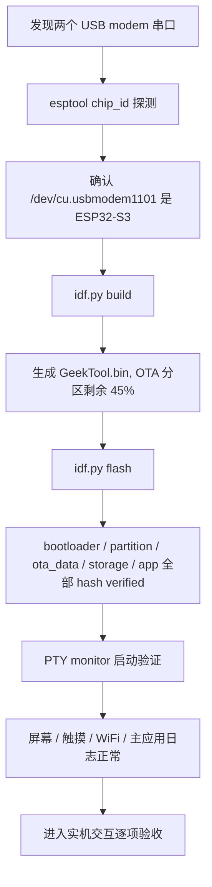
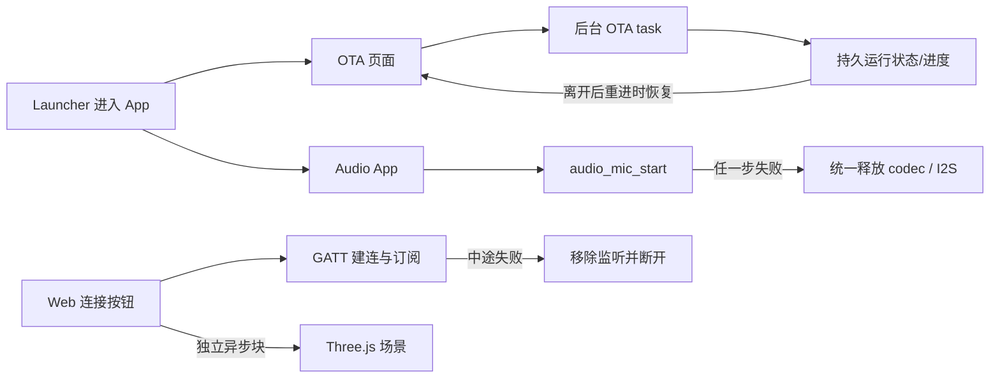
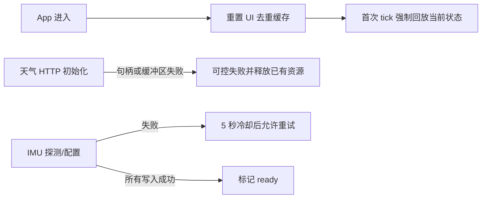
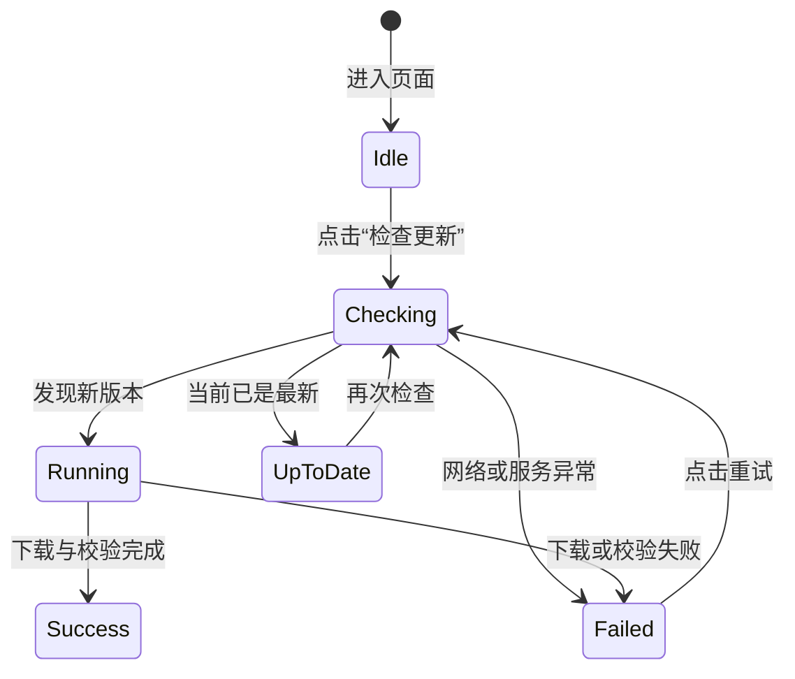
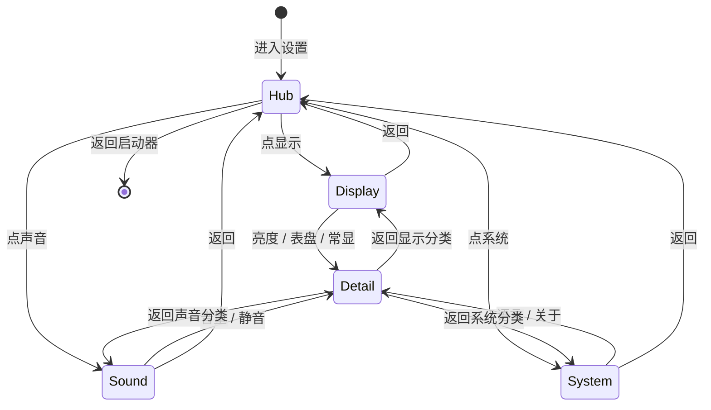

# GeekTool → ESP-IDF 移植配方与实现记录

早期移植目标:把 GeekTool 从 Arduino 迁到 **ESP-IDF + esp_lcd + esp_lvgl_port**,
用硬件 DMA 和缓冲流水线改善显示吞吐。配方来自小智(xiaozhi-esp32)官方对本板的支持。

**本地核对基线(2026-10-03)**:ESP-IDF 6.0.1、LVGL 9.5.0、esp_lvgl_port 2.8.0~1、
esp_codec_dev 1.5.10。下文早期版本表和设计目标为历史记录;当前调用链和验证见
[流畅性与动画优化](#2026-10-01-流畅性与动画优化)及
[OTA 失败恢复修复](#2026-10-02-ota-失败恢复修复)及
[实体按键功能对调](#2026-10-02-实体按键功能对调)及
[遥控台扩展](#遥控台扩展鼠标--演示--媒体)。CI 依赖差异见流畅性发布核对。

> 参考:`78/xiaozhi-esp32` → `main/boards/waveshare/esp32-s3-touch-amoled-1.75/`
> 该板同时支持 `1.75` 和 `1.75C`,我们用 **1.75C** 的引脚。

---

## 0. 关键结论

- **显示吞吐**:`esp_lcd` 的 QSPI **硬件 DMA**与缓冲流水线让 CPU 和推屏重叠。
  面板 TE 命令 `0x35` 已启用,当前代码没有 TE GPIO 同步;DMA/双缓冲本身不保证无撕裂,
  AMOLED 的实际流畅度仍需真机观察和测量。
- **LVGL 版本会变成 9**(`esp_lvgl_port 2.7.x` 依赖 LVGL v9)。所以我们的 UI 代码要做 **8.4 → 9 的 API 移植**
  (`lv_disp_*`→`lv_display_*`、`transform_zoom`→`transform_scale`、事件取参 `lv_event_get_param` 等)。

---

## 1. 依赖组件(组件管理器自动拉取)

| 组件 | 版本 | 作用 |
|------|------|------|
| `espressif/esp_lcd_co5300` | `^2.0.3` | CO5300 QSPI AMOLED 面板驱动(自带 + 可覆盖 init) |
| `waveshare/esp_lcd_touch_cst9217` | `^1.0.3` | CST9217 触摸 |
| `espressif/esp_io_expander_tca9554` | `==2.0.0` | 板载 TCA9554 IO 扩展(地址 000) |
| `esp_lvgl_port` | `~2.7.2` | LVGL 移植层(双缓冲/DMA/刷新,LVGL v9) |
| `lvgl/lvgl` | `~9.2` | GUI |

---

## 2. 1.75C 引脚(⚠ 和 Arduino 版不同!)

```
显示 QSPI:  CS=12  PCLK=38  D0=4  D1=5  D2=6  D3=7
LCD 复位:   GPIO1        ← 1.75C 是 1(非 C 是 39);Arduino 版误用了 2
触摸:       RST=2  INT=11  (I2C 共用总线)
I2C:        SDA=15  SCL=14
音频 I2S:   MCLK=16  WS=45  BCLK=9  DIN=10(麦)  DOUT=8(扬)   PA=46
TCA9554:    I2C 地址 000(0x20)
BOOT 键:    GPIO0
屏:         466×466,无 mirror/swap,列偏移 gap=0x06
```

## 3. CO5300 厂商初始化序列(QSPI 模式,来自小智已验证)

```c
static const co5300_lcd_init_cmd_t vendor_specific_init[] = {
    {0xFE, (uint8_t[]){0x20}, 1, 0}, {0x19, (uint8_t[]){0x10}, 1, 0}, {0x1C, (uint8_t[]){0xA0}, 1, 0},
    {0xFE, (uint8_t[]){0x00}, 1, 0}, {0xC4, (uint8_t[]){0x80}, 1, 0},
    {0x3A, (uint8_t[]){0x55}, 1, 0},   // 16bit/px
    {0x35, (uint8_t[]){0x00}, 1, 0},   // TE on
    {0x53, (uint8_t[]){0x20}, 1, 0}, {0x51, (uint8_t[]){0xFF}, 1, 0}, {0x63, (uint8_t[]){0xFF}, 1, 0},
    {0x2A, (uint8_t[]){0x00,0x06,0x01,0xD7}, 4, 0},
    {0x2B, (uint8_t[]){0x00,0x00,0x01,0xD1}, 4, 600},
    {0x11, NULL, 0, 600},              // sleep out
    {0x29, NULL, 0, 0},               // display on
};
```
亮度:命令 `0x51`(1 字节,0~255)。偶数对齐:LVGL9 用 `LV_EVENT_INVALIDATE_AREA` 回调把刷新区域 x1/y1 向下取偶、x2/y2 向上取奇(CO5300 必须)。

显示创建关键点(`esp_lvgl_port`):双缓冲 + 缓冲放 PSRAM + 合适的 buffer 大小,
开 `full_refresh` 或 `direct_mode` 以获得整帧一致刷新(无台阶撕裂)。

---

## 4. 前置条件(你的电脑)

- 安装 **ESP-IDF v5.1+**(VS Code 的 Espressif 插件,或命令行 `idf.py`)。这是 Arduino 之外的另一套工具链。
- 第一次构建会自动从组件管理器下载上面的依赖。

---

## 5. 推荐的推进顺序(里程碑)

1. **(强烈建议先做)验证前提**:用 IDF 直接编译小智官方固件的 `esp32-s3-touch-amoled-1.75c` 目标,
   烧到你板子上,确认 IDF 这套**在你的硬件上确实不撕裂**。顺带把 IDF 环境跑通。
2. **M1 — 显示底层**:新建独立 IDF 工程,用上面的组件 + 引脚 + init,点亮屏 + 触摸 +
   一个 LVGL9 轮播 smoke test,确认**滑动无撕裂、无台阶**。← 风险都在这一步,先单独打通。
3. **M2 — UI 移植**:把 GeekTool 的启动器 + WiFi/I2C/System 三个 app 从 LVGL 8.4 移到 9,接到 M1 上。
4. **M3 — 收尾**:AXP2101 真实电量、省电、OTA 等。

## M1 结论(已验证、已定稿)

显示底层跑通并接受。最终配置:`esp_lcd_co5300`(QSPI **80MHz**)+ `esp_lvgl_port`
**单缓冲**(内部 DMA,160 行)+ `swap_bytes`。构建:`idf.py set-target esp32s3 && idf.py build flash monitor`。

**踩坑经验(都很关键)**:
- **SPI DMA 必须开**(`spi_bus_initialize` 用 `SPI_DMA_CH_AUTO`)。关掉 = 轮询阻塞 = 和 Arduino 一样撕裂,优势全无。
- LVGL 缓冲放**内部 DMA RAM**(`flags.buff_dma=1`),**别放 PSRAM**(`buff_spiram`+DMA 之前点不亮)。
- SPI/QSPI 屏用**单缓冲**(`double_buffer=false`);双缓冲部分刷新会**闪烁**(小智 SPI 屏也是单缓冲)。
- QSPI 时钟 `io_cfg.pclk_hz = 80MHz` 提吞吐;花屏就降 60/40。
- `esp_io_expander_tca9554` 在 IDF6 缺 `esp_driver_i2c` 依赖 → 已从依赖移除,M2 要用再找兼容版本(别改 managed_components)。

**残留撕裂的最终结论**:`esp_lvgl_port` 的 `avoid_tearing` 只支持 **RGB/DSI** 屏;CO5300 是 **QSPI**,
推屏不与屏幕刷新同步,**全屏快滑的撕裂是架构上限,代码不再深抠**(用户已接受)。

## M2 进度

**M2a — 启动器 + 导航(已烧录,启动正常)** `launcher.c`
- "小面积运动"设计:静止黑底 + 居中大图标,切换只动中心一小块,避开整屏滑的撕裂。
- 切换动画 `swap_exec`:中心图标+名字半程滑出淡出 → 中点换内容 → 反向滑入淡入。
  旋钮在文件顶部:`SWAP_MS`(总时长)、`SWAP_SLIDE`(滑动幅度,设 0 = 纯淡入淡出)。
- 连击保护:动画进行中 `lv_anim_get` 命中则忽略新手势。

**M2b-1 — 共享列表 + System + I2C(已随整机烧录启动,System/I2C 交互待实机逐项验证)**
- `ui_list.c`:圆屏曲率聚焦滚动列表,三个 app 共用。LVGL 8→9 改名:`lv_event_send`→
  `lv_obj_send_event`、`get_child_cnt`→`_count`、`clear_flag`→`remove_flag`、
  `LV_LABEL_LONG_DOT`→`..._MODE_DOTS`、回调里 `lv_event_get_target_obj`。
- `app_sys.c`:`ESP.*` → `esp_chip_info`/`esp_flash_get_size`/`esp_psram_get_size`/
  `esp_get_free_heap_size`/`esp_get_idf_version`;`millis()`→`esp_timer_get_time()/1000`。
- `app_i2c.c`:Arduino `Wire` → `i2c_master_probe()`;总线由 `main.c` 创建,经新增的
  `board_i2c_bus()`(声明在 `board_config.h`)共享给 app。

**M2b-2 — WiFi(已随整机烧录启动,自动重连已验证,配网交互待实机逐项验证)** `app_wifi.c`
- Arduino `WiFi` → `esp_wifi`:`wifi_svc_init()` 一次性建 netif/event loop/wifi 并 `start`;
  扫描 `esp_wifi_scan_start(async)`,连接 `esp_wifi_set_config`+`esp_wifi_connect`。
- **线程约定(关键)**:esp_wifi/IP 事件回调**只写 volatile 标志位,绝不碰 LVGL**;
  所有 UI 更新放在 `wifi_tick()`(LVGL 任务)里轮询标志 —— 沿用 Arduino 的轮询模型,
  免去给 LVGL 额外上锁。密码键盘对话框照搬到 LVGL 9(`lv_btn`→`lv_button`、
  `lv_obj_del_async`→`lv_obj_delete_async`)。去掉了 Arduino 版填充用的假网络。
- 依赖:`main/CMakeLists.txt` 加 `esp_wifi esp_netif esp_event`(及 M2b-1 的 `esp_timer` 等)。

**Flash**:16MB → **32MB**(`sdkconfig.defaults` 已改 `CONFIG_ESPTOOLPY_FLASHSIZE_32MB`)。
当前 `partitions.csv` 是双 OTA app 槽(`ota_0`/`ota_1` 各 3MB)+ 4MB `storage`;烧录会写入
`ota_data_initial.bin`,让新固件从 `ota_0`(`0x20000`) 启动。

## 2026-07-13 烧录验证记录

- 目标串口:`/dev/cu.usbmodem1101`。`esptool.py chip_id` 确认为 ESP32-S3 rev v0.2、8MB PSRAM、MAC
  `a4:cb:8f:d6:35:b8`;另一个 `/dev/cu.usbmodem309NTPCEG5682` 无串口响应,本次未使用。
- 环境:`export PATH="/opt/homebrew/bin:$PATH"` 后 `source ~/.espressif/v6.0.1/esp-idf/export.sh`;
  使用 ESP-IDF v6.0.1。
- 构建:`idf.py -p /dev/cu.usbmodem1101 build` 通过,生成 `build/GeekTool.bin`;
  镜像大小 `0x1a3fb0`,3MB OTA app 分区剩余 `0x15c050`(45%)。
- 烧录:`idf.py -p /dev/cu.usbmodem1101 flash` 写入 bootloader、partition table、`ota_data_initial.bin`,
  `storage.bin` 和 `GeekTool.bin`,所有段均 `Hash of data verified`,最后 hard reset 成功。
- 串口启动:`idf.py monitor` 需交互式 TTY;普通管道会报 `Monitor requires standard input to be attached to TTY`。
  使用 PTY 监视后确认从 `ota_0`(`0x20000`) 启动,Flash 32MB、PSRAM 8MB 正常识别。
- 启动日志已确认:`CO5300 panel ready`、`LVGL task`、`CST9217 touch ready`、`GeekTool M2a up`;
  WiFi 自动连接 `superRice`,获取 IP `192.168.2.109`。本次固件版本显示为 `d067acd-dirty`,
  对应烧录的是当前未提交工作区状态。
- 续烧录:当前工作区新增/修改了 `bootkey.*`、`app_fluid.c`、启动器和若干 app 文件后再次执行
  `idf.py -p /dev/cu.usbmodem1101 flash`;`GeekTool.bin` 大小 `0x1a48f0`,3MB OTA app 分区剩余
  `0x15b710`(45%)。bootloader、partition table、`ota_data_initial.bin`、`storage.bin` 和 `GeekTool.bin`
  全部 `Hash of data verified`;PTY monitor 再次确认屏幕、触摸、主应用和 WiFi 自动重连正常。
- 再次续烧录:当前工作区继续修改 `app_wifi.c`、`lock.c`、`main.c`、`sdkconfig.defaults` 等后执行
  `idf.py -p /dev/cu.usbmodem1101 flash`;由于 `sdkconfig.defaults` 变化触发完整重编译。`GeekTool.bin`
  大小 `0x1a79b0`,3MB OTA app 分区剩余 `0x158650`(45%)。所有写入段仍全部 `Hash of data verified`;
  PTY monitor 确认从 `ota_0` 启动,Flash 32MB、PSRAM 8MB、CO5300、CST9217、LVGL、主应用和 WiFi 自动重连正常,
  WiFi 获取 IP `192.168.2.109`;日志显示 Light sleep 已启用。
- 本轮续烧录:继续执行 `idf.py -p /dev/cu.usbmodem1101 flash`,仅增量重编译 `app_fluid.c` 等;
  `GeekTool.bin` 大小 `0x1a7d20`,3MB OTA app 分区剩余 `0x1582e0`(45%)。bootloader、partition table、
  `ota_data_initial.bin`、`storage.bin` 和 `GeekTool.bin` 全部 `Hash of data verified`;PTY monitor 确认从
  `ota_0` 启动,Flash 32MB、PSRAM 8MB、CO5300、CST9217、LVGL、主应用和 WiFi 自动重连正常,IP 仍为
  `192.168.2.109`,Light sleep 仍启用。串口还看到 `enter maze` / `QMI8658 ready` / `enter fluid` 日志,
  仅代表 app 可进入并初始化到该阶段,交互效果仍需肉眼验收。
- 未完成的实机操作验收:启动器左右滑/进入/返回、System/I2C 列表、WiFi 扫描与密码连接、天气请求、
  设置亮度/音量、锁屏/侧键/省电、OTA 真 URL、音频 app 的 `rms=` 随声音变化。


```mermaid
flowchart TD
    A["发现两个 USB modem 串口"] --> B["esptool chip_id 探测"]
    B --> C["确认 /dev/cu.usbmodem1101 是 ESP32-S3"]
    C --> D["idf.py build"]
    D --> E["生成 GeekTool.bin, OTA 分区剩余 45%"]
    E --> F["idf.py flash"]
    F --> G["bootloader / partition / ota_data / storage / app 全部 hash verified"]
    G --> H["PTY monitor 启动验证"]
    H --> I["屏幕 / 触摸 / WiFi / 主应用日志正常"]
    I --> J["进入实机交互逐项验收"]
```

## M3 进度

**M3a — AXP2101 真实电量 + 充/放电可视化(已随整机烧录启动,电量显示和充放电表现待肉眼验证)**
- `power.c`/`power.h`:挂 AXP2101(I2C `0x34`),只读不写。电量 `0xA4`,
  方向 `0x01[6:5]`(1=充/2=放),充满 `0x01[2:0]==100`(寄存器取自小智 `common/axp2101.cc`)。
- `launcher.c` `battery_timer_cb` 每 2s 读一次,更新电量环 + ⚡:
  - 环颜色编码状态:放电 = 绿/琥珀/红(按电量);充电 = 青蓝(`COL_WIFI`);充满 = 绿(`COL_OK`)。
  - ⚡(`LV_SYMBOL_CHARGE`,顶端居中)仅充电/充满时显示;**充电时呼吸**(透明度动画)、充满常亮。
    只动这一小块,守住"小面积运动"避撕裂原则。
- 电量环写死的 72 已去掉(初始 0,开机立即读一次)。
- 充电参数(CV 电压/充电电流)没碰 —— 要调照小智板级 init 写 `0x64/0x61/0x62/0x63`。

**M3b — 锁屏 / Nothing 表盘 / 侧键 / 省电(已随整机烧录启动,侧键和省电策略待实机操作验证)**
- `watchface.c`:全屏黑底点阵表盘,挂 `lv_layer_top`(盖住启动器+app)。手绘 5×7 点阵数字、
  60 点外环、红点冒号(1Hz 闪)、沿环走的秒点;数字每分钟才重建 → 低运动避撕裂。
  下方信息区:日期、WiFi 名、电量% + IP(连上 WiFi 后显示)。
- `lock.c`:**AXP2101 PWRON 侧键**(不是 BOOT)—— 短按=锁/解切换、长按=关机。
  去抖+长短判定由 PMU 硬件做,软件只轮询 IRQ(`power_key_event`:`0x49` bit3=短/bit2=长,写 1 清,
  使能在 `0x41`)。表盘**上滑解锁**。省电:**锁屏+放电**时空闲 15s 变暗(亮度 `0x20`)→
  30s 熄屏(`display_sleep`);**充电常显**;触摸/按键唤醒。
- `display.c` 新增 `display_set_brightness`(`0x51`)+ `display_sleep`(`disp_on_off`)。
- 时间:`localtime`(时区 `CST-8` 在 main 设),WiFi 连上后 `esp_sntp` 自动校时(`pool.ntp.org`)。
  **没接 PCF85063 RTC**,没联网时表盘从开机零点起走。
- PWRON 键寄存器取自 XPowersLib(`~/Documents/Arduino/libraries/XPowersLib`)。

**M3c — OTA(本段记录初版移植;当前发布链路见根 README 与本文件 2026-07-19 记录)**
- `partitions.csv`:改双 app 槽 `ota_0/ota_1`(各 3MB)+ `otadata`(原单 `factory`)。
  **改了分区表,下次 flash 会重新分区**;`nvs` 偏移不变(WiFi 配置等保留)。
- `app_ota.c`:点更新环 → 独立任务跑 `esp_https_ota`(带 crt bundle,支持 HTTPS),成功后
  `esp_restart`,状态在 `ota_tick` 显示。**需先连 WiFi**。当前按 NVS beta 开关选择 Cloudflare R2
  正式对象 `GeekTool.bin` 或内测对象 `GeekTool-beta.bin`,不再使用初版的本地占位 URL。
- 依赖加了 `esp_https_ota app_update esp_http_client esp-tls mbedtls`。

## 里程碑完成

M1 显示 → M2 启动器+WiFi/I2C/System → M3 电量/锁屏/Nothing 表盘/省电/OTA。
可选后续:点阵日期、充电常显防烧屏(降亮度)、OTA 进度条、PCF85063 离线走时。

## UI 统一 — Nothing 单色(已随整机烧录启动,视觉细节待肉眼验收)

全局改造靠两个集中开关,不逐控件改:
- **调色板**(`app.h`):全部收敛到 黑`COL_BG` / 白`COL_TXT` / 灰`COL_TXT2` / 一个红`COL_RED`。
  旧彩色别名(`COL_WIFI/I2C/SYS/OTA/OK/RING`)都 `#define` 成白、`COL_WARN`=红 → 改这几行就能全局变色,各 app 不用动。
- **主题**(`main.c`):`lv_theme_default_init(disp, 红, 白, dark=true, montserrat)` + `lv_display_set_theme`
  → 键盘/按钮/文本框等默认控件统一暗色红强调。`sdkconfig.defaults` 开了 `LV_USE_THEME_DEFAULT`。
- **字体**(`app.h` 三个宏):正文 `UI_FONT_L/M` = 内置点阵像素字 `unscii_16`;含图标(⚡ / ‹ › / 键盘符号)的
  标签用 `UI_FONT_SYM` = `montserrat_20`(unscii 没有图标字形,符号会变空格)。开了 `UNSCII_8/16`。
- 细节:启动器图标 → **描边圆环**(不填充);OTA → **红色 CTA 按钮**;电量环 放电=白 / 低电+充电=红;
  表盘布局没动(用户要求),只把日期/WiFi 标签换成同一像素字(电量行因带 ⚡ 仍用 montserrat)。

**换真 Ndot 字体**:现用内置 unscii(够 Nothing 味、零转换风险)。要上 Nothing 官方 **Ndot**:
用 lv_font_conv 把 Ndot.ttf 转 LVGL 字体(合并 `0xF000-0xF8FF` 符号区),丢进 `main/`,
`app.h` 把 `UI_FONT_L/M` 指过去即可 —— 字体已集中,改一处。

## App 点描图标 + 天气 app(已随整机烧录启动,天气请求和图标观感待实机操作验证)

- **点描图标**:通用画法在 `glyph.c`/`glyph.h`(`glyph_arc`/`glyph_line`/`glyph_circle` 沿轮廓匀距撒小圆点,
  比之前 9×9 大点精致)。启动器图标 `launcher.c` 的 `ic_wifi/ic_scan/ic_chip/ic_ota/ic_sun`
  (`ICON_FN[]` **顺序对齐 `APPS[]`**),细线轮廓 + 红点焦点。加新 app = `APPS[]` 和 `ICON_FN[]` 各加一行。
- **天气 app**(`app_weather.c`,第 5 个):**Open-Meteo**(`api.open-meteo.com`,**HTTP** 不用 HTTPS,无 key)拿
  当前温度 + WMO 天气码 + 湿度 + **当日低/高温**。响应 ~1-2KB。**不用 cJSON**(组件名解析不到的坑):
  十几行 `json_num`(strstr 找 `"key":` 取无引号数值,数组跳 `[`)解析,**先定位到 `current`/`daily` 段**
  再取值,避开前面 `*_units` 段同名键的字符串值。天气码→图标用 `draw_wicon(int code)` 按 WMO 区间选(`wmo_desc` 给文字)。
  云/晴/雨/雪图标都用 `glyph_*` 点描(云 = 重叠圆求外轮廓 + 底边线);温度 5×7 大点阵 + 度环。
  顶部标题 `launcher_set_title(CITY)` 显示城市(`icon_cb` 已改成先设标题再 `enter`,app 可覆盖)。
  布局 y 固定不重叠:云 87–192 / 温度 205–296 / 天气 312 / 低高+湿度 344 / 状态 376。需先连 WiFi,换城市改 `WX_LAT/WX_LON`。
- 坑回顾:① `glyph_dot` 漏了 `bg_opa`(remove_style_all 后默认透明)→ 点全看不见,补 `LV_OPA_COVER`。
  ② GCC `-Wformat-truncation` 对小缓冲 snprintf 误报 → `main/CMakeLists.txt` 加 `-Wno-format-truncation`。
  ③ **天气走 HTTP 不走 HTTPS**:S3 内部 RAM 被显存(单缓冲 160 行)+WiFi 占满,mbedtls `ssl_setup`
  分配不出 ~32KB 收发缓冲 → `-0x008D` 失败。公开天气数据没必要 TLS,Open-Meteo 裸 HTTP 直接给 JSON。
  ④ **天气图标用户不满意但决定不改了**(试过 9×9 实心 / 描边 / 重叠圆 / 网格点阵几版),维持现状。

## 设置 app(第 6 个,已随整机烧录启动,滑条交互待实机操作验证)

- `settings.c`/`settings.h`:全局亮度 + 音量状态,存 NVS(命名空间 `settings`)。
  - **亮度**:`settings_set_brightness` 直接驱动 CO5300(`display_set_brightness`),拖动实时、松手才写 NVS(防频繁写 flash)。
    开机 `settings_init()`(在 `main.c` `display_init()` 之后)从 NVS 读并应用;**锁屏唤醒亮度也读它**
    (`lock.c` 的 `SCR_FULL` 改用 `settings_brightness()`,不再写死 `0xFF`)。
  - **音量**:存值(0-100)+ NVS,当前已接 `audio_out.c` 的 ES8311/I2S 输出。设置页可播放短提示音,
    倒计时结束可播放闹铃;麦克风与扬声器共用 I2S0,各 App 退出时必须完整释放后再切换。
- `app_settings.c`:两个 `lv_slider`(主题红强调),`VALUE_CHANGED` 实时应用、`RELEASED` 存 NVS。
- 启动器图标 `ic_settings`(三条滑轨,中间旋钮红)。`APPS[]`/`ICON_FN[]` 都加到第 6 项。
- **⚠ QSPI 命令编码坑(亮度一直不生效的根因)**:CO5300 走 QSPI 时,任何直接发的命令都要按 QSPI 编码 ——
  `cmd = (0x02 << 24) | (real_cmd << 8)`(`0x02` = 写命令 opcode)。驱动内部 `tx_param` 自动这么做,
  所以 init 的 `0x51` 没问题;但 `display_set_brightness` 之前发的是**裸 `0x51`**,面板收不到。
  已修(`display.c`)。以后任何 `esp_lcd_panel_io_tx_param` 直接发 CO5300 命令都得这样编码。

## 音频可视化 app(第 7 个,**已随整机烧录启动 —— 音频采集仍需实机进入 app 看 `rms=` 验证**)

- `audio_mic.c`/`.h`:麦克风采集。**ES7210(4 路 TDM)+ I2S RX(master)→ esp_codec_dev**,读单声道 16bit @ 16kHz。
  配置对齐小智 `BoxAudioCodec` 输入侧;I2S 用 `I2S_CHANNEL_DEFAULT_CONFIG` / `I2S_TDM_*_DEFAULT_CONFIG` 宏(跨 IDF 版本稳)。
  ES7210 总线 7-bit 地址是 `0x40`,但 `esp_codec_dev` 的 `audio_codec_i2c_cfg_t.addr` 要传 8-bit
  写地址 `ES7210_CODEC_DEFAULT_ADDR`(`0x80`,组件内部再右移为 `0x40`);当前输入增益为 40dB。
  新增依赖 `espressif/esp_codec_dev`(组件管理器首次 build 下载)+ `esp_driver_i2s`。
- `app_audio.c`:独立任务读一帧(480 样本)→ 对 18 个对数分布频点跑 **Goertzel** → `s_band[]`(快上慢下平滑);
  `audio_tick` 把 18 根竖条按能量设高度 + 颜色(低青/中黄/高红,**音频 viz 特意破单色**)。任务里 `ESP_LOGI("audio","rms=%.0f")` 供验证拾音。
- **风险**:① 首次 build 要下 `esp_codec_dev`,API 字段万一对不上会编译报错(照报错改);② 采集能不能真拾到音
  得看串口 `rms=` 有没有随声音跳 —— 这部分我没法离线测,大概率要在板上调增益/格式。退出时任务自己 `audio_mic_stop` 收尾。
- **⚠ 内存坑(加音频后开机黑屏)**:`esp_codec_dev`+I2S 链进来后内部 RAM 吃紧,LVGL 那块 466×160 单缓冲(~146KB 内部 DMA RAM)
  分配失败(`lvgl_port_add_disp ... Not enough memory for buf1`)→ 显示根本没起来 = 黑屏。把缓冲从 **160 行降到 80 行**
  (`display.c` `buffer_size = LCD_H_RES*80`,~73KB)就放得下了。再加 app 若又不够,继续降行数(别放 PSRAM,本板 PSRAM+DMA 点不亮)。
- 另:亮度下限抬到 `SETTINGS_BRIGHT_MIN=0x40`(25%)+ 开机夹住,防止存了过低亮度导致开机看着黑屏(和上面那个是两回事)。
- **⚠ ES7210 要 AXP2101 ALDO1 供电(写 0x40 全 NACK 的根因)**:音频 codec(ES7210/ES8311)挂在 **ALDO1**(3.3V)。
  小智在 `Pmic` 构造里 `0x92=(3300-500)/100` 设压 + `0x90 |= bit0` 开 ALDO1。我之前 `power.c` 只读 AXP2101、没开这轨 →
  ES7210 没电 → I2C 写 `0x40` 全 NACK → `es7210 open fail`。已加 `power_audio_on()`(只开 ALDO1、不碰其它轨),
  在 `audio_mic_start` 开头调用 + 60ms 上电延时。I2C 扫描看到 `0x40` 是对的,但传给
  `esp_codec_dev` 控制器的配置值必须是 8-bit `0x80`。

## 数字孪生退出 + 充电 95% 修复

- **twin app 退出卡死**:`go_home()` 在 LVGL 任务里同步调用 `cur_app->exit()`。旧版 `ble_twin_stop()` 在退出里直接
  `nimble_port_stop()` + `nimble_port_deinit()`,而 IDF NimBLE 的 `nimble_port_stop()` 会用永久等待等 host stop 完成;
  一旦 stop/deinit 与 GAP 事件、连接断开或 WiFi 恢复抢时序,LVGL 任务就可能卡住。第一次只加 `s_stopping` 阻止
  `DISCONNECT`/`ADV_COMPLETE` 重新广播,但仍保留同步 stop/deinit,实机退出仍会卡。
  当前修正:BLE host 跟 WiFi service 一样只初始化一次;twin 退出只清 RX 回调、停广播、断开当前连接、关闭前台 active 标志,
  不再在 LVGL 任务里 deinit NimBLE。后续注意:任何 app 的 `exit()` 都会跑在 LVGL 任务里,不要在里面做不可控的长阻塞;
  对系统协议栈优先采用"服务常驻 + 前台启停"模型,不要每次 app 退出都强制 deinit。
  ```mermaid
  flowchart TD
      A["进入 twin app"] --> B["ble_twin_start"]
      B --> C{"NimBLE host 已运行?"}
      C -- "否" --> D["初始化 NimBLE host + 注册 GATT"]
      C -- "是" --> E["仅打开 active 标志"]
      D --> F["host sync 后开始广播 GeekTwin"]
      E --> F
      F --> G["采样任务 notify IMU/电量帧"]
      H["退出 twin app"] --> I["停止采样 + 清 RX 回调"]
      I --> J["关闭 active 标志"]
      J --> K["停广播/断开当前连接"]
      K --> L["保留 NimBLE host,返回启动器"]
  ```
- **充电最多约 95%**:`power.c` 原来沿用 xiaozhi 示例的 AXP2101 CV 4.1V 保守档(`0x64=0x02`)。
  对普通 4.2V 锂电,4.1V 截止常会让电量计停在 95% 左右。已改为 `0x64=0x03`(4.2V),保留预充 50mA、终止 25mA、
  默认输入限流和温度降流策略不变。后续注意:不要改到 4.35V/4.4V,除非确认电池本身是高压锂电。

## 2026-07-19 代码与文档一致性优化

### 状态

- 已实现、已完成本机构建与浏览器验证

### 背景与当前行为

- 仓库代码与 Tag 已到 `v1.7-beta.5`,启动器实际注册 16 个 App,但根 README 仍停在
  `v1.4 / 15 个 App`,且本文件早期的 OTA URL、音频输出和 ES7210 地址说明已经被后续实现推翻。
- OTA 任务允许离开页面后在后台继续下载,但再次进入页面会把 `s_state/s_pct` 重置为空闲,
  UI 与仍在运行的任务脱节。
- `audio_mic_start()` 在 I2S 或 codec 初始化中途失败时直接返回,不会释放前面已经创建的对象;
  再次进入音频 App 可能继续泄漏资源或因 I2S0 被占用而失败。
- Web 蓝牙连接在 GATT 服务发现或通知订阅中途失败时没有统一清理设备事件和连接;Three.js 场景也随首包同步加载。

### 目标、范围与非目标

- 目标:修复上述生命周期问题,降低 Web 首包耦合,并让入口文档反映当前真实代码。
- 范围:`app_ota.c`、`audio_mic.c`、`app_audio.c`、Web 连接/场景入口、根 README、Web README 与本记录。
- 非目标:不升级 ESP-IDF 组件版本,不调整硬件参数、分区表、BLE 协议、OTA 发布地址或现有 UI 视觉。
- 本轮只做本机构建与静态检查;没有连接开发板,因此不把 OTA、音频、BLE 或屏幕效果标记为真机通过。

### 调用链与方案


```mermaid
flowchart LR
    L["Launcher 进入 App"] --> O["OTA 页面"]
    O --> T["后台 OTA task"]
    T --> S["持久运行状态/进度"]
    S -->|"离开后重进时恢复"| O
    L --> A["Audio App"]
    A --> M["audio_mic_start"]
    M -->|"任一步失败"| C["统一释放 codec / I2S"]
    W["Web 连接按钮"] --> G["GATT 建连与订阅"]
    G -->|"中途失败"| D["移除监听并断开"]
    W -->|"独立异步块"| R["Three.js 场景"]
```

### 验收、风险与回滚

- `idf.py -C GeekTool-IDF build` 通过,并记录镜像大小与分区余量。
- `npm --prefix web run build` 通过,对比拆分前后的产物体积。
- `git diff --check` 通过,README 的版本、App 数量、音频与 OTA 描述能由当前代码佐证。
- 风险集中在异步退出/重入时序;实现保持后台 OTA 策略不变,只恢复真实状态。若真机发现回归,
  可按文件回退本节涉及的局部生命周期修改,不需要更改 NVS、分区或发布对象。

### 实际实现结果

- `app_ota.c` 不再在页面进入时清空后台状态;重进会重置 UI 去重缓存,再由首个 `ota_tick`
  恢复检查中、下载进度、成功、失败或已是最新状态。重新发起更新时仍会把进度归零。
- `audio_mic.c` 对 TDM、data/control interface、ES7210 codec、codec device 和 open 的失败分支
  统一调用幂等清理;`app_audio.c` 在建任务前置位 alive,并在旧任务仍未退出时拒绝重复创建。
- Web GATT 服务发现或通知订阅中途失败时会移除事件监听并断开;Three.js 场景使用
  `lazy + Suspense`,姿态算法只直引 Three 数学子模块,避免渲染器回流主包。
- 固件构建通过:`GeekTool.bin` 为 `0x1ced30`,3 MiB OTA 分区剩余 `0x1312d0`(40%)。
- Web 类型检查与生产构建通过:主包从 `620.71 kB` 降到 `172.11 kB`(约 -72%),
  Three.js 场景独立为 `462.85 kB`,不再出现 500 kB chunk 告警。
- 应用内浏览器在 `1280 x 720` 和 `390 x 844` 验证页面非空、canvas=1、无错误覆盖层、
  干净会话无 console error/warn;点击“重置”后可见状态变为“校准已重置”,移动视口无横向溢出。
- `git diff --check` 通过。未连接开发板,OTA 后台重入、ES7210 失败重试和真实 BLE 连接仍需真机复验。

### 与原计划的偏差

- 初次只动态导入 `CubeScene` 时,Three 顶层入口仍被姿态算法共享,主包几乎没有下降;随后改为
  直接引用 `Quaternion/Vector3/MathUtils` 子模块,才实现真实拆包。没有扩大到依赖升级或 UI 重设计。

## 2026-07-19 第二轮异常路径优化

### 状态

- 已实现、已完成本机构建与静态验证

### 当前行为与范围

- 天气任务未检查 `esp_http_client_init()` 返回的句柄;内存紧张时可能带着空句柄继续 open/close。
- 天气和鼠标 App 用跨页面保留的静态值去重;重进页面时如果连接/失败状态未改变,
  新创建的标签可停在“正在启动”或“正在获取”。
- IMU 探测只执行一次,配置寄存器写入失败仍会标记 ready;瞬时 I2C 异常后也不会恢复。
- 本轮限定修改 `app_weather.c`、`app_mouse.c` 和 `imu.c`,不改天气 API、BLE HID 协议、
  IMU 量程/坐标映射、NVS 数据或 UI 布局。

### 方案与验收


```mermaid
flowchart LR
    E["App 进入"] --> R["重置 UI 去重缓存"]
    R --> S["首次 tick 强制回放当前状态"]
    H["天气 HTTP 初始化"] -->|"句柄或缓冲区失败"| F["可控失败并释放已有资源"]
    I["IMU 探测/配置"] -->|"失败"| C["5 秒冷却后允许重试"]
    I -->|"所有写入成功"| O["标记 ready"]
```

- 天气 HTTP 对 client/body 失败分支不解引空句柄,任务仍能正常退出并允许后续重试。
- 天气/鼠标每次进入都回放当前状态,并恢复与状态匹配的文字颜色。
- IMU 只在全部配置写入成功后标记可用;失败后限频重试,避免每帧冲击 I2C。
- 固件构建、`git diff --check` 与相关静态检查通过;未接开发板时,保留天气断网恢复、
  BLE 重连和 IMU I2C 故障注入为真机待验证项。

### 实际实现结果

- `app_weather.c` 对 HTTP client 和 8 KiB body 分配分别判空;只有 open 成功才 close,
  只要 client 存在就 cleanup,异常分支最终设为 `WX_FAIL` 并释放 body。
- 天气页进入时重置 `s_shown`,加载/成功时把状态文字颜色恢复为次要色;
  鼠标页用 `s_link_state_known` 保证首次 tick 必定显示配对或已连接,且启动失败文案不会被覆盖。
- `imu.c` 检查 CTRL1/2/3/7 全部写入;探测或配置失败会移除已添加的 I2C device,
  后续读取按 5 秒冷却重试,不再将部分初始化当作 ready。
- ESP-IDF 6.0.1 完整构建通过:`GeekTool.bin` 为 `0x1cef40`,3 MiB OTA 分区剩余
  `0x1310c0`(40%);Web 类型检查与 Vite 生产构建再次通过,主包 `172.11 kB`,异步场景 `462.85 kB`。
- `git diff --check` 通过。本轮未接开发板,因此天气断网/内存紧张分支、BLE 鼠标重进与
  QMI8658 故障注入仍是真机待验证,不作真机通过表述。

### 与计划的偏差

- 无。未扩大到 NVS 自动擦除或更底层的 I2C 总线重置,避免引入用户数据丢失或跨模块影响。

## 2026-07-19 OTA 圆屏视觉重构（Orbit Console）

### 状态

- 已实现、已完成本机构建与 466×466 离线视觉 QA;真机待验证

### 背景与当前行为

- 真机照片显示 OTA 页同时存在全局 458px 充电/电量环和页面内 268px 完整进度环,形成重复的
  “靶心”视觉;版本文字压在内环上沿,标题、返回键、版本和主操作缺少统一纵向秩序。
- 空闲态中央只有下载符号,点击含义依赖底部提示文字;“测试通道”标签和开关又独立贴在屏幕下沿,
  主操作、状态说明和次要设置没有形成清晰层级。
- OTA 后台任务、退出后继续下载、再次进入恢复状态等行为已经稳定,本轮只重构 OTA 页的
  LVGL 表现层,不改下载地址、版本比较、任务生命周期、分区或发布协议。

### 目标、范围与非目标

- 采用已确认的 **Orbit Console** 方向:保留全局外环作为设备状态边界,页面内部改为顶部留口的
  点阵轨道,把“检查更新”作为唯一主操作,底部测试通道收进一枚紧凑胶囊。
- 覆盖 `空闲 / 检查中 / 下载中 / 成功 / 已是最新 / 失败` 六种页面状态;所有状态沿用项目已有
  黑底、白灰点阵、红色交互强调和绿色成功语义,不引入图片资源或新的渲染依赖。
- 非目标:不改启动器全局标题/返回/电量层的通用布局,不新增 OTA 能力,不修改 Wi-Fi 与 OTA 业务逻辑,
  不扩大到其他 App 的视觉重构。

### 信息层级与状态流


```mermaid
stateDiagram-v2
    [*] --> Idle: 进入页面
    Idle --> Checking: 点击“检查更新”
    Checking --> Running: 发现新版本
    Checking --> UpToDate: 当前已是最新
    Checking --> Failed: 网络或服务异常
    Running --> Success: 下载与校验完成
    Running --> Failed: 下载或校验失败
    Failed --> Checking: 点击重试
    UpToDate --> Checking: 再次检查
```

- 顶部:全局返回键与“在线更新”标题,下方只显示一行当前版本。
- 中部:开放式点阵轨道承载检查动画或下载进度;中央图标、百分比和主操作文案保持同一视觉焦点。
- 底部:状态说明位于轨道下方;测试通道作为次要设置固定在独立胶囊内,不与主操作争夺注意力。

### 实施步骤与验收标准

1. 移除 OTA 页完整内环和无语义的上下漂浮动画,建立开放式点阵轨道与统一状态渲染函数。
2. 重排版本、中央图标/百分比、状态说明、主操作热区与测试通道胶囊,保持 466×466 圆屏安全区。
3. 保留现有触摸行为和后台状态恢复;运行态以轨道显示真实进度,其余状态提供明确反馈与重试入口。
4. ESP-IDF 完整构建和 `git diff --check` 必须通过;静态检查确认六种状态均有明确视觉输出。
5. 视觉验收:不再出现双完整圆环,文字不压线、不贴屏幕边缘,空闲态无需阅读说明即可识别主操作,
   测试通道保持可触达但视觉降级。离线预览只用于几何核对,最终 AMOLED 亮度、触摸命中和动态流畅度
   仍以真机照片/操作为准。

### 风险与回滚

- 点阵对象比单个 `lv_arc` 更多,但数量会控制在与现有秒表刻度同一量级;若真机刷新或内存出现回归,
  可只回退 `app_ota.c` 的表现层,不会影响 OTA 任务和分区数据。
- 全局充电环颜色由电池状态决定,页面不能假设外环始终为绿色;内部成功态仍需靠图标和文字独立表达。

### 实际实现结果

- `app_ota.c` 删除页面内完整 `lv_arc` 和上下弹跳动画,改为 54 个 LVGL 原生点组成的 260° 开放轨道。
  空闲态为白色轨道+红色起点,检查态由红色前沿沿轨道运行,下载态显示真实百分比、白色已完成段和红色前沿。
- 中央下载/对勾/叉继续复用项目 `glyph_line` 点阵语言;主操作文案改为“检查更新”,空闲、失败和已最新态
  共用 214×178 热区,检查/下载/成功待重启时自动禁止重复点击。
- 测试通道改为 192×48 底部胶囊,保留原设置持久化;检查、下载和成功待重启阶段禁用开关,
  避免用户将中途切换误解为会改变当前任务的下载通道。
- 六种状态在 466×466 本地几何预览中逐项核对,并将选定参考与空闲态预览按同尺寸并排比较;
  轨道顶部留口、版本行、主操作、状态反馈和底部胶囊均无可见越界或文字压线。
- ESP-IDF 6.0.1 完整构建通过:`GeekTool.bin` 为 `0x1cf500`,3 MiB OTA 分区剩余
  `0x130b00`(40%);`git diff --check` 通过。设计核验记录见根目录 `design-qa.md`。
- 本轮没有烧录开发板,因此 AMOLED 实际亮度、54 点轨道动画流畅度、主操作/开关触摸命中、六状态真机画面
  仍列为待验证,不以浏览器几何预览替代真机结论。

### 与计划的偏差

- 选定概念的底部胶囊更窄;实现为容纳现有 54×28 开关、中文标签和触摸间距扩大到 192px。
  其余偏差仅来自全局电量环和字体属于启动器共享层,本轮按非目标保持不变。

## 2026-07-20 设置页三分类视觉重构

### 状态

- 已实现、已完成本机构建与 466×466 离线视觉 QA;真机 OTA 后待验证

### 背景与当前行为

- 真机设置首页把显示、声音、系统的 7 个具体选项连续放进多张 306px 深色矩形卡片。虽然功能完整,
  但圆屏首屏主要被一个手机式列表卡占据,所有行视觉权重接近,分组标题与内容脱节,下方内容也缺少明确的层级预告。
- 当前返回关系只有“全部选项菜单 → 单项详情”两层;本轮按确认方案改为“设置首页 → 分类 → 单项详情”三层,
  让首屏只承担分类选择,具体设置在分类内出现。
- 亮度、表盘、常显、音量、静音、语言、关于的现有业务回调、NVS 存储、音量试听与运行时立即生效行为
  均为兼容约束,不能因视觉重构改变。

### 目标、范围与非目标

- 设置首页只显示 `显示 / 声音 / 系统` 三个大触摸入口,带实时摘要、点阵图标和次要箭头;
  中间“声音”入口用轻表面和红色焦点点强调,上下入口退为黑底描边,复现选定方案的视觉层级。
- 分类页使用轻量独立行展示该分类内的具体选项,不再用一个大矩形把所有内容包住;详情页继续使用适合圆屏的
  大读数滑块、大开关、表盘/语言选择和 About 信息。
- 非目标:不修改设置数据结构、默认值、亮度下限、音量输出、AOD/静音语义、表盘资源或全局电量环/返回键布局。
- 本次与上一节 OTA Orbit Console 改动共同进入下一测试版;发布前必须同时通过固件构建和代码一致性检查。

### 导航与动画


```mermaid
stateDiagram-v2
    [*] --> Hub: 进入设置
    Hub --> Display: 点显示
    Hub --> Sound: 点声音
    Hub --> System: 点系统
    Display --> Detail: 亮度 / 表盘 / 常显
    Sound --> Detail: 音量 / 静音
    System --> Detail: 语言 / 关于
    Detail --> Display: 返回显示分类
    Detail --> Sound: 返回声音分类
    Detail --> System: 返回系统分类
    Display --> Hub: 返回
    Sound --> Hub: 返回
    System --> Hub: 返回
    Hub --> [*]: 返回启动器
```

- 动画只作用于 3 个首页入口或当前面板:入场错峰 `40ms`,位移不超过 `14px`,时长 `160–220ms`,
  使用 ease-out/ease-in-out;不做全屏大距离滑动、不做常驻循环动画,避免 QSPI 刷新面积和对象更新量过大。
- 页面切换先建立目标内容,再做短淡入和小位移;离场不等待动画、不在回调内阻塞,确保返回栈和音频释放稳定。
- 按压反馈只改变当前行的背景/边框,点击区不小于 `64px` 高。

### 实施与验收

1. 把原一级连续菜单拆为三分类首页与分类列表,补齐 `首页 / 分类 / 详情` 状态和逐级返回。
2. 用项目原生 `glyph_*` 点阵能力绘制显示、声音和系统图标,使用现有黑/白/灰/红 token,不新增图片资源。
3. 首页摘要必须实时反映亮度、当前表盘、音量、静音和语言;从详情返回时重建对应层级刷新数值。
4. 验证三分类、7 个详情入口、亮度/音量实时反馈、开关、表盘、语言、About 与全部返回分支。
5. ESP-IDF 6.0.1 完整构建、`git diff --check`、视觉对照和动画/生命周期代码审查通过后,
   提交并打下一个 beta tag;再核对 Actions、GitHub prerelease 与 R2 测试通道资产。
6. 浏览器几何预览只能验证 466×466 布局与交互层级;实际帧率、触摸命中、拖动手感和屏幕亮度仍需真机 OTA 后确认。

### 实际实现结果

- `app_settings.c` 已从原来的“两层连续长列表”改为 `首页 → 分类 → 详情` 三级状态机。首页只显示显示、声音、
  系统三枚 72–82px 高胶囊;分类页分别承载 3、2、2 个独立设置行,7 个原有详情和逐级返回路径全部保留。
- 首页摘要会在返回时重新读取亮度、表盘、音量、静音、语言和 About 文案;语言切换后当前详情标题也立即刷新,
  不再出现中文内容配英文/旧标题的短暂不一致。
- 首页图标继续使用 `glyph_circle`、`glyph_line`、`glyph_arc` 原生点阵对象。首页和分类行只做一次
  `12px / 180–190ms` ease-out 入场,最多 3 行、间隔 40ms;详情面板只做一次 180ms 淡入/短位移,
  `app_settings.tick` 仍为 `NULL`,不存在常驻动画或整屏连续重绘。
- 音频输出从“进入设置立即初始化”改为“首次打开音量详情时按需初始化”,退出设置统一释放;浏览亮度、表盘、
  常显、语言或 About 时不再承担 codec/I2S 初始化延迟和资源占用。
- 滑块、开关、选中列表统一使用黑/灰/白/红 token,补齐按压边框反馈;详情标题交给启动器共享标题层,
  删除了详情页内重复的小标题,为控件和说明留出更稳定的圆屏安全区。
- ESP-IDF 6.0.1 完整构建通过:`GeekTool.bin` 为 `0x1cfef0`,3 MiB OTA 分区剩余
  `0x130110`(40%);`git diff --check` 与预览工程生产构建通过。466×466 参考/实现并排视觉核对、
  `首页 → 显示 → 亮度 → 显示 → 首页` 交互回归和浏览器错误日志检查均通过,记录见根目录 `design-qa.md`。
- 本轮未在真机安装测试版,因此 AMOLED 像素观感、实际触摸命中、滑块拖动手感与动画帧率仍保留为 OTA 后验收项。

### 与计划的偏差

- 选定概念中的外环是极细白线;实际产品继续使用启动器共享的 8px 电量环,本设置 App 不越权修改全局层。
- 浏览器预览用图标库模拟点阵轮廓来核对几何,固件实际使用项目原生 `glyph_*` 点对象;布局、尺寸、颜色层级
  与选定方案一致,但最终图标像素密度以真机固件为准。


## 2026-10-01 流畅性与动画优化

版本:`v1.7-beta.8`,基于 `50de959` 的流畅性优化;已提交并发布内测 OTA。
固件/Web 构建、主机回归和 Web 页面渲染通过,待真机验收;发布核对见本节末尾。
保持 466×466 分辨率、粒子数量、点阵字模/点距/颜色、
I2S 参数、迷宫重力/阻尼、BLE 20 字节协议及原始采样节奏。

### 调度与遮挡

- `launcher.c:app_tick_timer` 每 20ms 做心跳和触摸升频;按 `app_t.tick_period_ms` 调度各 App,
  默认 50ms,水平仪/迷宫/音频/秒表使用 20ms。节拍按截止时间推进,繁忙时跳过积压,不集中补 tick。
- `launcher_app_visible` 由锁屏和快捷面板的实际可见状态决定;`visibility` 负责暂停独立视觉任务。
  流体定时器、OTA 轨道动画和音频分析在遮挡时暂停;BLE sampler 和 OTA 下载任务继续运行。
- 倒计时显式开启 `tick_in_background`:隐藏时继续依据 `esp_timer` 判断到期、每 3 秒提醒,
  不更新屏幕、不处理隐藏页面的 BOOT 键。恢复时同步当前状态。秒表继续用绝对时间累计。
- 电量环只在颜色变化时提交样式;锁屏期间隐藏启动器外环并停止充电呼吸,解锁从缓存恢复。

### 绘制与动画

- `ui_update.h` 比较真实文字/样式再调用 LVGL setter。OTA 每点每帧只提交最终样式,
  避免“全部 dim → 重亮尾巴”两次写入和无效化列表溢出;计时点环、列表和读数也按变化提交。
- `glyph_digits_create/set` 用一个 LVGL 数字对象绘制原有圆点,不再每秒/分钟删建上百个对象。
  更新只失效化变化的字符。自绘字之间透明,`LV_EVENT_COVER_CHECK` 必须返回 NOT_COVER,
  让背景参与重绘,防止灭点残影。计时器和各表盘复用此控件;同心环和骰子保留点对象更新。
- 启动器仍为 220ms、56px 短滑/淡入淡出。动画前准备下一图标,中点交换对象;
  动画中最多保留一个后续方向,完成后继续响应。没有引入整屏滑动或更换视觉主题。
- 水平仪通过 `imu_read_tilt_z` 一次读取同帧三轴,消除第二次读取失败使用未初始化 z 的问题;
  消抖按经过时间计算。IMU 配置在开机锁外预热,20ms 稳定期由读取端检查,不在 UI 中睡眠。
- 迷宫按实际时间分成最多 10ms 的子步,阻尼换算到同一时间单位;胜利闪烁仍为约 900ms。

### 流体与资源生命周期

- `motion.h` 固定 8.25ms 物理步长,保留旧 33ms×4 的重力/阻尼速度;渲染目标节拍为 20ms。
  单帧最多补 12 步,遮挡恢复时清除时间积压。240 颗粒子、半径和碰撞算法保持不变。
- 唤醒与**入睡时姿态**比较,不能逐帧覆盖比较基准,否则缓慢累计倾斜永远达不到阈值。
  静止 693ms 后释放流体 CPU 锁,以原 33ms 传感器检测节奏等待唤醒;遮挡也释放本 App 的锁。
- 画布按 8 条水平带累计脏区;所有擦除、新位置和静止粒子修补都进入脏区,不遗漏改过的像素。
  Canvas 和粒子内存仍在 LV_EVENT_DELETE 中释放,退出先停 timer,避免异步删屏访问已释放缓冲。
- `audio_bus.c` 的互斥锁由硬件所有者任务持有。`audio_out_*` 只发启动/停止/播放/音量请求;
  输出 worker 等 I2S write 返回后释放 codec/I2S,输入任务释放后才允许输出取得 I2S0。
  退出不再等 400/500/600ms,也不因等待超时而强制释放正在写的设备。
- 输入/输出任务快速重进复用尚未退出的唯一任务;真正收尾后在临界区清除句柄并自删,
  释放任务栈。任务失败按激活代次抑制重复启动;音量在下一音频块应用,写失败停止本次播放。
- `app_i2c.c` 的后台扫描以代次取消旧请求,只由 LVGL tick 展示匹配代次的完成结果。
  `img_store.c` 后台读取/解码后发布只读缓存;图片表盘先显示加载态,完成后补背景和衬底。
  缓存仍为一次解码,未改变素材、分辨率或 RGB565 字节序。

### Web 姿态链路

`BLE notify → parseTwinFrame → deviceFrameTiming → computeOrientation → orientationRef → requestRender`。
每个数据包都更新姿态,读数面板每 100ms 更新;“数据频率”表示 BLE 收包率。
`CubeScene` 使用 50ms 时间常数的 slerp,30/60/120Hz 收敛时间一致;静止后停止请求帧,
页面隐藏时停渲染,恢复/尺寸变化/连接状态变化时重新绘制。断连/卸载统一移除监听;
场景释放边框、箭头、网格等几何和材质,共享对象只释放一次。

坐标仍为 `-ay/+ax/+az`,校准仍为 `offset * raw`。uptime 的 uint32 正常回绕继续计时;
设备重启或大于 1 秒的间断重建滤波基线,不积分成巨大旋转。无磁力计的偏航仍为相对姿态。
原生定时器和资源释放依据分别见 [LVGL 9.5 Timer](https://lvgl.io/docs/open/9.5/main-modules/timer.html)
和 [Three.js disposal](https://threejs.org/manual/pages/how-to-dispose-of-objects.html);关键 API 已核对本地实际依赖源码。

### 验证与验收

主机测试编译真实 `glyph.c`、`app_fluid.c`、`app_countdown.c` 和本地 LVGL,只替换硬件接口:

```sh
cmake -S GeekTool-IDF/tests/host -B /tmp/geektool-host-tests
cmake --build /tmp/geektool-host-tests -j 8
ctest --test-dir /tmp/geektool-host-tests --output-on-failure
cd web
npm test
npm run build
```

- 80 组原圆点/新数字控件像素对照:4 种点距、10 种数字组合、正常/半透明,并核对更新后无残影。
  相同数字和样式零失效化,变化字符只产生局部区域。
- 真实流体帧:缓慢累计倾斜唤醒、遮挡/PM 锁平衡、修改像素全被脏带覆盖;
  同样 3.3 秒在 33ms/20ms 渲染下均执行 400 个物理步,长卡顿补步有界。
- 真实倒计时:暂停/恢复保留微秒剩余量,隐藏到期仍提醒、无隐藏重绘,恢复同步状态,
  长忙帧不集中补响。
- Web 11 组回归:帧解析、uptime 回绕/重启、映射/校准、滤波、30/60/120Hz 收敛,
  自然断连/手动断连/订阅失败的监听释放。实际浏览器中 3D 场景正常显示,无 console 错误。
- ESP-IDF 6.0.1 完整构建、Web 类型检查/生产构建及 `git diff --check` 通过。

真机最小验收:连续快速切图标和进退 audio/声音设置/倒计时;流体缓慢倾斜及锁屏恢复;
水平仪/迷宫手感;锁屏下倒计时响铃、OTA 下载继续;BLE 连接/设零位/断连重连。
检查串口 I2S/codec 错误、看门狗重启、内部 RAM 是否回收,并观察 AMOLED 动画中间帧。
主机测试不覆盖实际 I2C/I2S/DMA/BLE 时序;未测真机 FPS、功耗或提升百分比。

### 内测发布核对

2026-10-01 用户授权提交、部署和发版。`v1.7-beta.8` 指向优化提交
`23f0c1486b9179a16adcbe38d109b2a4e5a6e9a3`;
[Actions 36876458246](https://github.com/soBigRice/soRound_os/actions/runs/36876458246)
的固件构建、Release 和 R2 上传均成功。
[Release](https://github.com/soBigRice/soRound_os/releases/tag/v1.7-beta.8) 资产与公开
`GeekTool-beta.bin` 逐字节一致,包内版本为 `v1.7-beta.8`,大小 1,940,256 字节,
SHA-256 为 `6052ee7d8c8377a5096531f8870db93ae4eecd2fcbd2abc037bc57ee06fe6147`。
HTTP 为 200,`Cache-Control: no-store, max-age=0`;正式对象发布前后摘要相同,仍为 `v1.6.1`。
仅部署固件内测通道;Web 代码已提交,仓库没有 Web 线上部署配置。实际设备升级和交互仍待验证。

发布可复用检查:仓库忽略 `dependencies.lock`,组件清单使用 `^` 范围,因此本地缓存依赖与
干净 CI 的解析结果可能不同。此次本地为 LVGL 9.5.0 / esp_lvgl_port 2.8.0~1 /
esp_codec_dev 1.5.10,CI 为 LVGL 9.6.0~1 / esp_lvgl_port 2.9.0 / esp_codec_dev 1.6.2;
CI 还解析到 CO5300 2.2.0、CST9217 1.0.4、esp_jpeg 1.3.1。
下次发布先核对 CI 解析版本,不能将本地构建或主机测试直接视为对不同依赖的验证;
固定依赖及锁文件策略属于另行评审的构建调整。本次保持既有发布配置。

补充验证:从 [官方组件库](https://components.espressif.com/components/lvgl/lvgl/versions/9.6.0~1)
下载与 CI 一致的 LVGL 9.6.0~1（源码 `60b614c23c816ca5edc5f2840c9945eff7da0ad4`）,在
临时目录对同一套 `tests/host` 和真实 `main` 源码执行回归,仅调整测试依赖路径。
80 组像素对照、局部失效化/残影、流体和倒计时用例全部通过;没有更改或替换项目依赖。
此补测不覆盖 CI 中其他硬件组件的实际时序,仍须用本 Release 的固件做真机验收。

## 2026-10-02 OTA 失败恢复修复

基于 `7c8712a` 的修复,已随 `v1.7-beta.9` 提交并发布内测 OTA。用户最初报告设备为 beta7、OTA 经常失败;
没有失败百分比或串口记录,因此未确认该设备的具体根因。已确认旧实现单次下载遇到断流立即失败,
读取镜像描述失败仍继续刷写,界面不区分连接/读取头/下载/校验错误,跨任务共享状态没有一致快照。
本次修正这些直接缺口,不改变通道地址、NVS 格式、分区表、HTTPS 证书验证或启动回滚策略。

### 调用链与状态

`app_ota.c:start_btn → ota_task → ota_update.c:ota_update_run → esp_https_ota_begin /
get_img_desc / perform / finish`。唯一后台 worker 捕获开始时选定的通道,只发布临界区保护的
`ota_status_t` 快照;`ota_tick` 在 LVGL 线程读快照并渲染。退出页面不取消下载,重入恢复真实状态。
状态为连接、读取镜像头、下载、重连、校验和终态;校验及启动分区切换前进度最多显示 99%。
成功后 worker 保持占有权直到重启,不能在重启等待期间再次发起 OTA。
任务结束恢复实际原有 Wi-Fi 省电档,不再固定覆盖为 MAX_MODEM。

| 条件 | 处理 |
| --- | --- |
| 临时连接错误、断流、HTTP 408/429/5xx | 最多 3 次,间隔 1 秒、2 秒;每次记录阶段、HTTP/TLS 和内部堆空闲/最大连续块 |
| 已写入至少 1024 字节、未写完、响应有强 ETag | 由 ESP-IDF 原生 `ota_resumption` 发 Range;If-Match 固定对象,只在本任务 RAM 中保留断点 |
| 缺少/弱 ETag 或尚未写够镜像头 | 从零重下,不推测断点、不写入跨重启续传状态 |
| SDK 将 Range 回退为完整 200 | 清除旧断点并重算进度;206 必须与断点及完整对象大小吻合 |
| 镜像头失败、项目不符、大小超分区、对象改变、证书/内存/Flash/校验错误 | 中止;不降级 HTTP、不跳过证书或镜像校验、不切换启动分区 |
| 远端版本与当前相同 | abort,显示已是最新,不刷写、不重启 |
| 下载未收齐或实际写入量与完整大小不符 | 不调用 finish;仅完整镜像才进入校验及切换启动分区 |

续传通过 Content-Range 取得完整大小,不能把尾段 Content-Length 当作整个镜像大小。
恢复时核对 ETag、大小及暂存镜像 ELF SHA;写入偏移来自 SDK 的成功写入计数,镜像头预读量不算断点。
perform 循环 45 秒没有新写入则结束本次尝试;此保护不覆盖 SDK begin/get_img_desc 内部的阻塞时段。
HTTP 超时为 15 秒,OTA 读缓冲使用板上 PSRAM,发送缓冲为 1024 字节;
内部 RAM 不足只是待核实的故障候选,没有设备日志证明本次用户失败由此引起。
`main.c` 保留原启动确认时机,仅检查 `esp_ota_mark_app_valid_cancel_rollback` 的返回值,
确认失败会如实报错,不再打印已取消回滚。

SDK 行为已核对本机 ESP-IDF 6.0.1 的 `esp_https_ota.c`、`esp_http_client` 和 `esp_ota_ops`;
接口依据为 [ESP-IDF 6.0.1 HTTPS OTA](https://docs.espressif.com/projects/esp-idf/en/v6.0.1/esp32s3/api-reference/system/esp_https_ota.html)。

### 验证、防复发与剩余验收

- `tests/ota/ota_tests.c` 编译真实下载引擎,18 组覆盖正常完成、断流续传、无 ETag 重下、200 回退、
  有界重试、连接恢复、证书/内存/404/412 错误、错误 Range、头部/项目/大小、同版本、截断、停滞及校验失败。
  模拟 Flash 保存真实字节并在 finish 比对,断流续传须产生完整一致镜像。
- `tests/host/ota_ui_tests.c` 使用真实 LVGL、页面、翻译及中文字模,检查英/中各 4 个重连、校验、
  下载失败和 TLS 失败状态,控制禁用、重复启动、beta URL 捕获及任务创建失败恢复。
  实际渲染检查两行错误提示与通道胶囊不重叠;英文胶囊标签采用 `beta`。
  原有 80 组数字像素对照、流体和倒计时回归仍通过。离线渲染没有启动器全局叠层,不等于真机截图。
  发版前在临时目录复用 CI 解析的 LVGL 9.6.0~1,同一套性能及新增 OTA 页面测试也全部通过;
  项目依赖和锁文件策略未改动。
- ESP-IDF 6.0.1 完整构建通过,`GeekTool.bin` 为 `0x1d36f0`,3 MiB app 分区剩余
  `0x12c910`(39%);`git diff --check` 通过。测试命令见根 README。
- 公开 beta 对象实测 Range `0-1023` 及 `3072-4095` 均返回 206、正确 Content-Range 和相同 ETag。
  错误 If-Match 的线上请求两次都在 TLS 连接阶段超时,没有验证线上 412;该边界仅由模拟用例覆盖。
- 增加中文错误文案时,发现字体工具仅扫描部分页面,直接重生成会删除既有字符。
  `tools/gen_font_cn.swift` 已并入旧产物字集并清除生成的空白行尾;327 个字形覆盖当前翻译,
  原有 297 个字符及位图逐字节保持一致。下次增加文案优先比较旧字集和像素,不能只看新文字能显示。

本轮没有连接开发板,未执行刷机、设备 OTA、断线故障注入、重启或回滚验收。
beta7 的下载器不会因服务器上传新包而自动获得本次恢复能力;
若旧客户端无法完成升级,需一次 USB 更新修复固件,保留 NVS 和现有资源分区,不默认整片擦除。
安装修复固件后最小验收:下载中临时断开/恢复网络,观察重连次数和进度,确认最终启动新分区;
离开/重进 OTA 页面状态连续,失败页有阶段/错误码,同版本检查不重刷,Wi-Fi 省电档恢复。
2026-10-02 用户说明昨天已更新,并授权继续发布新包;此前 beta8 发布不包含本节修复。
沿用既有 Tag → Actions → GitHub prerelease / R2 beta 对象发布流程,设备端下载、断线恢复与重启仍待验收。

### 内测发布核对

`v1.7-beta.9` 指向修复提交 `f6de169fd9385e77c995e5197199dca1be300b8a`;
[Actions 36965736970](https://github.com/soBigRice/soRound_os/actions/runs/36965736970)
的固件构建、Release 和 R2 上传全部成功。
[Release](https://github.com/soBigRice/soRound_os/releases/tag/v1.7-beta.9) 的 `GeekTool.bin`
与公开 beta OTA 对象逐字节一致,包内版本为 `v1.7-beta.9`,项目名 `GeekTool`,
ESP-IDF `v6.0.1`,镜像 checksum/validation hash 有效。发布包为 1,948,000 字节,
SHA-256 `dd8efedfd08e14c4ed27451d12f0010520e4ce5d90cd24aa78e12a9ce2f7e6c2`;
CI 镜像 `0x1db960`,3 MiB 分区剩余 `0x1246a0`(38%)。

公开地址返回 200、`Cache-Control: no-store, max-age=0`;
带匹配 If-Match 的 Range `3072-4095` 返回 206,Content-Range、ETag 及分段字节与完整包吻合。
正式通道发布前后逐字节一致,SHA-256 仍为
`703e4e5ff3c0b3b63baeaf45fcfaa73ae0a9d07e47028f9d73ae1b205a120807`。
CI 仍解析为 LVGL 9.6.0~1 / esp_lvgl_port 2.9.0 / esp_codec_dev 1.6.2;
本次已对 CI 的 LVGL 版本补测,没有修改组件清单或发布流程。
发布资产验证通过不代表设备已安装 beta9,真机剩余验收见上一节。

发版传输经验:本次 GitHub 直连在连接阶段超时,通过 macOS 已配置的本机代理完成推送。
下次同类连接失败先用 `scutil --proxy` 核对当前代理,按命令指定,不写死历史端口或修改全局 Git 设置。

## 2026-10-02 实体按键功能对调

用户确认对调的是 PWR / BOOT 两个实体键。本地基于 `1be5dab` 实现,已 USB 烧录并确认正常启动,
未发包,实体按键操作待用户验收;
本节取代早期 M3b 的软件映射,不覆盖硬件电源和烧录功能。

| 按键 | beta9 软件行为 | 当前本地软件行为 |
| --- | --- | --- |
| BOOT 短按 | 秒表/倒计时开始、暂停、继续/结束复位 | 全局锁屏/解锁,含熄屏后解锁唤醒 |
| BOOT 长按 | 无软件长按动作 | 按住 2 秒软件关机,本次按压不再触发短按 |
| PWR 短按 | 全局锁屏/解锁 | 可见的秒表/倒计时开始、暂停、继续/结束复位 |
| PWR 长按 | 软件关机 | 不派发计时控制或软件关机;PMU 硬件断电行为保留 |

`bootkey.c/h` 替换为 `buttons.c/h`,使用语义化控制事件避免函数名与实际实体键相反。
`lock_init → buttons_init → 20ms button_cb → buttons_poll(launcher_app_visible())`:
GPIO0 软件去抖 30ms,短按松手确认,长按仅触发一次,启动时按住必须先松开再响应。
GPIO 输入配置和引脚未改,PMU `power_key_event` 仍每 100ms 读取并清 IRQ,只有这一处读取者,
不会因为 20ms GPIO 轮询增加 PMU I2C 请求。锁屏和关机事件由 `lock.c:button_cb` 消费。

PWR 短按暂存为一次控制事件;`app_stopwatch:stopwatch_tick` / `app_countdown:countdown_tick`
通过 `buttons_control_pressed` 消费,控制计时状态转换不变。锁屏/快捷面板遮挡时丢弃事件;
进入 App、切换锁屏和可见性变化时清除旧事件,超出 200ms 未消费也不补发。
中英文开始/继续提示同步标明 PWR,新文案只使用原中文字集,不重生成字体。
触屏计时控件、锁屏省电策略、后台倒计时提醒、PMU 电源配置、OTA 和 NVS 均未改动。

硬件限制已核对 [Waveshare 产品文档](https://docs.waveshare.com/ESP32-S3-Touch-AMOLED-1.75C)
及 [烧录 FAQ](https://docs.waveshare.com/ESP32-S3-Touch-AMOLED-1.75C/FAQ):
断电后 PWR 上电、PMU 长按强制断电及 BOOT 上电下载入口不能用应用软件互换。

验证:真实 `buttons.c`、`lock.c` 和秒表代码的主机测试覆盖两个实体键映射、锁/解锁、2 秒关机、
长短互斥/松手不二次触发、抖动、上电按住、忙帧跨阈值、PWR 一次消费/长按不派发、
遮挡/锁屏丢弃/清旧事件/过期和 PMU 100ms 读取节奏。原有倒计时、流体、80 组数字像素和 OTA
中英文状态测试全部通过;固件完整构建通过。首次主机链接缺少模拟字体入口,补齐
`i18n_font_m` 后通过,未改生产字体逻辑。最终本地镜像 `0x1d3950`,3 MiB app 分区剩余
`0x12c6b0`(39%),`git diff --check` 通过。本次补跑 CI LVGL 9.6 主机环境时发现临时依赖目录已不存在,
该补测未执行;本次主机测试和固件构建使用本地 LVGL 9.5.0。

用户连接设备并明确授权烧录后,已通过 `/dev/cu.usbmodem1101` 写入 ESP32-S3。烧录前实际运行
`v1.7-beta.8`,当前 `ota_0` 的序号为 13、状态 VALID。核对设备分区表后,仅把应用写入备用
`ota_1`(`0x320000`),再写一个启动选择扇区(`0x10000`,序号 14、状态 NEW)。两次写入均通过
esptool 数据哈希校验,启动选择读回一致;原 `ota_0` 和其选择扇区保持完整,未写 bootloader、
分区表、NVS、PHY 或资源分区。

烧录版本为 `v1.7-beta.9-1-g1be5dab-dirty`,应用 1,915,216 字节,
SHA256 `2493047df10bc85e3340a776ba485bd40c12424e3330a86c1077a67a6100794e`。
串口确认从 `0x320000` 启动,版本和 ELF 哈希匹配;显示、触摸、IMU、PSRAM 初始化成功,
466×466 图片资源成功解码,原 Wi-Fi 配置自动重连。观察期间未见 panic、断言或看门狗复位。
启动后再次读取 otadata,确认序号 14 已为 VALID,原选择扇区未变。串口监视已关闭,设备正常运行。
本地备份、实际镜像、清单和日志位于 `build/flash-records/buttons-20261002-ca88knxy/`
(构建产物,不纳入 Git)。这次是 USB 烧录,不能作为设备 OTA 下载/断线恢复已验收的证据。

串口工具经验:本机 esp-idf-monitor 1.9.0 使用 `--disable-address-decoding` 时触发
`Logger.pc_address_decoder` 的主机端 AttributeError;去掉该选项并明确指定已安装的工具链前缀后
正常读取日志,未修改第三方工具。此异常不代表设备崩溃。

本轮未实际操作实体按键。真机最小验收:BOOT 短按锁/解及熄屏解锁;BOOT 长按关机后松手不锁屏;
PWR 控制两个计时 App,锁屏/快捷面板内按 PWR 后恢复不改变计时;原有 PWR 上电和 BOOT 烧录入口正常。
用户已明确要求提交全部代码,本次保存全部相关代码、测试及说明;实体按键待验收状态不变。

## 遥控台扩展(鼠标 / 演示 / 媒体)

核对日期:2026-10-03。ESP-IDF 6.0.1、LVGL 9.5.0;固件与主机测试通过,遥控台未烧录开发板。

### 目标与保留项

将现有 `app_mouse` 扩展成同一连接内的三模式遥控台。保留内部 `mouse` 标识、启动器图标、
设备名 `soRound`、鼠标 Report ID1 的四字节格式、Just Works 绑定和共享 NimBLE host。
顶栏返回、全局电量环、实体按键映射及 twin 的 20 字节协议保持不变。
沿用现有 NimBLE GATT 服务扩展,避免为键盘/媒体控制同时重写绑定与 twin 的 host 生命周期;
未新增依赖、改变分区或自动推送固件。

| 模式 | 真实输入 / 输出 | 状态边界 |
|---|---|---|
| 鼠标 | 触控位移、轻点、左右键、滚轮;新增左键拖拽锁定 | `PRESS_LOST` 释放瞬时按键;单指拖拽用独立锁定按钮 |
| 演示 | USB Keyboard PageUp `0x4b` / PageDown `0x4e` | 幻灯片 / 文档须在主机获得焦点;不发送 F5 或伪装跨软件通用的开始演示命令 |
| 媒体 | Consumer Previous `0xb6`、Next `0xb5`、Play/Pause `0xcd`、Mute `0xe2`、Volume +/- `0xe9/0xea` | 不推断曲名、播放状态或主机音量;具体响应由主机应用决定 |
| 演示计时 | `esp_timer_get_time()` 累计经过时间,点按暂停/继续,归零停止 | 无需连接;切换模式、锁屏时继续计时,退出页面结束本次计时 |

### 调用链与可靠释放

- `app_mouse.mouse_enter → ble_hid_start → ble_core_start`:三种 Input Report 在共享 host 首次启动时
  一起注册,模式切换只重建当前页面,不重启 host、不重新配对。
- 鼠标 `pad_event / mouse_button_event / wheel_event → ble_hid_mouse`:原 ID1 负载为
  `[buttons, dx, dy, wheel]`,带符号的相对位移保持原语义。
- 演示 / 媒体 `remote_action → ble_hid_key_tap / ble_hid_media_tap`:最多排队 8 次完整点击,
  队列满时页面明确显示繁忙并要求重试。ID2 是 8 字节键盘输入,ID3 是小端 16 位 Consumer Usage。
  BLE Report 特征不再次前缀 Report ID;通过 Report Reference 描述符关联 1/2/3。
- `mouse_tick → ble_hid_tick`:20ms 调度,按下与释放之间至少 35ms;每次 tick 最多发送一帧。
  发送失败保留待处理状态,持续失败达到 1 秒时断开,由主机清除持有输入状态。
- `clear_input → ble_hid_release_all`:模式切换或 `mouse_visibility(false)` 取消未发送点击,
  已提交给 NimBLE 的按住状态优先排队释放。`tick_in_background=true` 仅确保遮挡期间也能完成释放;
  隐藏时不更新页面。鼠标任意按键释放失败也会进入零状态恢复,包括同时按住左右键后
  只松开其中一个;不丢弃释放报文。恢复期间清理页面按住状态,避免后续位移再次按下旧按键。
- `gap_event`:连接代次隔离断连后的旧动作;加密和通知订阅按连接句柄验证。
  `ble_hid_ready(report)` 同时检查连接、加密、该 Report 的通知和 suspend 状态;
  配对成功不能直接视为全部控制可用。通知撤销后无法完成释放同样有超时断开防线。
  主机 suspend 时取消队列,恢复后释放;只支持 Report Protocol。
- GAP 可能在 notify 期间取消队列:连接代次与队列代次分别核对,仍记录 NimBLE 接受的按键并释放,
  不推进已清空队列、不把旧报文记到新连接。notify 成功仅说明 NimBLE 接受,不是主机执行验收。

### 验证与版本兼容

`tests/hid/hid_tests.c` 编译真实 `ble_hid.c`,只替换无线传输与 GAP 事件。
覆盖 Report Map 解析与 4/8/2 字节契约、通知就绪、同键连续点击、六种媒体 Usage、队列容量、
取消和释放重试、组合鼠标按键的部分释放失败、内存失败、持续失败断开、通知撤销、
suspend 与发送期间取消/重连竞态。

`tests/hid/remote_ui_tests.c` 使用真实页面、真实 LVGL 和真实 HID 实现,模拟触摸及主机事件。
覆盖原鼠标位移/轻点/滚轮、拖拽锁定、`PRESS_LOST`、遮挡释放、三模式无重连切换、全部媒体键、
离线计时暂停/恢复/跨模式/小时边界、繁忙和启动失败、中英文文字边界及圆屏模式按钮位置。
可传输出目录生成实际 LVGL 渲染;预览中的顶栏/电量环是测试框架重建,不是设备截图。
新增测试与原有性能、OTA 页面、实体按键三组回归共 5 组通过,已分别在本地 LVGL 9.5.0
与上游 LVGL 9.6.0 补测;18 组 OTA 恢复边界及最终固件构建通过。

旧主机可能缓存原鼠标的 Report Map;升级后新增模式不可用时需在主机删除旧配对再重新连接。
最小实机验收:新配对 → 鼠标轻点/左右键/滚轮/拖拽 → 演示前后翻页及计时 → 播放器六种媒体键 →
切换模式不中断连接 → 拖拽/按键中锁屏或离开页面 → 断连重连不重放输入 → twin 仍可连接。
当前无开发板串口,上述主机/设备兼容性、真实触摸及 AMOLED 观感未验收。

### 本次可复用检查

圆屏字体不能只按字号估算英文宽度:本项目 `unscii_16` 的字符宽度为 16px,初次布局测试发现
78px 模式按钮中的英文 `mouse` 越界。窄模式按钮改用既有 Montserrat 20 + 中文 fallback,
正文按钮按容器明确居中/换行,音量标签使用完整可见的短文案;真实中英文渲染检查防止回归。
LVGL `lv_refr_now` 不推进选中颜色的动画;截图前需运行真实定时器至动画结束,否则会显示上一模式
仍处于选中色,不能据此反复改 UI 数值。中文字体生成保留既有字集,新增文案后生成并核对缺字。
发布前复核发现释放恢复只覆盖全松开的零报文,遗漏组合按键只松开一个的情况。
新增用例在修复前失败、修复后通过;恢复判断按“此前按住的任意位是否被清除”,不能只判断新位图为零。
LVGL 9.6 已弃用 `lv_obj_add_flag/remove_flag/set_flag`,遥控台严格编译因此暴露兼容问题。
`lvgl_compat.h` 对四种实际用到的标志在 9.6 选择独立 setter、9.5 保留原位操作;
遥控台与 `glyph.c` 点描控件共同使用,没有改变标志或关闭告警。测试显式指定 RGB565,
保留 9.5 的 16 位配置;两版本的五组回归均通过,无需升级本地组件或重构其他页面。

来源:[ESP-IDF 6.0.1 HID 示例](https://github.com/espressif/esp-idf/blob/v6.0.1/examples/bluetooth/esp_hid_device/main/esp_hid_device_main.c)、
[Bluetooth HID Service](https://www.bluetooth.com/specifications/specs/human-interface-device-service-1-0/)、
[USB-IF HID Usage Tables](https://www.usb.org/hid)。本次复核标准 Usage 和独立 Input Report 结构,
没有套用示例的蓝牙栈来替换项目已有 NimBLE。
发包按明确发布授权执行,不覆盖已发布 beta9 Tag。

### 内测发布核对

2026-10-03 用户授权继续修复、提交和发版。`v1.7-beta.10` 指向代码提交
`b634602469d99a02c4033e9a8546fa7ab810aab8`,同时包含此前 `203c496` 的实体按键对调。
[Actions 37034677052](https://github.com/soBigRice/soRound_os/actions/runs/37034677052)
的固件构建、GitHub Release 和 R2 上传全部成功;
[Release](https://github.com/soBigRice/soRound_os/releases/tag/v1.7-beta.10) 明确标记 prerelease。

GitHub `GeekTool.bin` 与公开 `GeekTool-beta.bin` 逐字节一致,大小 1,957,904 字节,
SHA-256 `2bb6a83d7a825fd2edf35df3dc839d54aa9d6fc7fff7d1bc3a4e73d5983eb902`。
包内版本 `v1.7-beta.10`,项目 `GeekTool`,ESP-IDF `v6.0.1`,镜像 checksum/validation hash 有效。
公开下载返回 200、`Cache-Control: no-store, max-age=0`;带匹配 If-Match 的 Range
`3072-4095` 返回 206,ETag、Content-Range 和 1024 字节分段与完整镜像一致。
正式对象发布前后逐字节一致,SHA-256 仍为
`703e4e5ff3c0b3b63baeaf45fcfaa73ae0a9d07e47028f9d73ae1b205a120807`。

CI 解析 LVGL 9.6.0~1 / esp_lvgl_port 2.9.0 / esp_codec_dev 1.6.2;
发布镜像 `0x1de010`,3 MiB 应用分区剩余 `0x121ff0`(38%)。
已补测上游 LVGL 9.6.0 的五组主机回归,本地仍保留原组件及依赖策略。
本地干净 Tag 构建的包内版本、镜像校验也通过;公开发布资产以 CI 包及上述摘要为准。
遥控台真机输入、主机兼容性和设备 OTA 下载/重启仍待验收,不能以资产核对替代。
