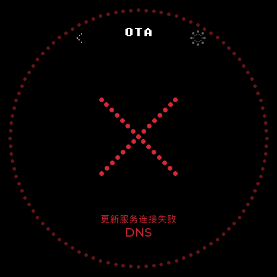
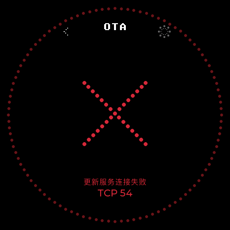

# 联网错误原生检查

2026-10-07，实际 `app_ota.c` / LVGL9.5 的466×466圆屏渲染。错误、电量为主机测试夹具，两张完整图已查看，文字未超出圆屏安全区域。

| DNS解析失败 | TCP连接失败 |
| --- | --- |
|  |  |

复现：主机 `ota_ui_tests` 指定 `OTA_CAPTURE_DIR=<临时目录>`，生成原生PPM后转换PNG；临时PPM与主机构建结束后清理。
这些图只证明失败信息布局；全App调用链、自动验证和真实设备待验收项见 [联网逻辑](../../NETWORKING.md)。
