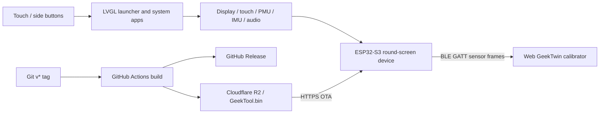

# soRound OS (GeekTool)

[中文](./README.md) · **[Official website](https://sobigrice.github.io/soRound_os/en/)** ·
[Firmware releases](https://github.com/soBigRice/soRound_os/releases) ·
[Setup guide](#quick-start-firmware)

A compact, versatile system for the **Waveshare ESP32-S3-Touch-AMOLED-1.75C** round AMOLED
board. The main ESP-IDF firmware provides a round-screen launcher, watch faces and lock
screen, network and sensor tools, audio, games, a BLE digital twin, and dual-partition OTA.

**October 9, 2026 (China time): [v1.7-beta.32](https://github.com/soBigRice/soRound_os/releases/tag/v1.7-beta.32) is published to the beta channel.**
Six HAND analog faces bring the total to 21. Fluid now offers the original particles and
soft, draggable color dye; Maze has 12 fixed levels with increasing difficulty. Enable beta
updates on the device OTA page. The stable channel remains v1.7. All 19 release CI checks
passed; complete R2 and domestic OTA images, matching digests and Range downloads were verified.
The 4,185,936-byte image requires two 4 MiB OTA slots. Physical touch, IMU feel and OTA restart
acceptance remain pending; see the [release record](./GeekTool-IDF/PORTING_NOTES.md#2026-10-08-v17-beta32-指针表盘流体双模式与固定迷宫关卡).

**October 8, 2026: [v1.7 stable](https://github.com/soBigRice/soRound_os/releases/tag/v1.7) is published.**
Both channels served v1.7 at that release; the beta channel now serves beta.32 above.
The stable v1.7 production code is the same as beta.31. Beta.30 remains withdrawn.
Scrolling Settings, separate adjustment pages,
centered watch-face previews, the ring-and-red-dot identity and About screen are included.
The boot animation lasts at least four seconds; shared initialization, core checks and
the revealed watch-face frame must pass before a new OTA image is confirmed. Core failures
roll back when a recovery image exists. Network-check failures allow offline startup;
network recovery for Weather, Answers, Zodiac and OTA is retained.

Use `GeekTool-IDF/` for current development. All 34 local regressions and nine startup
checks in the stable release CI passed. The release-dependency candidate's watch face,
unlock and Settings were accepted on the device. The device is currently disconnected;
the final stable image's physical OTA, software restart and first-boot acceptance remain
pending. The original beta.30 white-screen trigger has not been reproduced.

**Upgrade requirement: two 4 MiB OTA slots.** v1.6.1 uses 3 MiB slots and cannot directly
OTA-install this 4,149,792-byte image. Older layouts need a USB partition and resource
migration first; see the [migration record](./GeekTool-IDF/PORTING_NOTES.md#2026-10-04-分区扩容与usb迁移).
The application binary does not replace a complete first installation. See the
[v1.7 release verification](./GeekTool-IDF/PORTING_NOTES.md#2026-10-08-v17-正式发布),
[startup checks](./GeekTool-IDF/STARTUP.md), [network recovery](./GeekTool-IDF/NETWORKING.md)
and [Settings layout](./GeekTool-IDF/artwork/settings-detail/README.md).

[Beta.29](https://github.com/soBigRice/soRound_os/releases/tag/v1.7-beta.29) adds a scrolling
Settings home screen with inertia, fixed heading and back control, a curved position
indicator, and restored scroll position when returning. Its settings subpages, saved
preferences, Wi-Fi, partitions, OTA and startup behavior are retained. Native bilingual
regressions and local/CI builds passed in the recorded release checks. The published image
is 4,133,184 bytes, leaving 61,120 bytes in a 4 MiB OTA slot. Full R2 and OTA downloads
matched the GitHub asset's declared digest; Range checks passed. A complete GitHub CDN
download was not verified in that release session. Stable OTA remains v1.6.1. Physical
OTA, reboot and scrolling feel still need device acceptance. See the
[release verification record](./GeekTool-IDF/PORTING_NOTES.md#2026-10-07-v17-beta29-设置首页滚动发布).

[Beta.28](https://github.com/soBigRice/soRound_os/releases/tag/v1.7-beta.28) introduces the
ring-and-red-dot system identity, bilingual About screen and a 1.8-second native boot
animation. Version and battery values come from real state; initialization runs alongside
the animation, which returns to the existing lock screen. Recorded host regressions,
native 466 × 466 renders and local/CI builds passed. Device startup, touch and animation
feel remain subject to device acceptance. See [system identity and startup](./GeekTool-IDF/artwork/identity/README.md).

[Beta.27](https://github.com/soBigRice/soRound_os/releases/tag/v1.7-beta.27) fixes noise and
sustained sound during rapid Wooden Fish taps. Consumed I2S buffers are cleared, and a
new tap enters with a 2 ms transition. See the
[release and 4,000-request regression record](./GeekTool-IDF/PORTING_NOTES.md#2026-10-06-v17-beta27-木鱼音频修复发布).

Beta.24 added fifteen TYPE / ORBIT / SHIFT watch faces, approved TLS allocations in PSRAM
with full certificate checks retained, and lossless font compression that recovered
about 96 KiB of firmware space. A device upgraded from the beta.23 repair candidate to
beta.24, rebooted into `ota_0`, and successfully checked for updates again. The release
image was 4,078,448 bytes. Disconnection, corrupt-image and failed-boot rollback scenarios
still require physical testing. See the [OTA continuity record](./GeekTool-IDF/PORTING_NOTES.md#2026-10-05-ota-持续升级保障进行中).
Beta.23 added daily online horoscopes and Wooden Fish, and used a temporary full-frame
weather buffer with TE synchronization. Book of Answers supports online pages and the
screen or PWR key, with an explicit fallback label when requests fail.

## Features

- A 466 × 466 round AMOLED interface built with LVGL 9, using black, white and red
  dot-matrix elements and restrained colors for weather icons.
- Radial launcher, quick panel, lock-screen watch faces, brightness, volume, always-on
  display and persistent settings in NVS.
- **20 apps in the current source:** Wi-Fi, I2C scan, System info, Weather, Calendar, Timer, Stopwatch,
  Settings, OTA updates, Audio visualizer, Level, Maze, Fluid, Dice & coin, Bluetooth
  remote (mouse / slides / media), Digital twin, Book of Answers, Horoscope, Wooden Fish and Pixels.
  [Pixel Field](./GeekTool-IDF/PIXELS_UI.md) is a new development implementation and is not included in the published versions above.
- AXP2101 power and battery management, QMI8658 IMU, ES7210 microphone input and ES8311 audio output.
- Wi-Fi reconnection, SNTP time synchronization and Open-Meteo weather data.
- Dual OTA partitions, boot rollback protection, version checks and Cloudflare R2 distribution.
- A React / Three.js GeekTwin companion that displays orientation and battery data through
  Web Bluetooth. Its 3D scene loads separately; failed connection attempts clean up the GATT session.

The [website gallery](https://sobigrice.github.io/soRound_os/en/#explore) includes native
English app previews, fifteen watch faces and the official Waveshare board photo.
Preview readings are fixed fixtures; the website does not connect to a device.
The firmware supports Chinese and English controls. Horoscope readings retain the
provider's Chinese original in both languages, as indicated by the `CN` label.

## Hardware baseline

| Component | Configuration |
| --- | --- |
| MCU | ESP32-S3R8, dual-core 240 MHz |
| Display | 1.75-inch, 466 × 466 AMOLED, CO5300 over QSPI |
| Touch | CST9217 over I2C |
| Storage | 32 MB Flash, 8 MB OPI PSRAM |
| Sensor | QMI8658 six-axis IMU |
| Power | AXP2101 PMU |
| Audio | ES7210 microphone ADC, ES8311 DAC / speaker |
| Wireless | 2.4 GHz Wi-Fi, Bluetooth LE |

This firmware targets the **1.75C** model. See the [official board page](https://www.waveshare.com/esp32-s3-touch-amoled-1.75c.htm)
and the [hardware development guide](./ESP32-S3-Touch-AMOLED-1.75C-开发指南.md) for pins,
dependency versions and hardware details. Linked implementation documents are currently in Chinese.

## Repository map

| Path | Purpose | Status |
| --- | --- | --- |
| `GeekTool-IDF/` | ESP-IDF / LVGL 9 firmware | Current mainline |
| `GeekTool-IDF/main/` | Launcher, services, drivers and apps | Main development area |
| `GeekTool-IDF/images/` | Watch face images flashed to the FAT partition | Firmware assets |
| `web/` | GeekTwin React / Three.js Web Bluetooth calibrator | Companion app |
| `site/` | Chinese / English product website and UI gallery | GitHub Pages |
| `scripts/build_site.py` | Website generation, localization, asset and release checks | Website build |
| `GeekTool/` | Arduino / LVGL 8 multi-tool prototype | Earlier implementation |
| `WiFiList_StressTest/` | Arduino round-screen Wi-Fi list stress test | Hardware checks |
| `.github/workflows/firmware.yml` | Tag builds, GitHub Releases and R2 uploads | Firmware publishing |
| `.github/workflows/pages.yml` | Static website build and GitHub Pages deployment | Website publishing |

Website preview, bilingual content, native UI export, photo sources and deployment are
explained in [site/README.md](./site/README.md). The product website and GeekTwin calibrator
remain separate applications.

Direct implementation references:

| Area | Documentation |
| --- | --- |
| Scheduling, animation and resource lifetime | [Performance record](./GeekTool-IDF/PORTING_NOTES.md#2026-10-01-流畅性与动画优化) |
| Audio spectrum and level layout | [Audio / Level design](./GeekTool-IDF/AUDIO_LEVEL_DESIGN.md) |
| Twenty-one watch faces, images and always-on state; new HAND group locally verified, device acceptance pending | [Watch faces](./GeekTool-IDF/WATCHFACES_UI.md) |
| Original particles + color dye fluid modes and twelve fixed maze levels; device acceptance pending | [Play implementation](./GeekTool-IDF/PLAY_UI.md) |
| Coin drawing, animation, pause and exit | [Coin implementation](./GeekTool-IDF/PORTING_NOTES.md#2026-10-04-抛硬币外观与抛掷动画) |
| Memory statistics and System info pages | [System UI](./GeekTool-IDF/SYSTEM_UI.md) |
| Nineteen geometric launcher icons | [Launcher icons](./GeekTool-IDF/LAUNCHER_ICONS.md) |
| Bilingual online answers, fallback and physical keys | [Book of Answers](./GeekTool-IDF/ANSWERS_UI.md) |
| Daily horoscopes, scrolling, Wooden Fish sound and counter | [Horoscope / Wooden Fish](./GeekTool-IDF/ZODIAC_MERIT_UI.md) |
| Settings navigation, Wi-Fi and password entry | [Settings / location](./GeekTool-IDF/SETTINGS_LOCATION_DESIGN.md) |
| System identity, About and startup | [Identity / startup](./GeekTool-IDF/artwork/identity/README.md) |
| OTA recovery and state synchronization | [OTA recovery](./GeekTool-IDF/PORTING_NOTES.md#2026-10-02-ota-失败恢复修复) |
| TLS memory and error-code handling | [Beta.23 TLS investigation](./GeekTool-IDF/PORTING_NOTES.md#2026-10-05-beta23-ota-tls-内存不足) |
| R2 archive and atomic server mirror synchronization | [OTA mirror](./GeekTool-IDF/tools/ota_mirror/README.md) |
| OTA dot ring, arrow and real progress | [OTA UI](./GeekTool-IDF/PORTING_NOTES.md#2026-10-03-ota-极简页面) |
| BOOT / PWR behavior | [Physical button mapping](./GeekTool-IDF/PORTING_NOTES.md#2026-10-02-实体按键功能对调) |
| HID reports and input release | [Bluetooth remote](./GeekTool-IDF/PORTING_NOTES.md#遥控台扩展鼠标--演示--媒体) |
| Weather icons, day / night and rendering | [Weather UI](./GeekTool-IDF/WEATHER_UI.md) |

## System relationships



## Quick start: firmware

### 1. Prepare the environment

- ESP-IDF **v6.0.1** is recommended. The component manifest declares a minimum of **v5.1**.
- On macOS, use an Espressif IDF terminal or load `export.sh` manually.
- The first build downloads dependencies such as LVGL, CO5300, CST9217 and `esp_codec_dev`
  through ESP-IDF Component Manager. Component registry access is required.

Replace this example with your actual ESP-IDF installation path:

```bash
export PATH="/opt/homebrew/bin:$PATH"
source "$HOME/.espressif/v6.0.1/esp-idf/export.sh"
idf.py --version
```

### 2. Build

Run from the repository root:

```bash
idf.py -C GeekTool-IDF set-target esp32s3
idf.py -C GeekTool-IDF build
```

The application image is written to:

```text
GeekTool-IDF/build/GeekTool.bin
```

### 3. Flash and monitor

Check your serial port first. On macOS:

```bash
ls -la /dev/cu.usbmodem*
```

Replace `<SERIAL_PORT>` with the actual port:

```bash
idf.py -C GeekTool-IDF -p <SERIAL_PORT> flash monitor
```

`/dev/cu.usbmodem1101` was used in a previous verification; the port can change after
reconnecting or between devices. Exit the monitor with `Ctrl+]`. If flashing waits for
synchronization, hold BOOT while reconnecting USB or resetting, then retry.

**Use the full USB flash for initial installation.** A Release `GeekTool.bin` contains the
application image, not all bootloader, partition and resource images. Current beta releases
require **two 4 MiB OTA slots**. Expanding an older partition layout requires USB migration;
an application-only OTA cannot change the partition table. Check the
[partition migration notes](./GeekTool-IDF/PORTING_NOTES.md#2026-10-04-分区扩容与usb迁移) before upgrading.

## Run the Web digital twin calibrator

Install Node.js and npm, then run:

```bash
npm --prefix web ci
npm --prefix web run dev
```

Vite first tries port `5173` and selects another available port if needed. Use the URL
printed in the terminal. Web Bluetooth requires a secure context: use `http://localhost`
for development and HTTPS for deployment. Desktop Chrome or Edge is recommended.

1. Open the `twin` app from the device launcher.
2. Open the calibrator and click its connection button.
3. Select **GeekTwin** in the Bluetooth picker.
4. View orientation, battery and sample rate, or set the current orientation as zero.

Build and preview:

```bash
npm --prefix web run build
npm --prefix web run preview
```

See [web/README.md](./web/README.md) for coordinate mapping and BLE frame details.

## Bluetooth remote

1. Open `remote` and pair **soRound** in your computer's Bluetooth settings.
2. **Mouse:** drag the touch area to move the pointer and tap to left-click. `L` / `R`
   are left / right buttons; the vertical strip scrolls. Toggle drag lock to hold the
   left button while moving with one finger, then toggle it again to release.
3. **Slides:** previous / next send PageUp / PageDown. Focus the presentation or document
   on your computer first. Tap the time to start, pause or resume the local timer;
   reset stops and clears it. This timer does not start a presentation on the computer.
4. **Media:** play / pause, previous / next track, system volume and mute. The host and
   active player determine how those commands behave.

All three modes share one pairing and connection. Controls become available after the
host completes encryption and subscribes to the corresponding input reports. The slide
timer works without Bluetooth. Media mode does not invent track, playback or volume state
without host feedback. Locking, quick-panel coverage and mode switches cancel queued
input and release held buttons; leaving the app disconnects BLE.

After upgrading from an older mouse-only firmware, forget the old **soRound** pairing and
pair again if slides or media remain unavailable. This clears a cached HID Report Map.
Automated checks cover the protocol and native LVGL pages; actual pairing, host responses
and physical touch still require hardware testing.

## Firmware releases and OTA channels

`.github/workflows/firmware.yml` runs when a `v*` tag is pushed:

1. Build `GeekTool-IDF` with ESP-IDF v6.0.1.
2. Upload `GeekTool.bin` to the matching GitHub Release; beta tags become prereleases.
3. Overwrite the appropriate Cloudflare R2 objects with `Cache-Control: no-store`.
   R2 keeps current channel images; GitHub Releases retain historical images.

| Tag type | R2 objects replaced | Recipients |
| --- | --- | --- |
| Stable, e.g. `v1.6` | `GeekTool.bin` **and** `GeekTool-beta.bin` | All devices |
| Beta, e.g. `v1.6-beta.1` | Only `GeekTool-beta.bin` | Devices with beta enabled |

Use the settings button in the OTA app to enable the beta / test channel. The choice is
saved in NVS and defaults to off. Back or a right swipe returns to the main OTA screen.
You can open settings during a download, but cannot change its channel.

- Beta off: `https://ota.miaozong.cc/GeekTool.bin` — stable releases.
- Beta on: `https://ota.miaozong.cc/GeekTool-beta.bin` — beta releases and future stable
  releases, since stable publishing also replaces this object.

The previous firmware resides in the other OTA partition for rollback protection.
The next update overwrites it automatically; **do not delete it manually**.

The current client makes up to three attempts for temporary connection failures or
interrupted downloads. A strong ETag permits resuming within the same update task; without
reliable object identity, the download restarts. Image headers, project, size and full
image integrity are checked before switching the boot partition. The UI reports retries,
verification and failure stages / codes; downloading continues after leaving the page.
Older firmware must first install these fixes. If its OTA cannot complete, use USB once.

Required GitHub Actions secrets:

- `R2_ACCESS_KEY_ID`
- `R2_SECRET_ACCESS_KEY`

Publishing examples (use the version being released):

```bash
# Stable
git tag v1.6 && git push origin v1.6
# Beta
git tag v1.6-beta.1 && git push origin v1.6-beta.1
```

Tags should point to a clean commit that has completed the intended local and hardware
checks. A successful Actions run or HTTP `200` alone does not verify device OTA. Check:

1. The old firmware finds and installs the new version.
2. Download, writing, reboot and startup from the new partition succeed.
3. A second check reports `already up to date` without reflashing the same version.
4. Serial logs contain no TLS, certificate, partition or rollback errors.

## Useful verification commands

```bash
# Firmware build
idf.py -C GeekTool-IDF build

# OTA recovery: real business code with transport and flash fixtures
cmake -S GeekTool-IDF/tests/ota -B /tmp/geektool-ota-tests
cmake --build /tmp/geektool-ota-tests
ctest --test-dir /tmp/geektool-ota-tests --output-on-failure

# LVGL, OTA UI, physical buttons, HID and native page interaction
cmake -S GeekTool-IDF/tests/host -B /tmp/geektool-host-tests
cmake --build /tmp/geektool-host-tests -j 8
ctest --test-dir /tmp/geektool-host-tests --output-on-failure

# Web type check and production build
npm --prefix web run build

# Patch whitespace and conflict checks
git diff --check
```

For hardware changes, verify the directly affected display, touch, navigation, BOOT / PWR,
Wi-Fi, audio, IMU, lock / power-saving and OTA behavior on the board. A build is not device
acceptance. Close test servers and remove only the temporary build directories created
for your own test session.

Historical verification: the October 3 beta.11 record reports a full firmware build,
18 OTA recovery checks and six host regression groups, including 26 bilingual OTA renders
and 78 weather renders, on LVGL 9.5 and release LVGL 9.6.0. Later original-icon checks added
fixed pixel references; a local image was USB-flashed and its boot and Wi-Fi reconnection
checked. These are dated records, not a claim that all checks were rerun for the current
release. Web's eleven regressions, type check and build were recorded on October 1.

The current software button mapping is **BOOT short press: lock / unlock; BOOT hold for
2 seconds: software shutdown; PWR short press: start / pause / resume Timer and Stopwatch**
(or reset a completed Timer). Powering on with PWR and holding BOOT at power-on for download
mode are hardware functions. Past boot checks do not replace physical button acceptance.

## Known boundaries

- CO5300 uses QSPI. Large, rapid redraws can still tear; this is not an RGB / DSI display
  with equivalent tearing-avoidance capabilities. Small animations and fewer full-screen
  redraws reduce the impact.
- The Web calibrator has no magnetometer or full orientation quaternion. Horizontal yaw
  is a short-term relative estimate and drifts over time.
- Web Bluetooth support is limited. Safari and Firefox are not primary targets for the
  current calibrator. This limitation applies to the calibrator, not the product website.
- `PORTING_NOTES.md` is chronological. Earlier sections describe earlier states; use this
  README, current code and workflow configuration for current entry points and commands.

## Earlier release records

These summarize the Chinese README's dated release history; they do not imply fresh
hardware acceptance. Follow the linked records for detailed validation and remaining checks.

| Release | Recorded change and verification boundary |
| --- | --- |
| [beta.13](https://github.com/soBigRice/soRound_os/releases/tag/v1.7-beta.13) · Oct 4 | Settings / offline province-city-district picker, night rain icons and IMU recovery. Host / build / image checks passed; touch and physical tilt remained pending. [Settings](./GeekTool-IDF/SETTINGS_LOCATION_DESIGN.md) |
| [beta.14](https://github.com/soBigRice/soRound_os/releases/tag/v1.7-beta.14) · Oct 4 | Audio gradients, level layout, weather details and scrolling. Host / release checks passed; no device flash in that session. See the [dated release record](./GeekTool-IDF/PORTING_NOTES.md#2026-10-04-v17-beta14-发布核对). |
| [beta.15](https://github.com/soBigRice/soRound_os/releases/tag/v1.7-beta.15) · Oct 4 | Coin appearance / flip animation. Download and image checks passed; update / reboot and animation feel awaited device acceptance. [Record](./GeekTool-IDF/PORTING_NOTES.md#2026-10-04-v17-beta15-发布核对) |
| [beta.16](https://github.com/soBigRice/soRound_os/releases/tag/v1.7-beta.16) · Oct 4 | Weather HTTP send-buffer repair and distinct offline / request-error messages. Host / release checks passed. Weather later worked after USB reboot; the original failure still needed request logs. [Record](./GeekTool-IDF/PORTING_NOTES.md#2026-10-04-v17-beta16-发布核对) |
| [beta.17](https://github.com/soBigRice/soRound_os/releases/tag/v1.7-beta.17) · Oct 4 | Three System info pages. The authorized USB migration to dual 4 MiB slots retained settings and Wi-Fi; page display / touch remained pending. [Record](./GeekTool-IDF/PORTING_NOTES.md#2026-10-04-v17-beta17-发布与usb迁移核对) |
| [beta.18](https://github.com/soBigRice/soRound_os/releases/tag/v1.7-beta.18) · Oct 4 | Launcher icon redraw with app order and navigation retained. Bilingual renders / release checks passed; no USB flash in that session. [Record](./GeekTool-IDF/PORTING_NOTES.md#2026-10-04-v17-beta18-图标发布核对) |
| [beta.19](https://github.com/soBigRice/soRound_os/releases/tag/v1.7-beta.19) · Oct 5 | Icon borders / labels, categorized Settings and separate Wi-Fi/password pages. Image exceeded the older 3 MiB layout; dual 4 MiB slots required. Host / mirror checks passed; physical touch and OTA remained pending. [Record](./GeekTool-IDF/PORTING_NOTES.md#2026-10-05-v17-beta19-发布与镜像上限核对) |
| [beta.25](https://github.com/soBigRice/soRound_os/releases/tag/v1.7-beta.25) · Oct 6 | Restore default mountain backgrounds while preserving genuine custom images; refine fifteen watch faces and long-SSID layout. Host / asset / release checks passed; device display and OTA remained pending. [Record](./GeekTool-IDF/PORTING_NOTES.md#2026-10-06-v17-beta25-表盘纠正发布) |

## More documentation

- [Development / migration records](./GeekTool-IDF/PORTING_NOTES.md)
- [Weather details and scrolling](./GeekTool-IDF/WEATHER_DETAILS_DESIGN.md)
- [Web GeekTwin calibrator](./web/README.md)
- [Arduino GeekTool prototype](./GeekTool/README.md)
- [Arduino Wi-Fi list stress test](./WiFiList_StressTest/README.md)
- [Hardware development guide](./ESP32-S3-Touch-AMOLED-1.75C-开发指南.md)

When changing behavior, update the affected module documentation, comments and README
status / commands / acceptance notes together. Chinese and English README entry points
should stay aligned; dated historical records retain their original evidence boundaries.
