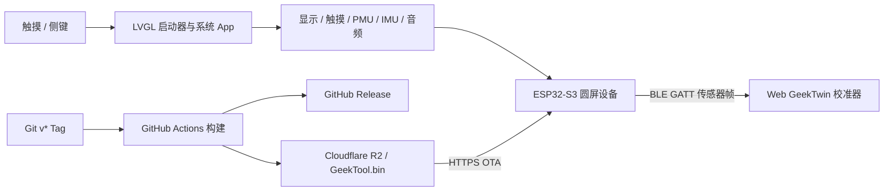

# soRound OS（GeekTool）

面向 **ESP32-S3-Touch-AMOLED-1.75C** 圆形 AMOLED 开发板的轻量多功能系统。项目以
ESP-IDF 固件为主线，提供圆屏启动器、表盘与锁屏、网络与传感器工具、音频、小游戏、
BLE 数字孪生以及双分区云 OTA。

当前仓库 `main` 对应 `v1.7-beta.6` 内测基线，最近稳定版 Tag 为 `v1.6.1`。主线开发请使用
`GeekTool-IDF/`；Arduino 工程主要用于早期原型和硬件压力测试。

## 功能概览

- 466 x 466 圆形 AMOLED UI，黑/白/红点阵视觉，基于 LVGL 9。
- 径向启动器、快捷面板、锁屏表盘、亮度/音量/常显模式与 NVS 持久化。
- 16 个内置 App：Wi-Fi、I2C、系统信息、天气、日历、倒计时、秒表、设置、OTA、
  音频可视化、水平仪、迷宫、流体、骰子、BLE 鼠标和数字孪生。
- AXP2101 电源与电量管理，QMI8658 IMU，ES7210 麦克风输入和 ES8311 音频输出。
- Wi-Fi 自动重连、SNTP 校时、Open-Meteo 天气数据。
- 双 OTA 分区、启动回滚保护、版本比对和 Cloudflare R2 固件分发。
- React + Three.js Web 校准器，通过 Web Bluetooth 显示设备姿态与电量；3D 场景独立异步加载，
  蓝牙连接中途失败时会主动清理残留 GATT 会话。

## 硬件基线

| 模块 | 当前配置 |
| --- | --- |
| 主控 | ESP32-S3R8，双核 240 MHz |
| 屏幕 | 1.75 英寸、466 x 466 AMOLED、CO5300 QSPI |
| 触摸 | CST9217，I2C |
| 存储 | 32 MB Flash、8 MB OPI PSRAM |
| 传感器 | QMI8658 六轴 IMU |
| 电源 | AXP2101 PMU |
| 音频 | ES7210 麦克风 ADC、ES8311 DAC/扬声器 |
| 无线 | 2.4 GHz Wi-Fi、Bluetooth LE |

完整引脚、依赖版本和硬件说明见
[ESP32-S3-Touch-AMOLED-1.75C 开发指南](./ESP32-S3-Touch-AMOLED-1.75C-开发指南.md)。

## 目录结构

| 路径 | 用途 | 定位 |
| --- | --- | --- |
| `GeekTool-IDF/` | ESP-IDF + LVGL 9 主线固件 | 当前主线 |
| `GeekTool-IDF/main/` | 启动器、系统服务、硬件驱动和各 App | 主要开发目录 |
| `GeekTool-IDF/images/` | 随固件写入 FAT 分区的表盘图片 | 固件资源 |
| `web/` | GeekTwin React/Three.js Web Bluetooth 校准器 | 配套前端 |
| `GeekTool/` | Arduino + LVGL 8 多工具原型 | 早期版本 |
| `WiFiList_StressTest/` | Arduino 圆屏 Wi-Fi 列表压力测试 | 硬件验证 |
| `.github/workflows/firmware.yml` | Tag 构建、GitHub Release 和 R2 上传 | 发布流程 |

## 系统关系



## 快速开始：主线固件

### 1. 准备环境

- 推荐 ESP-IDF `v6.0.1`；组件清单声明的最低版本为 `v5.1`。
- macOS 推荐使用 Espressif IDF 插件终端，或手动加载 `export.sh`。
- 首次构建会通过 ESP-IDF Component Manager 下载 LVGL、CO5300、CST9217、
  `esp_codec_dev` 等依赖，需要能够访问组件仓库。

本机使用自定义安装路径时，请把下面路径替换为实际的 `IDF_PATH`：

```bash
export PATH="/opt/homebrew/bin:$PATH"
source "$HOME/.espressif/v6.0.1/esp-idf/export.sh"
idf.py --version
```

### 2. 构建

在仓库根目录执行：

```bash
idf.py -C GeekTool-IDF set-target esp32s3
idf.py -C GeekTool-IDF build
```

成功后主固件位于：

```text
GeekTool-IDF/build/GeekTool.bin
```

### 3. 烧录与串口日志

先确认设备串口。macOS 可使用：

```bash
ls -la /dev/cu.usbmodem*
```

将 `<SERIAL_PORT>` 替换为实际串口：

```bash
idf.py -C GeekTool-IDF -p <SERIAL_PORT> flash monitor
```

例如本项目曾验证使用 `/dev/cu.usbmodem1101`。不同设备或重新插拔后端口可能变化，不应把该值
写死到脚本中。退出串口监视器使用 `Ctrl+]`。

如果烧录一直等待同步，可按住 BOOT 键后重新插入 USB 或复位，再重试烧录。

## 启动 Web 数字孪生校准器

要求安装 Node.js 和 npm。首次运行：

```bash
npm --prefix web ci
npm --prefix web run dev
```

Vite 默认尝试使用 `5173` 端口；该端口被占用时会自动选择下一个可用端口，请以终端输出的 URL
为准。Web Bluetooth 需要安全上下文，开发时使用 `http://localhost`，正式部署使用 HTTPS；推荐
桌面版 Chrome 或 Edge。

连接步骤：

1. 在设备启动器中进入 `twin` App。
2. 在浏览器打开校准器并点击“连接”。
3. 在蓝牙选择器中选择 `GeekTwin`。
4. 连接后可查看姿态、电量、帧率，并将当前姿态设为零位。

生产构建与本地预览：

```bash
npm --prefix web run build
npm --prefix web run preview
```

更多坐标映射与 BLE 帧说明见 [web/README.md](./web/README.md)。

## 固件发布与 OTA（正式 / 内测双通道）

`.github/workflows/firmware.yml` 在推送 `v*` Tag 时执行以下流程：

1. 使用 ESP-IDF `v6.0.1` 构建 `GeekTool-IDF`。
2. 把 `GeekTool.bin` 上传到同名 GitHub Release（beta Tag 自动标记 prerelease）。
3. 按 Tag 类型覆盖上传 Cloudflare R2 对象（`Cache-Control: no-store`，覆盖即"删除旧包"，
   R2 不堆积历史；历史归档在 GitHub Release）。

双通道规则：

| Tag 形式 | R2 覆盖对象 | 谁会收到 |
| --- | --- | --- |
| 正式 `v1.6` | `GeekTool.bin` **和** `GeekTool-beta.bin` | 所有设备 |
| 内测 `v1.6-beta.1` | 仅 `GeekTool-beta.bin` | 仅开了 beta 开关的设备 |

设备端在 OTA 页有 `beta channel` 开关（存 NVS，默认关）：

- 关 → 拉 `https://ota.miaozong.cc/GeekTool.bin`，只收正式版。
- 开 → 拉 `https://ota.miaozong.cc/GeekTool-beta.bin`，收内测版；因正式版同时覆盖
  beta 对象，内测设备也不会漏掉正式更新。无需设备端比较版本新旧，不存在通道乒乓。

设备上的"旧固件"位于另一个 OTA 分区（A/B 双分区），是启动回滚的保险，
下次 OTA 自动覆盖，**不需要也不应该手动删除**。

仓库需要配置以下 GitHub Actions Secrets：

- `R2_ACCESS_KEY_ID`
- `R2_SECRET_ACCESS_KEY`

发布示例：

```bash
# 正式版
git tag v1.6 && git push origin v1.6
# 内测版
git tag v1.6-beta.1 && git push origin v1.6-beta.1
```

Tag 应指向已经完成本地构建与真机验证的干净提交。OTA 完成的判断不能只看 Actions 成功或下载
地址返回 `200`，还需要在设备上验证：

1. 旧版本可检查并升级到新版本。
2. 下载、写入、重启和新分区启动均正常。
3. 再次检查同一版本时显示 `already up to date`，不会重复刷写。
4. 串口没有 TLS、证书、分区或回滚相关错误。

## 常用验证命令

```bash
# 固件编译
idf.py -C GeekTool-IDF build

# Web 类型检查 + 生产构建
npm --prefix web run build

# 检查补丁空白和冲突标记
git diff --check
```

涉及硬件交互的改动至少还应验证屏幕、触摸、启动器导航、PWR/BOOT 键、Wi-Fi、音频、IMU、
锁屏/省电和 OTA 中直接受影响的项目。仅通过编译不等于真机功能已验收。

最近一次本机构建基线（2026-07-19）：审查起点 `v1.7-beta.5` 的优化后固件编译通过，
`GeekTool.bin` 大小 `0x1cef40`，3 MiB OTA App 分区剩余 `0x1310c0`（40%）；Web 类型检查和
生产构建通过，入口 JS 为 172.11 kB，Three.js 场景异步块为 462.85 kB。
该结果只证明构建链路，不代表本轮 OTA、音频、BLE 或屏幕交互已经在真机复验。

## 已知边界

- CO5300 使用 QSPI，无法获得 RGB/DSI 面板级的 tearing avoidance；大面积快速重绘仍可能出现轻微
  撕裂。当前 UI 通过小面积动画和减少全屏重绘控制影响。
- Web 校准器没有磁力计或完整姿态四元数，水平偏航只能做短时间相对估算，长时间会漂移。
- Web Bluetooth 的浏览器支持有限；Safari 和 Firefox 不能作为当前校准器的主要运行环境。
- `GeekTool-IDF/PORTING_NOTES.md` 是按开发时间累积的记录，早期章节描述的是当时状态；当前入口、
  构建和发布方式以本 README、代码和工作流配置为准。

## 开发文档

- [ESP-IDF 移植、真机记录与历史问题](./GeekTool-IDF/PORTING_NOTES.md)
- [Web GeekTwin 校准器说明](./web/README.md)
- [Arduino GeekTool 原型说明](./GeekTool/README.md)
- [Arduino Wi-Fi 列表压力测试](./WiFiList_StressTest/README.md)
- [硬件开发指南](./ESP32-S3-Touch-AMOLED-1.75C-开发指南.md)

提交功能改动时，请同步更新直接相关的代码注释、模块文档和本 README 中受影响的状态、命令或
验收说明，避免文档与真实固件行为分离。
