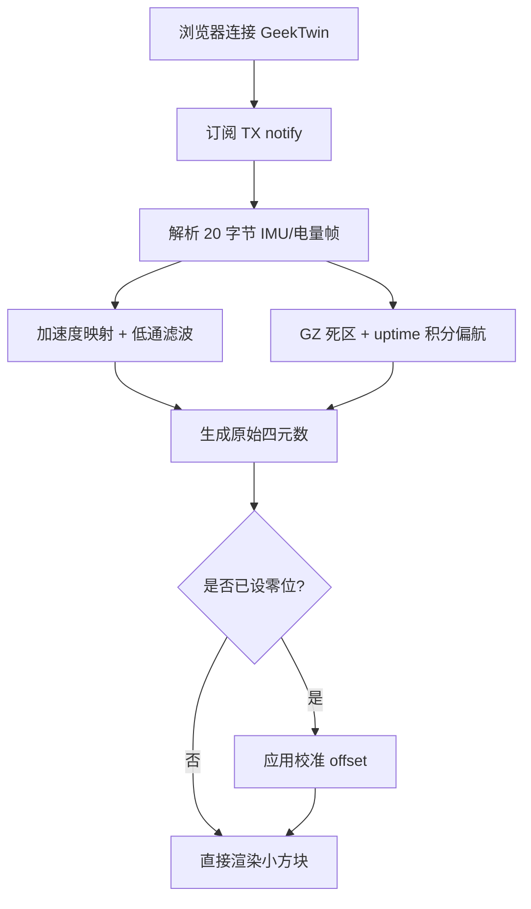

# GeekTwin Calibrator

独立前端脚手架,按固件 `app_twin.c` / `ble_twin.c` 的 BLE 帧协议重新实现。用于连接固件里的 `twin` app,
显示一个可校准的小方块姿态。

```bash
npm install
npm run dev
```

Web Bluetooth 必须通过 `http://localhost` 或 HTTPS 打开,推荐桌面 Chrome / Edge。

生产构建会把 Three.js 场景拆成独立异步块,先渲染状态面板和连接控件,再加载 WebGL 场景。
GATT 已连接但服务发现/通知订阅失败时会移除事件监听并主动断开,避免下次重连复用残留会话。

## 坐标校准

固件 `imu.c` 的实测方向是:右边压低时 `ay` 变大,下边压低时 `ax` 变大。前端小方块显示的是设备屏幕法线姿态。
当前网页端按实机手持方向映射为 `-ay / +ax / +az`,只修正显示坐标,不改变固件数据帧。
姿态算法对加速度方向做低通,对 `gz` 做静止死区和角度归一化;由于当前帧没有磁力计或完整四元数,水平偏航只能短时间相对校准,
不能长期绝对防漂。

## Mermaid


