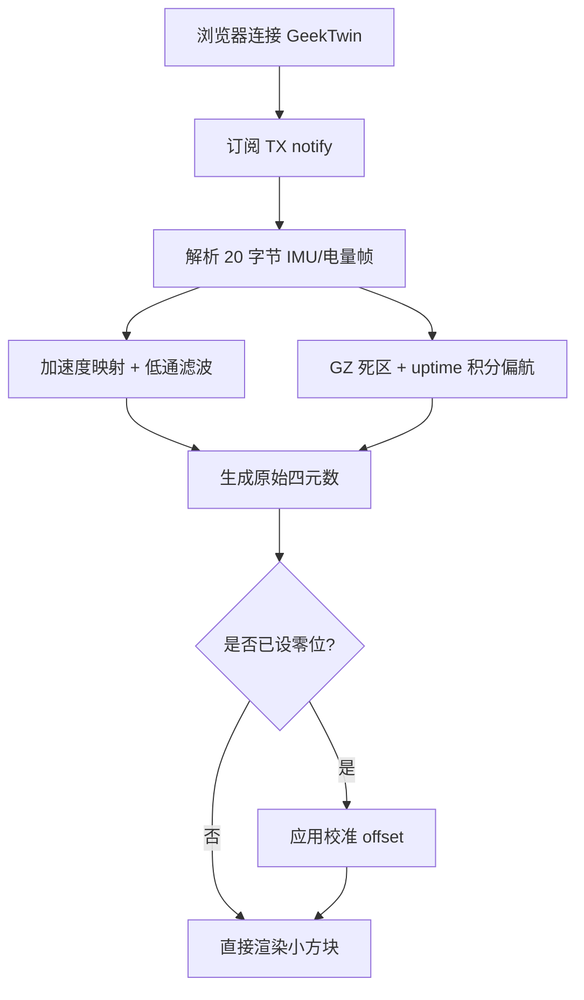

# GeekTwin Calibrator

独立前端脚手架,按固件 `app_twin.c` / `ble_twin.c` 的 BLE 帧协议重新实现。用于连接固件里的 `twin` app,
显示一个可校准的小方块姿态。

```bash
npm install
npm run dev
```

Web Bluetooth 必须通过 `http://localhost` 或 HTTPS 打开,推荐桌面 Chrome / Edge。

生产构建会把 Three.js 场景拆成独立异步块,先渲染状态面板和连接控件,再加载 WebGL 场景。
GATT 服务发现/订阅失败、自然断连和组件卸载都会清理监听与会话。
姿态经 ref 每包更新,读数面板每 100ms 更新;“数据频率”是 BLE 收包率。
3D 插值按时间计算,静止后停止渲染、隐藏页面暂停,恢复/调整尺寸/状态变化时重新绘制。

验证命令:`npm test`(协议、校准、刷新率和连接生命周期回归)与 `npm run build`。
实现调用链与真机验收边界见 [固件性能记录](../GeekTool-IDF/PORTING_NOTES.md#2026-10-01-流畅性与动画优化)。

## 坐标校准

固件 `imu.c` 的实测方向是:右边压低时 `ay` 变大,下边压低时 `ax` 变大。前端小方块显示的是设备屏幕法线姿态。
当前网页端按实机手持方向映射为 `-ay / +ax / +az`,只修正显示坐标,不改变固件数据帧。
姿态算法对加速度方向做低通,对 `gz` 做静止死区和角度归一化;由于当前帧没有磁力计或完整四元数,水平偏航只能短时间相对校准,
不能长期绝对防漂。

## Mermaid


```mermaid
flowchart TD
    A["浏览器连接 GeekTwin"] --> B["订阅 TX notify"]
    B --> C["解析 20 字节 IMU/电量帧"]
    C --> D["加速度映射 + 低通滤波"]
    C --> E["GZ 死区 + uptime 积分偏航"]
    D --> F["生成原始四元数"]
    E --> F
    F --> G{"是否已设零位?"}
    G -- "否" --> H["直接渲染小方块"]
    G -- "是" --> I["应用校准 offset"]
    I --> H
```
